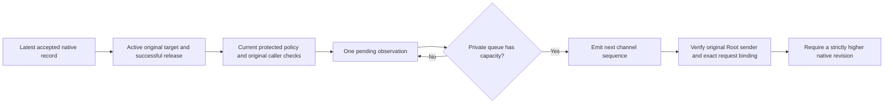

# Native command job observations

Local wire 6 extends the PTY stream. Local wire 7 extends separate stdio controls.
Both use carrier 4 and submission schema 1. Each requires an explicit offer from both peers.

```mermaid
sequenceDiagram
    participant F as Original frontend
    participant R as Serialized Root owner
    participant M as Owned native monitor
    participant T as Original target
    F->>R: Explicit wire 6 or 7; original submission and stdio
    R-->>F: Bound admission and opened control right
    R->>M: One committed release
    M->>T: Execute original command
    F->>R: Authenticated stop control
    R->>M: Apply control through retained native ownership
    M-->>R: Native revision and original target snapshot
    R->>R: Check current policy; coalesce only unsent observations
    R-->>F: Ordered, request-bound stopped observation
    F->>R: Authenticated continue control
    M-->>R: Higher native revision; continued snapshot
    R-->>F: Ordered, request-bound continued observation
    Note over R,M: Exec, exit and actual wait evidence remain independent
    R-->>F: Original terminal outcome
```

## Explicit compatibility

| Wire | Stdio | Job observations | Output acknowledgment |
| --- | --- | --- | --- |
| 3 | Separate fileports | None | None |
| 4 | Private PTY stream | None | Required |
| 5 | Separate fileports with controls | None | None |
| 6 | Private PTY stream with controls | Native target snapshots | Required |
| 7 | Separate fileports with controls | Native target snapshots | None |

Existing defaults and wire 3, 4 and 5 meanings remain unchanged.
A caller that requires observations offers `streamingJobExecution` or `pipeJobExecutionControls`.
It does not silently fall back to a profile without observations.
Wire 7 rejects PTY bytes, credit, resize, EOF and output acknowledgment.
Wire 6 retains the PTY input window and interruption marker.

## Exact observation fields

A job frame uses the existing canonical stream envelope with body tag 5.
It includes the original profile, Mac, account, submission, digest and admitted request binding.

| Body key | Meaning | Accepted values |
| --- | --- | --- |
| 0 | Native job revision | Positive UInt64 |
| 1 | State | 1 for stopped; 2 for continued |
| 2 | Stop signal; stopped only | Positive native signal below NSIG |
| 3 | Raw stop code; stopped only | CLD_STOPPED or CLD_TRAPPED |
| 4 | Tracing snapshot; stopped only | 0 unknown; 1 untraced; 2 traced |

A continued body contains only keys 0 and 1.
Unknown keys, tags, tracing values and invalid fields fail closed.
The observation exposes no PID, birth identity, release permission or retry authority.

The tracing value describes the stop snapshot. It does not establish the historical stop cause.
Unknown remains unknown. Neither raw stop code proves that the stop came from a debugger.
The target can emit a continued snapshot after its initial release.
A nested foreground job has its own owner and does not imply that the original shell stopped.

## Bounded delivery and authentication



Root retains one unsent observation. A newer native revision replaces that pending value under queue pressure.
Native revisions can skip. Emitted channel sequences remain consecutive.
A full queue advances no sequence. Repeated identical native snapshots produce no additional frame.
Known target exit or an uncertain observation discards the unsent snapshot.
A frame already queued can describe an earlier state.
These observations are not a complete history of every kernel transition.

The frontend authenticates Root before decoding the frame.
It checks the original binding, direction, channel sequence and increasing native revision.
Failure closes that original session without resubmitting the command.
Only this verified path constructs `VerifiedCommandExecutionJobObservation`.
External callers can read the observation but cannot construct it through the public API.

PTY output EOF ends bytes and credit. It still permits later job observations.
This does not reopen output or remove the required output acknowledgment.
Pipes retain their original separate descriptors and require no stream acknowledgment.
Job frames cannot prove execution, exit or successful cleanup.

## Validation and remaining integration

Tests exchange real anonymous Mach messages and exercise the four-message queue.
They verify unsent coalescing, repeated revision rejection, exact binding and observations after PTY EOF.
Codec tests reject malformed fields, wrong directions and incompatible profiles.
External compiler probes check that verified observation construction remains private.

Native tests stop and continue disposable commands in both I/O modes.
They then cancel the original target and verify its actual SIGKILL outcome and cleanup.
The monitor fixture substitutes only its UID guard. The launcher changes no credentials.
These tests grant no production elevation and install no service.

The local runtime is macOS 27.0.1. The build targets arm64 macOS 26.
The installed frontend, terminal restoration and macOS 26 runtime remain separate gates.
The frontend must not suspend itself from a queued historical snapshot alone.
Debugger attach and ownership changes remain tracked in [issue 250](https://github.com/rock3r/remozio/issues/250).
Physical device and privileged end-to-end checks wait for the interactive handoff.
