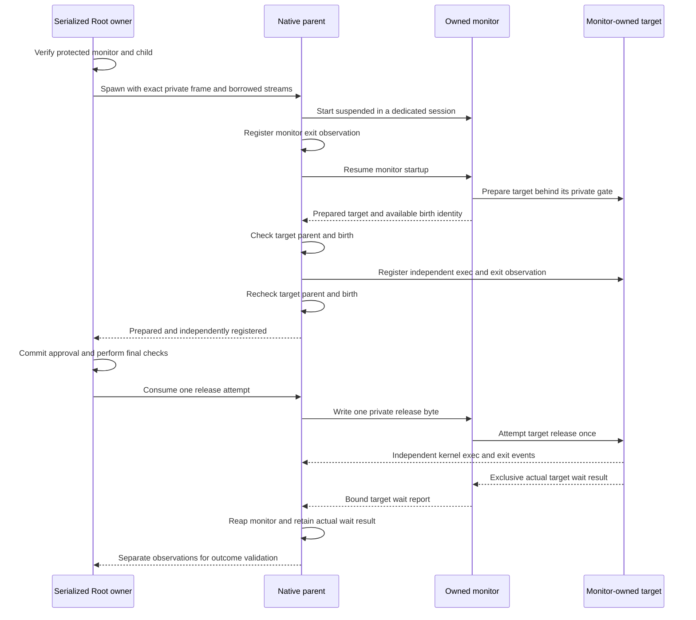

# Native monitor parent

`CommandMonitor.c` gives the serialized Root owner a native monitor API.
The authority and Swift executor now use this API. Both helpers pass protected-path and installed-code checks before preparation and release.
The host service and command frontend remain disconnected until their installation and selected elevation policy are ready.

## Ownership and admission

Both helper paths must be absolute. The parent decodes the exact child frame before spawning.
It checks the supplied stream access modes and retained directory. It never reads borrowed input or changes shared stream flags.
Only owned private pipe endpoints become nonblocking. The monitor receives descriptors zero through seven and an empty environment.
Its arguments contain only its mode and protected-child path. Captured command arguments remain inside the private frame.

The monitor starts suspended in its own session. Root registers monitor exit observation before resuming startup.
A successful spawn returns an owner even if later registration or resume fails. The caller must retain, cancel and poll that owner.
An ignored `SIGCHLD` disposition or `SA_NOCLDWAIT` prevents spawning. Root must preserve exclusive monitor wait ownership.

A prepared report does not establish target identity by itself.
Root checks the public BSD snapshot for the exact PID, monitor parent, valid birth, and a process that has not exited.
A reported birth must match. Root registers target exec and exit, then checks the same parent and birth again.
A failed query, changed identity or failed registration prevents release. Root never directly signals or waits for that target PID.

## Bounded progress and release

| Operation | Work per poll |
| --- | --- |
| Private configuration | At most sixteen chunks of 16 KiB |
| Private status | At most four reads, each bounded by one 64-byte record |
| Kernel observations | At most eight events |
| Monitor wait | One nonblocking wait for the exact owned monitor |

The parent uses the original preparation budget. It does not reset that budget during configuration or preparation.
There is no runtime limit after a release attempt.
Status decoding retains one partial record. Versions, canonical fields, sequence, birth and target binding use the existing private protocol.
Malformed records and partial EOF cause a sticky fault. Root closes the failed status endpoint so a blocked writer can retire.
The parent does not resynchronize or accept a replacement target.
Clean status EOF, monitor exit and target status reports remain separate observations. None grants approval or proves execution alone.

Release requires complete configuration, prepared state and independent target registration.
Fresh polling must find no fault, cancellation, terminal target, terminal monitor or closed status channel.
The local release attempt is consumed before its one-byte write. A failed write is consumed and cannot be retried.
The monitor's later target attempt remains a separate protocol field.
Root must commit its durable permit and complete policy, capture and code checks before calling release.

## Controls and cleanup

Signals use consecutive private control records. Root validates the original authenticated caller and current policy before calling this API.
A successful write means that the control reached the private pipe. It does not prove target delivery.
A full control pipe can return `EAGAIN` before acceptance. Other write failures cause a sticky fault.
No control contains a PID, command or approval. Root never falls back to a borrowed target PID.

Cancellation closes configuration, release and control endpoints, then clears the retained frame.
The monitor observes EOF and cancels its own target group while retaining the actual target wait result.
If startup failed while the owned monitor was suspended, cancellation resumes that still-owned monitor once so it can observe EOF.
This startup resume does not release the target gate. A reaped monitor or lost wait owner receives no signal.

The caller must cancel an unreleased command after a poll fault. Released observation failures retain cleanup without killing selected continuing work.
The caller keeps polling until actual monitor reaping or explicit ownership loss.
Disposal returns `EBUSY` while the monitor remains owned and live. There is no hidden reaper, blocking destructor or ownership transfer.
An owned terminal master must remain alive and drain through cleanup. The parent borrows only its slave during spawning.

## Evidence and remaining gates

Twenty-one regressions exercise the actual parent source with disposable processes.
Normal cases cover separate streams, unchanged input, independent exec and exit, stop/resume, terminal ownership, cancellation and actual exec failure.
Preflight cases reject missing helpers, wrong stream modes and dispositions that discard child wait results.
Fault wrappers exercise registration, startup resume, unavailable metadata, wrong parent, changed birth and changed identity across registration.
Malformed monitor fixtures cover unsupported versions, truncated EOF, skipped sequences and a target equal to the monitor, and a blocked status writer after rejection.

The actual monitor source uses a test wrapper that changes only its UID guard. The synthetic child performs no credential changes.
The malformed monitor has no target. No test fixture is packaged in the app.
Dispatch fixtures run both helpers with no arguments before starting their request receive window. Each probe must exit with its expected fixture error.
This completes first-launch policy evaluation for the newly compiled fixture without changing product timeouts or launching a target.
All 80 affected policy, monitor, cancellation and dispatch tests passed after this integration.
The full native gate passed with 1,288 core tests, 97 protocol tests, packaging checks and included experiments.
All six required Kotlin/Android tasks also passed, including APK assembly and lint.
Local experiments used macOS 27.0.1 with an arm64 macOS 26 deployment target. They do not prove behavior on a macOS 26 runtime.

The Swift owner checks both helper roles, preserves the durable dispatch transition, and retains the monitor through actual cleanup.
A changed monitor role prevents release while the unchanged frontend role keeps its original token.
Known command results require independent target exec and exit, a valid bound target wait report, and a successful actual monitor wait.
A released observation failure remains unknown. It does not automatically kill the target, and authenticated owned controls remain available.

Required later work includes protected installation, host-service wiring, policy selection and the command frontend.
Privileged cross-user execution, nested terminal foreground behavior and external debugger attach/detach remain platform gates.
The debugger ownership gate remains tracked in [issue 250](https://github.com/rock3r/remozio/issues/250).
