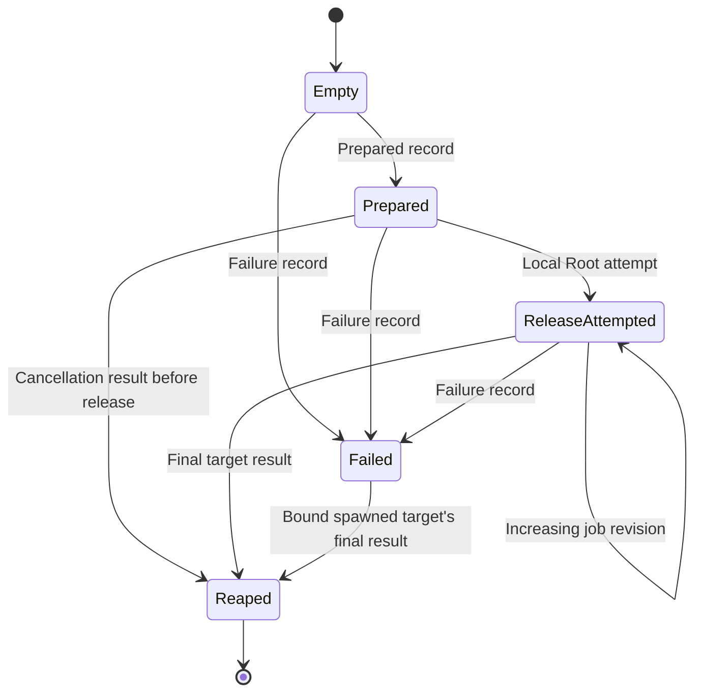

# Private command monitor status

The native codec defines the status stream for the [embedded command monitor](macos-command-monitor.md).
It grants no approval, authenticates no executable, and does not establish kernel process ownership.
The embedded monitor uses it. The product authority does not consume it yet.

The monitor must own the target's final wait result. Root must own the monitor's final wait result.
Root must register separate target exec and exit observations before releasing execution.
A valid status record cannot replace those observations or the required code and policy checks.

```mermaid
sequenceDiagram
    participant R as Root dispatch owner
    participant M as Protected monitor
    participant T as Target
    M->>T: Prepare target; retain exclusive wait ownership
    M-->>R: Prepared, target PID and optional birth timestamp
    R->>R: Register target kernel observations; perform final checks
    R->>R: Consume durable permit and local release attempt
    R->>M: One private release write
    M->>T: One target release attempt
    T-->>M: Stop, continue, final wait result
    M-->>R: Consecutive private status records
    R->>R: Combine status with independent kernel and monitor evidence
```

The status pipe must be inherited privately between verified Root and monitor components.
The target must not inherit that writer. Stdin, stdout, stderr and terminal output remain separate from status records.
The codec cannot enforce descriptor isolation; the native parent and embedded monitor must establish it.

## Version and layout

Every record contains exactly 64 bytes. Integers use network byte order, without native structure padding.
Unknown versions, tags, flags, nonzero reserved bytes, malformed fields, truncated records and excess bytes are rejected.
A failed decode clears the output record.

| Byte offset | Width | Field |
| --- | --- | --- |
| 0 | 4 | Magic `RMM1` |
| 4 | 4 | Private wire version, currently 1 |
| 8 | 4 | Record tag |
| 12 | 4 | Flags |
| 16 | 4 | Target PID; zero only for failure before spawn |
| 20 | 4 | Stop signal, final wait status, or failure errno |
| 24 | 4 | Raw stop code; zero for other records |
| 28 | 4 | Reserved; must be zero |
| 32 | 8 | Emitted record sequence |
| 40 | 8 | Observed job revision |
| 48 | 8 | Bound BSD birth seconds |
| 56 | 8 | Bound BSD birth microseconds |

| Tag | Required meaning |
| --- | --- |
| Prepared, 1 | The target is prepared. No target release or job state is claimed. |
| Job state, 2 | The target release was attempted. Report a stopped or continued state with a positive revision. |
| Target reaped, 3 | The monitor reports the original target's final wait status. |
| Failure, 4 | Report a positive errno. Retain any spawned target's cleanup responsibility. |

Flags represent stopped state, known tracing, traced state, known birth, and an attempted target release.
A traced flag requires known tracing and a stopped record. Continued and final records clear stop and tracing fields.
Raw stop codes permit `CLD_STOPPED` and `CLD_TRAPPED`; neither code proves a historical stop cause.
Unknown tracing remains unknown. The codec selects no frontend suspension behavior.

A known birth requires a positive PID, positive seconds, and microseconds below one million.
An unknown birth carries zero timestamps. Final wait statuses must encode an actual exit or a valid terminating signal.
A core-dump flag is permitted on signal termination. Stop statuses and noncanonical reserved status bits are rejected.

## Stream transitions

Initialize the consumer once for each fresh private channel. It accepts sequences starting at one and increasing by exactly one.
Duplicate, skipped, regressed and wrapped sequences fail without changing the consumer state.
Assign sequences when records enter the output stream. Coalesced job observations can skip revisions, but cannot skip emitted sequences.

The first record must be prepared or failure. Once a record binds a target, its PID and birth fields cannot change.
An unavailable birth cannot become known later on that channel. A later target requires a new execution owner and channel.

Root marks its local release attempt before writing the release byte, including when the write fails.
The marker requires prepared state and permits only one attempt. It does not replace durable consumption or final authority checks.
A monitor report cannot grant that marker. A target-release report requires a previous local Root attempt.

A Root write does not prove that the monitor received it or attempted the target gate.
Failure or exit records already queued before that write can still arrive without the target-release flag.
Once a report establishes the target-release flag, subsequent records cannot clear it.



Each job record requires a strictly increasing revision. A final record cannot regress the last observed revision.
Failure is sticky, blocks later job records, and retains its errno even when the target is subsequently reaped.
A failure before spawn cannot introduce a replacement target. A failure with a spawned target permits that target's final reap report.
No further record is accepted after reaping. Status EOF alone establishes neither execution nor a command outcome.

## Validation and remaining work

Focused native tests cover canonical encoding, record shapes, malformed bytes, replay, identity changes, release races and terminal transitions.
They use synthetic protocol records. They do not establish protected process behavior or cross-user execution.

The native parent must add bounded framing, partial-EOF handling, independent kernel observations, verified launch and owned cleanup.
The embedded monitor implements bounded status buffering, target ownership and private control handling.
The native Root parent and authority must connect those mechanics without granting authority from decoded records.
Frontend job control remains subject to [issue 250](https://github.com/rock3r/remozio/issues/250), including external debugger behavior.
Physical tests, the chosen elevation policy, and service installation remain separate gates.

## Private control records

Controls contain exactly 32 bytes in network byte order. They use a separate magic and the same explicit wire version.
The Root parent must verify the original caller before emitting a control. The inherited pipe does not authenticate external caller messages.

| Byte offset | Width | Field |
| --- | --- | --- |
| 0 | 4 | Magic `RMK1` |
| 4 | 4 | Private wire version, currently 1 |
| 8 | 4 | Signal tag 1 or cancel tag 2 |
| 12 | 4 | Valid signal number for signal; zero for cancel |
| 16 | 8 | Consecutive control sequence starting at one |
| 24 | 8 | Reserved; must be zero |

Controls carry no target PID, command bytes, release flag, or approval. Unknown versions, tags and reserved fields are rejected.
The monitor validates ordering on its private channel and retains the target through its exclusive native owner.
