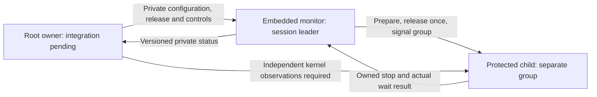
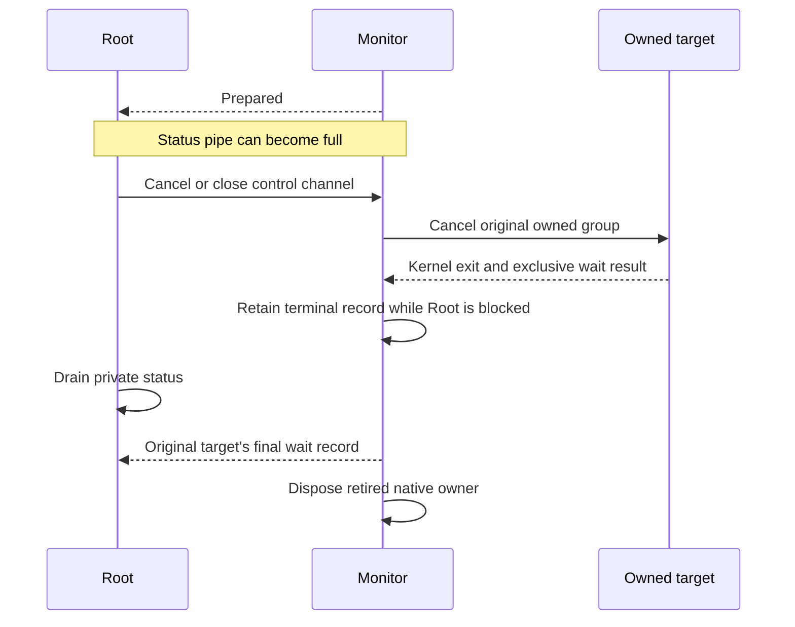

# Embedded command monitor

`RemozioCommandMonitor` is an embedded C helper. It owns one target through the existing native process API.
The authority does not launch this helper yet. The Root parent, policy selection and frontend connection remain required.

The helper accepts only `--monitor` and an absolute protected-child path. It requires real and effective UID zero before touching descriptors.
It also requires its own session and process group. The future Root parent must verify both helpers before launching this dedicated session.
The helper provides no public listener and accepts no command arguments through its process arguments or environment.

## Private descriptors and configuration

| Descriptor | Owner-supplied purpose |
| --- | --- |
| 0, 1, 2 | Borrowed command streams, or one owned terminal slave |
| 3 | Read the exact private child frame, followed by EOF |
| 4 | Retain the captured directory |
| 5 | Write private monitor status |
| 6 | Read Root's one release byte |
| 7 | Read ordered private controls |

Private pipe endpoints must have the expected access mode. The helper marks them nonblocking and close-on-exec.
It closes other inherited descriptors before creating target resources. Borrowed stream flags remain unchanged.
Live descriptor fields become invalid after closing. Later cleanup cannot close descriptors that the native owner has reused.
The target receives only its own native child mappings. The synthetic program checks that private monitor descriptors do not survive exec.

Configuration reads make bounded progress: at most sixteen chunks of 16 KiB per loop.
The frame decoder keeps the existing byte and entry limits. Exact EOF is required; extra bytes or incomplete EOF cause failure.
The original preparation budget starts when the monitor starts. Reading configuration or spawning the target does not reset that budget.
There is no executed-command runtime limit in the monitor loop.

PTY mode requires the same owned slave for all three streams. The monitor claims that terminal before spawning the target.
The native owner selects the target's foreground group before resuming preparation. The monitor ignores terminal output suspension for these operations.
Pipe mode keeps the supplied streams separate and does not claim them as a controlling terminal.
Root must retain and drain its private terminal master while the target exits. The monitor does not own that master.

## Release, controls and cancellation

The monitor reports prepared state before accepting Root's release byte.
Only byte one permits an attempt at the target's private gate. The attempt is consumed before the native call and cannot be retried.
The native owner still rechecks its own prepared state. A race can prevent a target release after Root has attempted its write.
The [status protocol](macos-command-monitor-protocol.md) preserves that distinction.

Control records use the same explicit private wire version. Every control has a consecutive sequence starting at one.
Signal records contain only a valid signal number. Cancel records contain no signal. Neither record contains a PID or approval.
Malformed versions, fields, partial EOF, or repeated sequences cause failure and owned cleanup.

Root release is processed before controls. A control cannot grant a target release.
A signal requires an attempted target release. It targets the original group only while the native owner retains the unreaped leader.
Cancel is accepted before configuration, during preparation, while stopped, and after execution begins.
A clean control EOF also requests cancellation. A clean release EOF cancels a prepared target without executing it.

Root must keep the monitor channel when an attached caller selects continued execution on disconnect.
Caller disconnect and loss of Root's private channel are different events. This helper cancels when Root's private channel ends.
It does not preserve command ownership through an authority crash or reconstruct a previous dispatch after restart.

## Status backpressure and exit ownership

The monitor retains at most one encoded status record while writing it.
Process observation and cancellation continue while that write is blocked. The latest job state can coalesce without growing an output queue.
Prepared, failure and final wait records are retained until sent or the status channel fails.
Sequences are assigned when a record enters this retained output slot. Coalescing skips job revisions, not emitted record sequences.

A failure keeps its first errno, prevents further release, and starts owned cancellation.
A preparation failure with a spawned target still retains the target's final wait result.
A broken status pipe does not skip target cleanup. Unexpected wait ownership loss remains a failure with no invented final wait result.
The monitor never signals a borrowed PID after reaping or ownership loss.

A monitor exit or valid status record alone is not an approved-program outcome.
Root must independently observe target exec and exit, own the monitor's actual wait result, and verify the installed code and authority transition.
The monitor never waits for a Root acknowledgment to reap its own target.

## Evidence and remaining gates

Twenty-two regressions compile the actual monitor source into an unprivileged test wrapper.
The wrapper substitutes only the UID guard; the synthetic child performs no credential changes. Neither fixture enters a product bundle.
They exercise exact streams, large-frame preparation, ordinary stops, owned terminals, suspend characters, ordered controls and cancellation.
They also cover malformed configuration, release and controls, preparation deadlines, launcher failures, backpressure and broken status channels.
Where preparation reaches Root, the driver independently observes target exec and exit and verifies that Root cannot wait for the target.
The backpressure regression establishes preparation before filling status. It observes target exit before draining that full pipe.

Packaging checks verify both Debug and Release helper identities, generation, hardened runtime, unchanged embedded bytes, and non-root refusal.
The refused helper preserves input and emits no command-stream output.

These results do not prove production Root launch, cross-user execution, external debugger behavior, nested foreground jobs, or frontend shell suspension.
[Issue 250](https://github.com/rock3r/remozio/issues/250) retains the debugger and frontend gates.
The native Root parent, authority dispatch connection, selected elevation policy, service installation and physical tests remain required.
