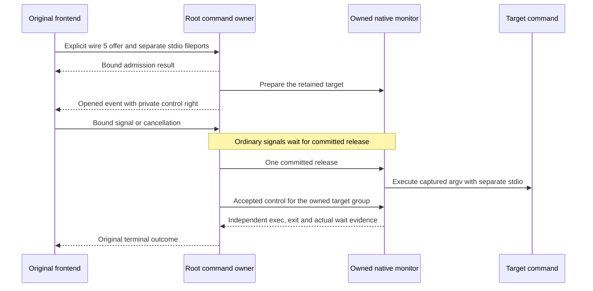

# Private controls for pipe commands

Local wire version 5 uses carrier 4 and preserves separate stdin, stdout and stderr fileports.
It adds a private signal and cancellation channel for the original admitted request.
It does not route pipe bytes through a PTY or change shared stream flags.

## Explicit compatibility

| Local wire | I/O contract | Control contract |
| --- | --- | --- |
| 3 | Separate stdio fileports | Original terminal result only |
| 4 | Private PTY stream with input credit | Signal, resize, cancellation and output acknowledgment |
| 5 | Separate stdio fileports | Signal and cancellation; no stream credit or output acknowledgment |

Both peers must offer wire 5 before selecting it.
The existing wire 3 and wire 4 declarations and frame meanings remain unchanged.
A caller that requires pipe controls can offer only `pipeExecutionControls`.
It must not silently fall back to a profile without those controls.

`CommandCallerReadiness.submitIO` accepts an explicit capability set.
Its default remains the existing wire 3 contract for existing callers.
PTY callers select `streamingExecution`; pipe callers can select `pipeExecutionControls`.
The same bounded readiness deadline and verified busy-state retry rules apply.
An admitted command has no readiness deadline or automatic execution retry.

## Bound channel

The opened event transfers exactly one private control right.
Its wire 5 payload is null. It grants no input credit.
The channel binds the Mac, account, profile, submission identifiers, submission digest and admitted request.
It authenticates the original retained process incarnation and enforces ordered sequences in each direction.

Wire 5 accepts only opened, signal and cancellation frames.
Input, input EOF, PTY output, output EOF, credit, resize and output acknowledgment frames are rejected.
The same four-message queue bounds apply. A full queue advances no sequence.
The sender retains and retries only the unsent control body.
It never retries admission, approval or execution from that control result.

## Native owner

Root opens the controls after the monitor prepares the retained target.
It does not release the target before the dispatch transaction and final checks succeed.
Up to four accepted signals can wait before release.
Root rechecks the original caller and current protected frontend policy before applying those signals.
Cancellation can retire a prepared target without executing it.

Controls act through the owned monitor, never through a caller-supplied PID or process group.
After release, a disconnected control channel follows the captured terminate or continue choice.
A closed channel cannot replace the approved invocation or its retained streams.
Pipe input and output keep their ordinary kernel behavior after disconnect.
This channel does not buffer or drain their bytes.

Root commits the native outcome before delivering the original terminal result.
Pipes need no PTY output EOF or output acknowledgment.
The frontend still rejects a program exit or signal result before its opened event.
An ordinary refusal or pre-start failure can arrive before controls open.
The existing PTY interruption marker remains invalid for wire 5.

## Validation limits

The complete local gate passed with 1,318 core tests and 97 Swift protocol tests.
The required Kotlin/Android tests, debug APK assembly and lint also passed.

Tests use actual anonymous Mach channels, fileports, copied descriptors and disposable target processes.
The monitor fixture substitutes only its UID guard; the launcher changes no credentials.
They do not activate an installed authority or grant production elevation.

The local host runs macOS 27.0.1. The build targets arm64 macOS 26.
These checks do not establish macOS 26 runtime behavior, protected service activation or cross-user policy.
The packaged frontend, terminal restoration and job-state events remain required.
Physical end-to-end checks stay in the interactive handoff.
