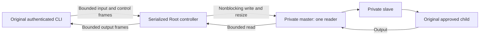

# Private command terminal

The command controller can own a fresh private PTY without exposing its master descriptor.
Its slave belongs only to the spawned command. No real user terminal is attached or changed by this owner.

The diagram shows the required complete integration. This PR implements the private terminal owner and native mechanics.
The authenticated stream and control carrier, CLI forwarding and controller activation still need integration.
The existing dispatcher retains its pipe guard until that complete channel is available.

## Ownership and bounded operations

Both descriptors have close-on-exec protection. Only the private master has nonblocking status.
The child retains blocking slave streams. Original stdin, stdout and stderr flags remain unchanged.
The controller borrows the slave while spawning, then seals its own slave descriptor.
The actual child owns separate copies; retaining a parent copy would hide stream EOF.

Each read and write handles at most 64 KiB. A waiting read and a zero-progress write are ordinary backpressure.
Short writes retain the unsent input suffix in the caller. A bounded transport buffer must keep it for the next opportunity.
Resize affects only the private slave and permits native unknown zero dimensions.
Copied terminal attributes and initial size apply only to that private terminal.

Only one owner reads the master. A full outbound buffer pauses reading and applies normal terminal backpressure.
Use bounded pump invocations and disable blocked read interests. A readable master must not cause a busy retry loop on a full transport queue.
The journal lock must never enclose blocking reads or writes to the original user's streams.

## Completion and lifetime

Stream EOF establishes no child execution or exit result. Those results still require the original native process owner.
Keep draining during cancellation and after the child exits. Retire transport buffers before declaring the output complete.
Closing the master early can hang up the slave. Keep it through child supervision and output drain.
The captured continue choice must retain a drain path after CLI loss. It cannot silently close the master or impose a command runtime limit.

## Evidence and activation gates

The unit tests cover binary bytes, unchanged original stream flags, blocking slave flags, chunk limits, backpressure, resize and stream retirement.
Actual native child tests verify a private controlling terminal, a sealed parent slave and drain before disposal.
They also match 1 MiB of binary output and drain group cancellation through EOF and actual reaping.

Disposable experiments separately passed 20 trials each for direct forwarding, master fileport import and a bounded Mach relay.
The relay used one queue slot, zero-timeout sends and a 32 KiB pending buffer with a slow receiver.
Queue timeouts retained the unsent bytes. The fileport experiment also confirmed shared file-status flags.
Those same-task experiments do not establish authenticated cross-process handoff or a production wire contract.

The checks use unprivileged fixtures on macOS 27.0.1 with a macOS 26 ARM64 compiler target.
Actual macOS 26 runtime, privileged allocation, CLI restoration and physical terminal checks remain platform gates.
No service or device was activated. The complete frontend, authenticated carrier and protected controller integration remain required.
