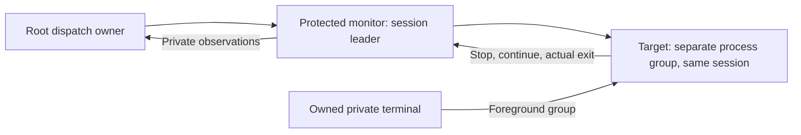
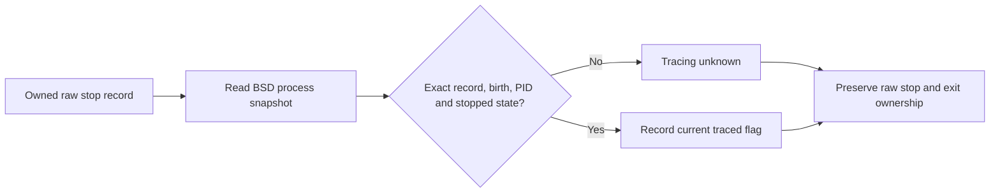

# Native command process owner

The native owner prepares the embedded command child through public `posix_spawn` and private pipes.
It preserves captured bytes and observes real process events. These mechanics grant no dispatch permission.
The authority service does not call this API yet.

```mermaid
sequenceDiagram
    participant R as Serialized Root dispatch owner
    participant N as Native process owner
    participant C as Signed command child
    R->>N: Verified protected launcher, exact frame, borrowed streams and directory
    N->>C: Spawn suspended with isolated descriptors and clean environment
    N->>N: Register kernel exec and exit observation
    N->>C: Resume preparation; pump bounded frame; close its writer
    C-->>N: Exact private prepared status
    N-->>R: Prepared observation, no dispatch permission
    R->>R: Durable permit, current policy and final capture checks
    R->>N: One release attempt
    N->>C: Private release byte
    C->>C: execve exact approved invocation
    N->>N: Observe NOTE_EXEC, then NOTE_EXIT and owned waitpid result
    N-->>R: Process observations for bound terminal reporting
```

## Resources and startup

The factory validates and copies the bounded private frame before spawning.
It borrows stdin, stdout, stderr and the retained directory without reading, writing or changing their shared flags.
Owned duplicates start at descriptor 128 before mapping to child descriptors 0–6. This avoids source/destination collisions.
Each raw pipe endpoint receives `FD_CLOEXEC` immediately after that pipe is created.
Raw child endpoints close as soon as their owned duplicates exist, before spawn setup.
Only the explicit mappings survive `POSIX_SPAWN_CLOEXEC_DEFAULT`.
Darwin's public `pipe` API does not atomically set close-on-exec. The host must use close-on-exec defaults for every concurrent launch.
This avoids inheritance during the short interval between pipe creation and descriptor marking.
The legacy launcher receives only its path and `--execute`, with an empty environment.
The approved raw argv and deterministic environment travel through the private frame.

Startup resets the child's signal mask and dispositions.
Pipe mode creates a new process group. PTY mode creates a new session instead.
The child starts suspended. Kernel process observation is installed before it resumes or receives configuration.
The parent changes nonblocking flags only on private endpoints.
Private writes use descriptor-local `F_SETNOSIGPIPE`; they do not change the parent signal mask or handlers.

The caller must serialize this opaque owner and be its exclusive `waitpid` owner.
The factory rejects automatic child-reaping configurations before spawning.
A failure after a successful spawn still returns the owned object. The caller must retire that object too.
No polling or cleanup method waits for a child exit.

## Dedicated monitor session

The additive `spawn_in_session` API prepares a target inside a dedicated monitor's session.
The [embedded monitor](macos-command-monitor.md) now uses this session API. Its Root parent and authority dispatch API are connected. The protected host service remains pending.
The [private monitor status protocol](macos-command-monitor-protocol.md) defines records and stream transitions for that connection.
The monitor must be both the session leader and its process-group leader. An ordinary caller is rejected before spawn.
The target receives its own process group. Its live parent stays in the same session, preserving ordinary job-control stops.
The legacy `spawn` API keeps its existing session behavior.



In PTY mode, the monitor must own the supplied controlling terminal and initially own its foreground group.
The native owner registers kernel observations and selects the target foreground group before resuming preparation.
A failed handoff still returns any spawned child. The monitor retains responsibility for its cancellation and reaping.
The native API does not restore the foreground group, drain output, or manage the monitor's terminal signal dispositions.
The dedicated monitor must handle those operations and retain its terminal through target cleanup.
Pipe mode preserves separate borrowed streams; it does not attach them as a controlling terminal.

This path selects the protected child's `--execute-in-session` mode. Its root requirement remains unchanged.
The child validates its inherited session and separate group. PTY mode verifies the existing controlling terminal instead of claiming it again.
The private frame, preparation deadline, one release attempt, and exclusive exit owner remain unchanged.

Six regressions use disposable session owners and a synthetic launcher.
They cover pipe input, direct suspend, the terminal suspend character, stopped cancellation, and two rejected caller contexts.
The targets stop while their session owners keep running. Resume and cancellation preserve actual exit ownership.
The tests retain unread stdin and shared descriptor flags. Packaging checks exercise both modes' non-root refusal.
These results do not prove protected monitor integration, debugger classification, cross-user execution, or frontend shell suspension.

## Bounded preparation and release

Each poll writes at most sixteen configuration chunks of 16 KiB and reads at most four status chunks.
A full pipe yields to the owner. The configuration writer closes after the exact frame and its owned copy is wiped.
The sleep-inclusive preparation deadline does not limit an executed command's runtime.
A stalled preparation, broken pipe or malformed status prevents release.

Status records require the exact magic, tag and errno contract from [the child specification](macos-command-child.md).
Prepared must follow completed configuration. Duplicate prepared records, repeated failures, unknown tags and partial EOF fail.
A status EOF alone never proves exec or exit.

Release requires a live, configured, prepared child with no fault or reported preparation failure.
The release attempt is consumed before its one-byte write. A failed or interrupted write cannot be retried.
This single attempt is a process guard, not a replacement for durable authority consumption.
The Root integration must verify the installed code, current elevation policy and original capture immediately before this call.
No receipt, snapshot, caller-supplied PID or Boolean authorizes it.

## Exit, signals and ownership

The native owner records kernel `NOTE_EXEC` and `NOTE_EXIT` before reading its child's wait status.
An exit from the launcher without a later exec cannot become an approved-program exit status.
The future bound terminal controller must require both actual exec evidence and a reaped result for a program outcome.
It must preserve unknown when evidence is unavailable.

Each poll consumes at most four owned stop or continue records through nonblocking `waitid`.
It requests `WSTOPPED` and `WCONTINUED`, never `WEXITED`. The existing `waitpid` owner still consumes the final exit result.
The observation includes the latest stop state, stop signal, kernel stop code and a revision for observed changes.
The stop code is raw kernel evidence, not a debugger classification. Darwin can report debugger stops as `CLD_STOPPED`.
A frontend must establish separate tracing state before mapping an observed stop to shell suspension.
[Issue 250](https://github.com/rock3r/remozio/issues/250) tracks this required monitor integration gate.
It must not infer a trap distinction from `stop_code` or forward a debugger trap as a shell suspension.
The observation also reports `stop_tracing_known` and `stop_traced` from a separate stopped-process snapshot.
The native owner records the child's public BSD birth timestamp while it is still suspended, before preparation resumes.
The stop snapshot must match that timestamp and PID, return the complete structure, remain stopped, and exclude exit in progress.
A missing initial timestamp or failed, partial, mismatched, running, or exiting snapshot keeps tracing unknown.
Metadata failure does not fail execution or change the raw stop record. Continue, reap, and ownership loss clear these fields.



This is a current tracing snapshot, not proof of the historical stop cause.
It does not authorize forwarding a trap as a shell suspension. Monitor and frontend consumers still need explicit classification behavior.
Self-trace tests do not prove external debugger attachment or detach behavior.
[Apple's attach/detach implementation](https://github.com/apple-oss-distributions/xnu/blob/main/bsd/kern/mach_process.c) can change the wait parent; the existing permanent `ECHILD` disposition needs integration validation.
The unprivileged sibling-attach fixture was refused with `EPERM`; it did not establish that behavior.
Issue 250 remains open for these monitor and frontend gates.

The revision does not count every transition that the kernel can coalesce.
The `P_PID` selector binds continued records to the owned child. Darwin can report the signal sender in their `si_pid`.
Stop and trap records still require the owned child PID. An unchanged zeroed record represents no event.
Repeated polls without an event keep the revision unchanged. Reaping or ownership loss clears the stop state.
Preparation can itself produce a continued event because the launcher starts suspended. Consumers use relative revisions.
These observations do not change session ownership or provide frontend job control by themselves.

Signals target the process group only while the original leader remains owned and unreaped.
Zero, invalid signals and a reaped or lost leader are rejected.
An unexpected `ECHILD` retires PID ownership and prevents later signaling or reaping through that object.
It is an ownership failure, not a known command result.

Cancellation signals the owned group before closing the configuration and release pipes and wiping the frame.
This order avoids retiring a prepared launcher before the signal reaches its group.
If Darwin returns `EPERM`, one nonblocking poll can confirm that the owned child has exited and been reaped.
The fallback also makes one nonblocking wait for the exclusively owned child when an exit event is not yet available.
If the wait is not ready, a kernel snapshot can confirm that the same owned child is already exiting.
That snapshot must match its PID, parent and retained birth identity, and contain `P_WEXIT`. Missing or mismatched evidence retains the permission error.
This exception records no exec, exit event or wait result. The owner must still observe and reap the actual child before disposal.
A live child retains the permission error and its process ownership. No delay or runtime limit is added.
Neither cancellation path releases an unapproved command.
Disposal returns `EBUSY` while the leader remains unreaped. The caller retains ownership and polls again.
No hidden reaper thread or blocking destructor takes that responsibility.

Apple's [signal source](https://github.com/apple-oss-distributions/xnu/blob/main/bsd/kern/kern_sig.c) excludes zombies during group iteration and can return `EPERM` when no member is selected.
Its [snapshot source](https://github.com/apple-oss-distributions/xnu/blob/main/bsd/kern/kern_sysctl.c) maps the kernel exit flag to `P_WEXIT`.
A local PTY cancellation trace observed this interval before the target became waitable. It used only disposable unprivileged processes.

## PTY integration

PTY callers supply a private slave for all three command streams.
The native owner creates the session; the child attaches that slave as its controlling terminal.
The caller must drain the master while the program runs and exits.
An experiment found that waiting for exit before reading queued terminal output can leave a Darwin child in its exit path.
Draining the master allowed the same child to finish and produced its exact exit status.
Cancellation must also manage the owned master and forwarding operations; a signal alone cannot promise instant terminal cleanup.

This API does not allocate a PTY, forward its streams, set its terminal size or authenticate caller control messages.
Those integrations remain required. It does not steal a real user's controlling terminal.

## Evidence and remaining integration

Native tests use an unprivileged synthetic launcher and an actual executable fixture.
They cover unread stdin, raw argv/environment, retained directory, descriptor isolation, private release, real exit/signal results and group forwarding.
They also cover large frames, deadlines, malformed status, failed release writes, cancellation and unexpected external reaping.
A disposable PTY test verifies the new session, controlling slave, foreground group, output and observed program exit.
Cancellation regressions cover a retired preparation helper, ordinary prepared cancellation and a live permission failure.
They verify actual child reaping and preserve unread stdin bytes and shared descriptor flags.
The retired-helper regressions use real kernel exits. Fault wrappers inject permission failures, delay observation or reaping, and mutate snapshot fields.
They reject the wrong PID, parent, birth, absent exit flag and missing snapshot without inventing a terminal result.
The live permission failure still returns `EPERM` and retains the live child.
Four job-state regressions check actual stop/continue events, synchronous `sigwait`, cancellation while stopped and unexpected external reaping.
They check stable revisions, retained exit ownership, cleared stop state, unread stdin and unchanged descriptor flags.
Twelve tracing regressions cover ordinary stops, self-traced stops and traps, and unavailable or mismatched metadata.
They verify stable revisions, unread stdin, shared flags, birth binding, actual final exit, and cleared metadata.
Metadata-fault cases inject only the query response; stop and exit records remain real kernel events.
External debugger attachment, protected monitor integration and frontend shell suspension remain unproven.
The fixture never enters a product bundle, changes credentials or installs a service.

Protected launcher validation, durable dispatch ownership, bound terminal results and current elevation-policy selection remain separate gates.
The product authority has no command executor connection yet.
Full PTY forwarding, terminal resize, CLI control and physical end-to-end validation also remain open.
