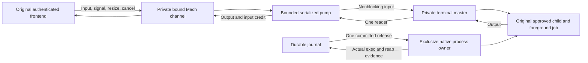

# Connected command terminal

Wire 4 now connects the authenticated command stream to a private PTY and the retained native execution owner.
The journal still commits dispatch before the one release attempt. Stream messages grant no execution authority.



## Two completion paths

Native completion and output consumption are separate facts. The owner retains each fact until both permit cleanup.

```mermaid
sequenceDiagram
    participant N as Native process owner
    participant J as Journal
    participant P as PTY pump
    participant F as Original frontend
    N-->>J: Actual reaped outcome
    J->>J: Commit outcome once; retain the result
    Note over J,P: Keep the IO owner while output drains
    P-->>F: Remaining ordered output
    P-->>F: Output EOF
    F->>P: Acknowledge consumed output
    J-->>F: One original terminal outcome attempt
    J->>N: Dispose the finished native owner
    J->>P: Close the private PTY and rights
```

A slow frontend cannot defer or repeat the durable native transition. PTY EOF cannot establish program execution, exit, or success.
The final terminal reply follows output EOF and the authenticated acknowledgment while the frontend remains connected.

A failed outcome commit latches Unknown. Output must still drain before that reply.
The retained owner retries only the durable Unknown transition after storage recovers. It never retries execution or sends a second result.

## Buffers and original streams

The pump retains at most 32768 input bytes and one 4096-byte output chunk. Each private Mach queue holds at most four messages.
Every turn handles at most four controls and four native IO steps. All native IO and Mach sends are nonblocking.

Successful native writes restore only the corresponding input credit. Partial writes keep a bounded copy of the unsent suffix.
A full outbound queue retains the same output chunk and sequence. Reading pauses until that chunk can be queued.
Pending credit is queued before output EOF, which ends the output sequence.

The controller copies initial terminal attributes and size from original stdin when it is a terminal.
It spawns through the fresh private slave, then closes its own slave copy. Original stream flags and terminal attributes remain unchanged.
The private master never leaves its opaque owner. Only the child receives the slave descriptors.

Wire 3 pipes remain supported. Wire 4 pipes and legacy PTY combinations still fail before spawning.
The product frontend must select the matching profile and restore its own terminal after every exit.

## Controls and disconnect

Each control requires the original request binding, sequence, kernel caller identity, and current protected code policy.
Closing all control send rights counts as disconnect even while the original process remains alive.
Queued valid controls are consumed before the kernel's no-senders state retires the channel.

Before release succeeds, the pump retains bounded input and at most four signal controls. It writes no input or EOF to the prepared helper.
After the committed release succeeds, the controller applies retained signals in order after fresh caller and policy checks.
Cancellation before release clears those signals and retires preparation. A failed release never flushes input or retained signals.

Signals use the private terminal's current foreground group through `TIOCSIG`.
Cancellation signals that foreground group and cancels the exclusively owned initial process group.
Controls cannot signal a recycled process group after the native owner reports reaping or ownership loss.
Resize changes only the private terminal and lets the kernel notify its foreground job.
Normal terminal signal flushing follows the application's current `NOFLSH` setting. The controller does not rewrite that setting.

Logical input EOF ends further input frames. In canonical mode, two current enabled `VEOF` characters flush a partial line and end a read.
Raw mode has no general input half-close. The pump invents no raw bytes, changes no application modes, and keeps output open.
Each EOF retry reads the current mode and enabled character again. It retains only the number of unsent characters.
Zero or partial writes cannot retain a stale EOF byte across mode changes. The pump imposes no command runtime limit.

Before release, disconnect cancels preparation. After release, the captured disconnect choice applies:

| Choice | Native behavior | Output behavior |
| --- | --- | --- |
| Terminate | Cancel the owned command | Drain remaining private output through native cleanup |
| Continue running | Keep the original command supervised | Flush accepted bounded input; drain and discard output |

A detached continuing command cannot block behind the lost frontend's output queue.
The existing active-command capacity includes owners awaiting output acknowledgment. No unbounded list of retained pumps is added.

## Evidence and remaining gates

Actual Mach and native fixture tests cover exact full-duplex bytes, queue saturation, canonical EOF, foreground signals, resize, and cancellation.
They also cover a live process closing its controls, selected continuation, delayed output acknowledgment, and ordinary or checkpointed journal failure.
Native regressions retain a prepared helper through an early terminating signal and early terminal interrupt input.
The EOF regression uses actual terminal mode changes and controlled zero or partial write results.

The bulk fixture validates 128 KiB of input, echoes it, and writes a further 1 MiB pattern. The slow one-slot receiver checks every output byte.
The continuation fixture closes controls, drains 1 MiB, writes one completion marker, and returns the actual exit result.
Finite fixture deadlines bound tests only. They add no production runtime limit.

[Lifecycle experiment evidence](experiments/evidence/2026-10-09-command-pty-lifecycle.json) retains 80 disposable native trials.
Ten leader-exit trials found immediate terminal EOF even with a descendant retaining its slave. Later descendant writes failed with EIO.
Thirty EOF trials distinguish canonical input from ordinary raw bytes. Forty foreground trials verify signaling through the private terminal, including opaque ownership.

Measurements used unprivileged fixtures on macOS 27.0.1 with the macOS 26 ARM64 build target.
The internal fixture policy seam supplies test identities. It proves no installed Root or cross-user deployment.
Actual macOS 26 runtime, protected service installation, production elevation policy, frontend restoration, and physical terminal tests remain gates.
No user terminal, firewall rule, installed service, or device was changed by these checks.

The complete repository gate passed 1192 core tests and 97 Swift protocol tests, plus Python, packaging, experiment, and ownership checks.
The required Kotlin/Android tasks passed with JDK 21 and SDK 37. The wrapper records the required test, APK, and lint results.
