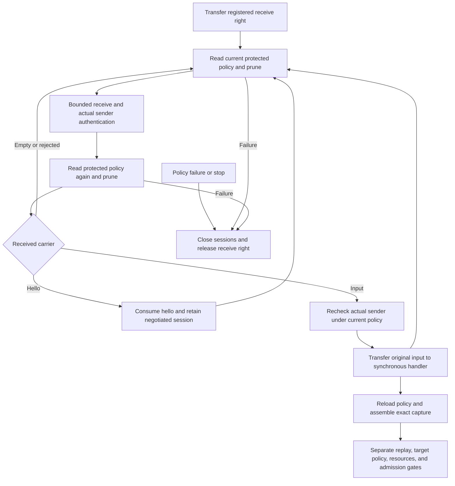

# Command receive host

`CommandReceiveHost` owns one actual Mach receive right and one bounded command session registry.
It serves one trusted Mac, account, UID, and optional audit session. It registers no service.
The host is not Sendable. One serial caller owns its methods and receive loop.
Only the independent `stop` signal can be used from another thread.

## Protected policy

Product construction takes an existing `AuthorityJournal` and the configured local scope.
Each policy read requires UID zero, validates the current running authority role, and checks journal scope.
The host then derives the frontend requirement from the protected role, code hash, and security floor.
It accepts no public arbitrary requirement or peer-provided role metadata.
An internal fixture seam uses disposable ports and explicit test policies.

Every receive turn reloads policy before waiting and after receipt or rejection.
The second read prevents a cached pre-wait policy from admitting a hello after a changed role.
Assembly reads policy again before routing the submission to its retained session.
A failed read stops the host and clears its sessions. It does not reuse a cached snapshot.
A frontend update that changes its role revision retires old sessions; a fresh hello can negotiate a new one.

Idle turns prune exited or changed callers. Rejected traffic also drives pruning, so it cannot starve maintenance.
`receiveWaitMilliseconds` and `replyTimeoutMilliseconds` are checked configuration, each from 1 to 60,000 milliseconds.
They bound receive and hello reply work. They are not approval deadlines.
Stopping during a hello reply can wait for its configured send timeout.

## Serial loop and input ownership

`poll(handleInput:)` performs one receive turn and returns only Sendable receipt metadata.
`run(handleInput:)` drives the same turns until stop or an escaping error.
The input handler is synchronous and consumes a fresh receipt through a Swift `sending` parameter.
It may call `assemble`, but it must not call `poll` or reenter `run`.
Receive work finishes before the handler starts; there is never a second port consumer.

The metadata includes Idle, accepted hello profile, Input handled, or a local rejection category.
Input handled means the handler received ownership. It does not claim admission, approval, or execution.
The input payload remains untrusted. Assembly matches its claimed binding against the actual retained frontend incarnation.
The handler must own cleanup and catch request-local rejection that should leave the host usable.
An escaping handler error retires this lifetime. No ambiguous failure grants permission to retry a command.

Malformed packets, wrong senders, unsupported negotiation, capacity rejection, and reply send failure leave unrelated sessions usable.
An ordinary Mach right in place of an input fileport is malformed. It still drives a fresh policy read.
Other descriptor import failures remain fatal. An invalid protected policy or fatal receive error retires the host.
A refused duplicate or reentrant assembly cannot close input already owned by another capture.
Closing the host does not close captures transferred to the journal or another request owner.

## Stop and receive right

Construction transfers the receive right on success and on configuration failure after verifying the actual right.
The caller must not retain another consumer, destroy the borrowed name, or reuse the transferred right.
The host releases only its receive right. Other rights in the caller's namespace remain the caller's responsibility.

`stop.requestStop()` sets a locked signal without destroying resources on the signaling thread.
The serial owner observes it during receive turns and capture cancellation checks, then disposes its resources.
A stop before the first work call also disposes the receive right when that call observes the signal.
`close()` signals first and disposes immediately when idle. Reentrant close defers disposal until active work returns.
Closing and deinitialization are idempotent. A stopped host cannot reopen; recovery needs a new protected lifetime.

## Evidence and remaining work

Disposable Mach fixtures cover mixed receipt handling, capacity, incompatible and malformed hellos, full reply queues,
policy failure before and after receipt, idle and invalid-traffic pruning, unread input, reentry, cancellation, and receive-right disposal.
A non-fileport input leaves existing sessions and the run loop usable. Its carried right is released without leaking a reference.
A fixture transfers a captured command into the journal and proves that host retirement preserves the queued request's objects.
Committed cancellation then releases those objects.
External compiler probes cover public poll/run, capture assembly, and journal transfer. Receipt and capture reuse are rejected.

These tests do not prove protected launchd registration, Developer ID Root deployment, or physical-device behavior.
The app does not start this host. Installation must establish and transfer its dedicated registered receive right.
Durable submission replay reservation, target policy, resource budgets, authenticated no-admission replies, dispatch permits,
and complete process I/O remain prerequisites for a production command endpoint.
The existing phone-transport XPC listener is not the command frontend listener.
