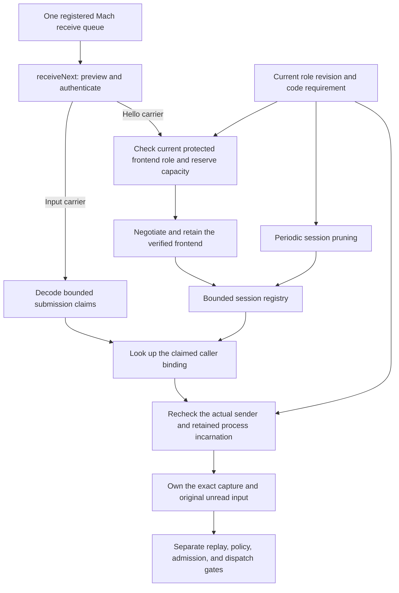

# Command session registry

`CommandSessionRegistry` owns verified frontend sessions for one trusted local account.
The host configures its Mac ID, account ID, UID, optional audit session, and maximum retained sessions.
The account identity comes from local configuration and kernel credentials. A submitted label cannot select it.

## One receive owner

`MachCommandCallerReceiver.receiveNext` selects the carrier from the actual queue preview.
It routes only a hello or an original-input submission. Legacy submission and hello-reply carriers are rejected on this listener.
Both routes use the existing sender authentication, receipt-token match, descriptor validation, and cleanup path.
The hello limit stays at 4 KiB even when the command limit is larger.

The host must serialize its sole receive consumer. Do not alternate separate consumers on the same port.
This change does not register a launchd listener or widen the configured UID policy.
A future host for multiple accounts must resolve their trusted context from actual kernel identity.

## Session and capture ownership

The registry reserves capacity before sending an accepted profile. It returns immutable profile metadata and exposes no mutable session handle.
Capacity rejection closes the incoming hello and sends no accepted profile. Existing sessions keep their slots.
It is not an authenticated command rejection or proof that an earlier submission may be retried.

Capture assembly uses the decoded caller binding only to select a candidate session.
The retained session rechecks both actual process identities before accepting the binding and constructing the capture.
Submission schema support remains explicit. An unsupported schema cannot select an automatic downgrade.
Neither routing nor assembly reads stdin.

The public hello and input APIs use Swift `sending` parameters.
Copies of an input receipt share one capture-ownership claim. A repeated transfer cannot close an earlier capture's objects.
Callback reentry rejects the same active input without closing it. A separate rejected receipt releases only its own objects.
Closing the registry during an assembly callback cancels that assembly and retires its sessions.

## Current policy and retirement

Each public operation takes the host's fresh `AuthorityCodePolicySnapshot`.
The registry requires an active command frontend entry and its retained role revision.
It builds the Developer ID peer requirement from the current protected identity, hash, and installed security floor.
It does not accept a peer-supplied role, code hash, or revision.

A changed frontend role revision retires its sessions. An unrelated role revision does not replace this token.
Periodic pruning rechecks retained kernel identities and removes exited or exec-changed processes.
A missing or inactive frontend policy clears the retained sessions.
If reading protected policy fails before an operation, the host must close the registry instead of reusing a cached snapshot.
The host can retire a binding explicitly, and closing or destroying the registry clears all sessions.
A new registry starts empty. A remembered binding cannot recreate a session after restart.

Session retirement prevents new capture assembly. It does not close independent captures already owned by requests.
Those requests retain their existing lifecycle and must recheck current execution policy at dispatch.
The registry imposes no approval deadline. Its checked session limit is a host setting, not a phone request lifetime.

## Evidence and remaining work

Real Mach tests route interleaved hello and input messages on one queue and reject other carriers, oversized controls, malformed descriptors, and wrong senders.
They inspect right cleanup, full-capacity behavior, unread pipe bytes, copied-binding rejection, repeated ownership transfer, and callback reentry.
Disposable signed processes prove retirement after exec and exit while another session stays usable.
Compiler probes accept valid public registry transfers and reject direct and alias reuse afterward.

These fixtures use disposable ports and explicit test policies under the test user's UID.
They do not prove a protected Developer ID Root deployment or physical-device end-to-end behavior.
The host still must install and register the listener, supply fresh protected policy, enforce its serial lifetime, and call pruning while idle.
Durable submission replay reservation, authenticated no-admission results, elevation policy, resource budgets, dispatch, and process I/O remain required.
This registry creates no phone request and executes no approved command.
