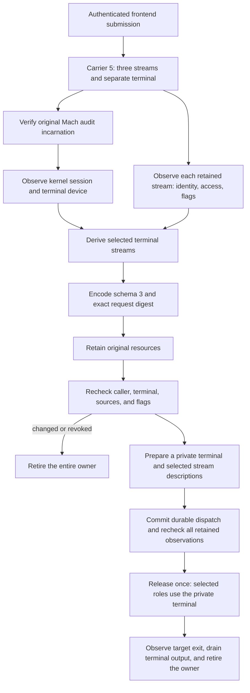

# Retained command stream layouts

Schema 3 records each original stream and the original caller terminal separately.
Root derives the routing mask from retained kernel objects before encoding approval bytes.
Capture and native mapped execution support all eight masks. Android inspection and production frontend integration remain separate gates.

## Separate transport contract

The internal carrier uses message ID `0x524d040c` and version 5.
It keeps six Mach port descriptors in this order:

| Index | Object |
| --- | --- |
| 0 | Original stdin fileport |
| 1 | Original stdout fileport |
| 2 | Original stderr fileport |
| 3 | Separate caller terminal fileport, or `MACH_PORT_NULL` |
| 4 | Admission reply right |
| 5 | Terminal-result reply right |

The payload prefix remains the big-endian version and byte count, followed by bounded submission bytes.
Only descriptor 3 permits a null port. All other descriptors remain required send rights.
Carrier 4 retains its five descriptors, message ID, and version unchanged.

The sender binds `/dev/tty` to a physical terminal object before creating a fileport.
The receiver rejects a raw terminal alias, event-only descriptors, and invalid stream access modes.
A supplied terminal is still untrusted until Root compares it with the original caller context.
Malformed submissions retire their imported resources. The receiver can process the next submission.

## Kernel context and stream observations

Root samples the original audit incarnation before, between, and after two kernel context observations.
The context includes the process start time, session ID, terminal presence, and terminal device.
A changed incarnation, exited process, inconsistent sample, or changed context fails the check.
A revoked terminal can retain the kernel control-terminal flag while its device becomes absent.
Root treats that state as terminal loss.

Each stream observation records its retained file identity, access mode, and four portable semantic flags.
The flags are append, nonblocking, asynchronous IO, and synchronous IO.
Observation reads no stream bytes and changes no stream flags or terminal attributes.
An available path is descriptive. Root does not reopen it to obtain authority.
Null sources retain access and flag observations but expose no source identity or path.
Kernel write-history flags are not portable routing semantics.

For PTY mode, Root compares the separate terminal with the original caller's kernel session and device.
Each selected stream must also match that terminal's retained file identity, device, and session.
Unrelated terminals remain unselected streams. Files, pipes, sockets, and other sources also remain unselected.
The mask uses stdin bit 1, stdout bit 2, and stderr bit 4.

| Caller context | Capture result |
| --- | --- |
| Caller terminal and matching stdio | Select only the matching stream bits |
| Caller terminal with all stdio redirected | Keep the separate terminal and mask 0 |
| No caller terminal | Require no separate terminal and mask 0 |
| Pipes mode | Require no separate terminal and mask 0 |
| Foreign terminal offered as caller terminal | Reject the capture |

Mask 0 keeps every stdio role direct. PTY mode still provides a private command terminal for `/dev/tty`.
A layout is an observation and routing contract. It grants no process, signal, wait, or execution authority.

## Ownership and rechecks

Construction claims the received submission once and owns the imported stream descriptors and reply rights.
Copies cannot claim or retire resources that another owner has claimed.
Failed construction, explicit close, and failed rechecks close the imported resources together.
Caller-owned originals remain open.

The capture and execution resource owners retain the same stream observations and original audit context.
Rechecks compare source identities, access modes, portable flags, session, and terminal presence/device.
A semantic flag change or terminal revocation invalidates the retained capture.
Rechecks do not restore the caller's flags or terminal state.
The current caller signing policy remains an independent requirement before and after the context check.

## Explicit mapped execution profiles

The internal handshake adds wire version 8 for mapped PTY execution and version 9 for direct streams with controls.
Both require submission schema 1, carrier 5, capture schema 3, and explicit offers.
Version 8 accepts PTY mode. Version 9 accepts pipes mode.
Both retain authenticated controls and native target job observations.
Existing profile declarations and default offers remain unchanged.
The legacy client API rejects mapped profiles. `submitMapped` requires their separate descriptor carrier.

For PTY execution, Root copies attributes and size from the separate caller terminal when one exists.
Root creates a private terminal even when the routing mask is zero.
Each selected role receives an independent private slave description with its captured access mode and portable flags.
Unselected roles keep their original retained descriptors.
Root obtains the private slave path from its owned descriptor and rechecks the opened object's identity.
It changes only the new description's flags. It does not reopen a caller-supplied stream path.
All temporary descriptions close after the bounded spawn callback, including partial failure and thrown callbacks.

The private child frame uses version 2 for mapped PTY mode and includes the routing mask.
Root passes its private control terminal separately from the three streams.
The monitor retains that terminal until actual target cleanup, including mask zero.
Pipes mode keeps the existing direct-stream frame.
Preparation reads no command input. The durable dispatch path rechecks retained context and stream observations before release.
A changed stream flag prevents release even after the dispatch commit. Root does not restore the caller's changed flags.

## Evidence and remaining gates

[PR 267's macOS 26 CI run](https://github.com/rock3r/remozio/actions/runs/38014309124/job/114101093008)
proves the kernel-context and capture paths on macOS 26.6.2, build 25G83, arm64, using SDK 26.5.
Its 1,370 core tests cover actual Mach messages, imported fileports, all eight masks, and malformed raw terminal aliases.
They preserve queued input and terminal attributes during capture.
They check unrelated terminals, terminal replacement, wrong audit identity, caller exit, ownership, and resource retirement.
A private caller revokes its own terminal with masks zero and seven. Fresh observations invalidate the retained capture.

Swift and Kotlin share 39 valid and 75 invalid schema 3 fixtures.
They retain exact legacy bytes and reject malformed nested layouts.
Signed phone-session tests bind routing to the issued request and reject changed layouts under the original signature.
These tests prove parsing and authentication, not the Android inspection UI.

Mapped execution tests pass locally on macOS 27.0.1 and in [macOS 26 CI](https://github.com/rock3r/remozio/actions/runs/38018582425/job/114114369697).
They exercise authenticated submission, schema-3 phone approval, the journal dispatch commit, and actual native targets with all eight masks.
The private launcher grants no privilege. Its monitor fixture substitutes only the Root UID guard.
Targets check selected stream identities and access, direct streams, their private controlling terminal, and descriptor cleanup.
Separate tests preserve binary redirected input, separate outputs, and portable stream flags under profiles eight and nine.
They check terminal drain acknowledgment with no caller terminal and prevent replay after cleanup.
Native copy tests cover all three access modes and all 16 portable flag combinations without changing the private control description.

The CI run uses macOS 26.6.2, build 25G83, arm64. All 1,384 core tests pass, including both real mapped handshakes.
The Android app still advertises capture schemas 1 and 2. It must show the complete layout before advertising schema 3.
Production frontend integration must use the separate caller terminal for interactive traffic and preserve redirected stdin.
Installed Root deployment, elevation policy, and physical-device tests remain unperformed.
