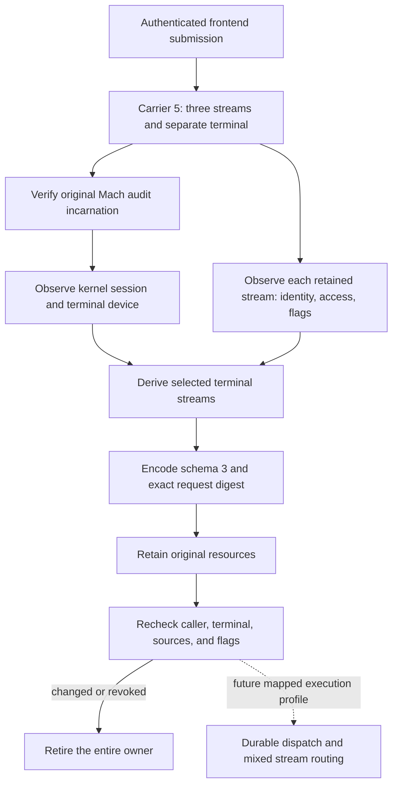

# Retained command stream layouts

Schema 3 records each original stream and the original caller terminal separately.
Root derives the routing mask from retained kernel objects before encoding approval bytes.
This capture phase supports all eight masks. Mapped execution and Android inspection remain the next integration phase.

## Separate transport contract

The internal carrier uses message ID `0x524d040c` and version 5.
It keeps six Mach port descriptors in this order:

| Index | Object |
| --- | --- |
| 0 | Original stdin fileport |
| 1 | Original stdout fileport |
| 2 | Original stderr fileport |
| 3 | Separate caller terminal fileport, or `MACH_PORT_NULL` |
| 4 | Admission reply right |
| 5 | Terminal-result reply right |

The payload prefix remains the big-endian version and byte count, followed by bounded submission bytes.
Only descriptor 3 permits a null port. All other descriptors remain required send rights.
Carrier 4 retains its five descriptors, message ID, and version unchanged.

The sender binds `/dev/tty` to a physical terminal object before creating a fileport.
The receiver rejects a raw terminal alias, event-only descriptors, and invalid stream access modes.
A supplied terminal is still untrusted until Root compares it with the original caller context.
Malformed submissions retire their imported resources. The receiver can process the next submission.

## Kernel context and stream observations

Root samples the original audit incarnation before, between, and after two kernel context observations.
The context includes the process start time, session ID, terminal presence, and terminal device.
A changed incarnation, exited process, inconsistent sample, or changed context fails the check.
A revoked terminal can retain the kernel control-terminal flag while its device becomes absent.
Root treats that state as terminal loss.

Each stream observation records its retained file identity, access mode, and four portable semantic flags.
The flags are append, nonblocking, asynchronous IO, and synchronous IO.
Observation reads no stream bytes and changes no stream flags or terminal attributes.
An available path is descriptive. Root does not reopen it to obtain authority.
Null sources retain access and flag observations but expose no source identity or path.
Kernel write-history flags are not portable routing semantics.

For PTY mode, Root compares the separate terminal with the original caller's kernel session and device.
Each selected stream must also match that terminal's retained file identity, device, and session.
Unrelated terminals remain unselected streams. Files, pipes, sockets, and other sources also remain unselected.
The mask uses stdin bit 1, stdout bit 2, and stderr bit 4.

| Caller context | Capture result |
| --- | --- |
| Caller terminal and matching stdio | Select only the matching stream bits |
| Caller terminal with all stdio redirected | Keep the separate terminal and mask 0 |
| No caller terminal | Require no separate terminal and mask 0 |
| Pipes mode | Require no separate terminal and mask 0 |
| Foreign terminal offered as caller terminal | Reject the capture |

Mask 0 does not prohibit a private command terminal during future execution.
A layout is an observation and routing contract. It grants no process, signal, wait, or execution authority.

## Ownership and rechecks

Construction claims the received submission once and owns the imported stream descriptors and reply rights.
Copies cannot claim or retire resources that another owner has claimed.
Failed construction, explicit close, and failed rechecks close the imported resources together.
Caller-owned originals remain open.

The capture and execution resource owners retain the same stream observations and original audit context.
Rechecks compare source identities, access modes, portable flags, session, and terminal presence/device.
A semantic flag change or terminal revocation invalidates the retained capture.
Rechecks do not restore the caller's flags or terminal state.
The current caller signing policy remains an independent requirement before and after the context check.

## Evidence and remaining gates

Private process tests on macOS 27.0.1 exercise actual Mach messages and imported fileports.
They cover all eight masks, all redirected streams, unrelated terminals, and malformed raw terminal aliases.
They preserve queued stdin bytes and terminal attributes during capture.
They verify single ownership, reply-right lifetime, imported-resource retirement, and open caller originals.

A private caller revokes its own terminal after capture with masks 0 and 7.
Its PID, PID version, and session remain unchanged while the fresh kernel observation reports terminal loss.
The retained capture fails its recheck and retires its resources.
A separate native fixture checks terminal replacement, wrong audit identity, and actual caller exit.

Swift and Kotlin share 39 valid and 75 invalid schema 3 fixtures.
They retain exact legacy bytes and reject malformed nested layouts.
Signed phone-session tests bind routing to the issued request and reject changed layouts under the original signature.
These tests prove parsing and authentication, not the Android inspection UI.

No execution profile advertises carrier 5 yet. The Android app still advertises capture schemas 1 and 2.
The next phase must wire explicit mapped profiles, native frame version 2, stream pumping, and Android inspection together.
It must recheck the retained layout before durable command release.
Installed Root deployment, production frontend integration, and physical-device tests remain unperformed.
The new kernel-context and capture paths still require CI evidence from the supported macOS 26 runtime.
