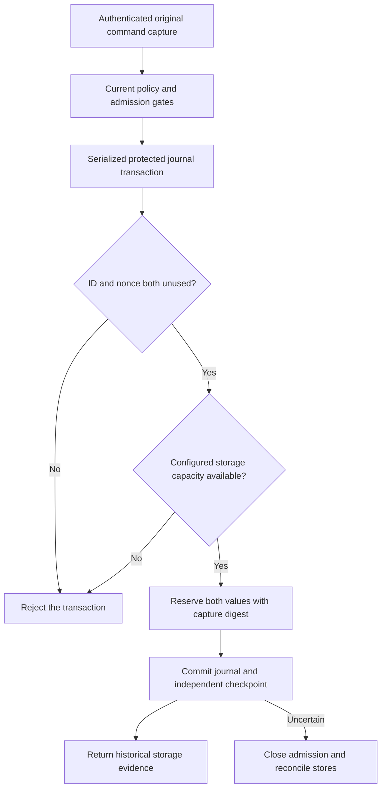

# Protected command submission replay storage

A command submission ID and nonce can each be reserved once within one Mac/account scope.
`CommandSubmissionReplayJournal` uses the existing protected journal connection and synchronous transaction boundary.
It has no separate cache, expiry path, or deletion API.

## Stored metadata

`CommandSubmissionReservation` contains the trusted Mac/account scope, submission ID, nonce, caller binding, and capture digest.
The host must authenticate the actual caller and assemble the original capture before supplying these values.
The ID has 16 bytes, the nonce has 32, the caller binding has 16, and the capture digest has 32.
Storage includes no command text, paths, rationale, credentials, or input bytes.
Constructing, reserving, or reading this value grants no admission, retry, or execution permission.
A reservation cannot reconstruct a request or dispatch an action.

The journal fixes its scope and capacity when opened.
`maximumCommandSubmissions` is checked from 1 through Int32.max; its default is 1,000,000.
This limit is separate from phone-decision consumption capacity.
Reusing either the ID or nonce is rejected, including a different ID with an old nonce.
Duplicates are rejected even when the store is full. Capacity rejection preserves all earlier reservations.
A host can raise the configured capacity when reopening the journal. No automatic eviction weakens replay protection.

## Explicit migration and protected continuity

`JournalTransaction.installCommandSubmissionReplay()` migrates schema 13 or 14 to schema 15.
Installed code policy is required first. Schema 12 cannot silently become a command-enabled store.
Schema 13 also gains the empty history-recovery table. Existing history evidence is preserved on schema 14.
The migration is idempotent on schema 15 and cannot lower the schema or installed code policy.
It must commit through `CheckpointedJournal` before the host accepts commands.
Legacy schema interpretation remains unchanged until explicit installation.

The new table is in the protected authority digest, with authority digest domain schema15.
It is security state, so missing or changed reservations require repair.
Automatic audit-history recovery must never excuse losing them.
Audit records and history evidence remain in the separate ledger digest.
Normal history recovery preserves command reservations and rejects their replays afterward.

Reservation and migration results remain withheld until the journal and independent checkpoint both commit.
After an interrupted write, recovery compares both durable stores to finalize a committed candidate or retain the old boundary.
A rejected body can preserve the writer only after rollback is independently proved.
Catching a replay error inside the transaction does not let other tentative changes commit.
Corrupt stored bindings retire the journal. Read-only and expired transaction handles cannot write.

## Evidence and remaining integration

Disposable journal fixtures cover independent ID/nonce reuse, capacity, wrong scope, malformed records, transaction lifetime,
rollback, schema migration, reopening, and preservation of code policy and history evidence.
Checkpoint fixtures inject preparation and finalization failures for migration and reservation commits.
They also prove that reservation loss requires repair while audit-history loss preserves replay protection.
No request or command is recreated by these tests.

The production command endpoint is still disabled.
The [command admission transaction](macos-command-admission-replay.md) reserves this evidence with request creation on the retained-object path.
Update quiescence remains a separate integration gate.
Current elevation policy, resource reservations, authenticated no-admission replies, dispatch permits, and process I/O remain separate gates.
A storage error alone is not an authenticated no-admission result and never authorizes automatic resubmission.
Physical-device testing and protected Root installation remain unproven here.
