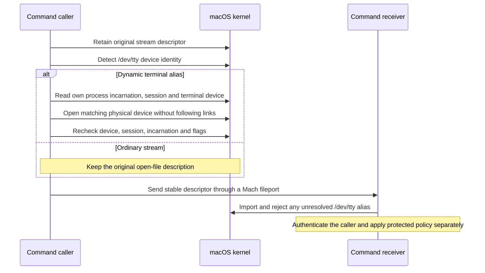

# Caller terminal sources

## Problem

A `/dev/tty` descriptor names the current process's controlling terminal. A Mach fileport does not make that alias name the original caller's terminal.

The private-session experiment reproduced both outcomes:

- A receiver without a controlling terminal gets `EIO` from terminal inspection.
- A receiver with another controlling terminal sees its own terminal through the imported alias.

The physical slave descriptor continues to name the original caller's terminal in both cases.

## Binding before transfer

`CommandStreamSource.c` retains each source before inspection. It detects the alias by character-device identity, independent of the receiver's session.

For an alias, it reads this process's `PROC_PIDTBSDINFO` record and session. It uses the kernel terminal device number, not a submitted pathname.

It inspects direct entries under `/dev` for the matching character device. It verifies the directory owner and permissions before this metadata lookup.

It opens the physical device with `O_NOFOLLOW`, `O_NOCTTY` and `O_CLOEXEC`. It then checks the opened device identity and controlling session.

A second process snapshot must match the original PID, start time, terminal device and session. The original stream flags must also remain unchanged.

The new description preserves the access mode and `O_NONBLOCK`, `O_APPEND`, `O_ASYNC` and `O_SYNC` flags. It reads no input and changes no terminal settings.

Ordinary files, pipes, sockets and physical terminal descriptors retain the original open-file description. Normalizing an alias creates an independent physical-terminal description.

Both admission and execution senders use this binding before creating fileports. The frontend terminal lease also resolves aliases before retaining its independent terminal owner.

The receiver rejects raw aliases in stdin, stdout and stderr as malformed traffic. It does not resolve an alias using its own controlling terminal.

Device metadata supplies no caller identity, user consent or execution authority. Existing caller authentication, protected policy and dispatch checks remain required.

## Evidence

The tests use disposable unprivileged processes and private pseudo-terminals. They use actual Mach fileports and actual terminal sessions.

`CommandStreamSourceTests` verifies:

- The raw alias rebinds after transfer when the receiver acquires another controlling terminal.
- The bound descriptor keeps the original caller's device identity and session after that change.
- Read-only, write-only and read/write sources retain their access modes.
- Nonblocking, append, asynchronous and synchronous flags survive normalization, separately and together.
- The new description can change its nonblocking flag without changing the alias's flags.
- Terminal settings stay unchanged, and queued binary input remains unread until the test reads it.
- An ordinary pipe keeps its shared description and unread bytes.
- A closed source returns no owned descriptor.

The signed-peer receiver tests exercise every stream role. Bound aliases pass capture; raw aliases fail before delivery to a handler.

The receive host accepts the next valid submission after rejection. The frontend lease tests also exercise a dynamic alias through activation and restoration.

## Remaining platform gates

The measured host runs macOS 27.0.1 on Apple Silicon. The fixtures compile for macOS 26.0, but that does not prove macOS 26 runtime behavior.

These tests do not install a privileged service or change credentials. They do not exercise a physical user terminal, the complete CLI, or phone approval.

The native execution terminal and the caller's source terminal serve different roles. Root capture and negotiated mixed-stream integration remain separate work.
