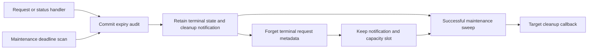

# Request expiry reconciliation

Both authority service constructors use the same coordinator expiry batch. A request can expire during frame retrieval, status exchange, decision verification, a local pending check, or periodic maintenance. Every committed expiry retains a cleanup notification before another serialized operation can observe it.

`expirePending` first commits any new deadline expiries, then returns all unreported expiry notifications in request-ID order. A successful batch takes each notification once. It does not add another expiry audit event or change the original terminal time, request digest, challenge, or signed status. Expiry grants no approval or execution authority.

Handler errors do not discard a committed notification. A failed sweep also retains previous notifications and rolls back its new audit records. The next successful sweep includes both groups.

Forgetting terminal metadata preserves its notification. The union of retained request IDs and unreported expiry IDs shares the existing request capacity limit. This bounds forgotten notifications without dropping cleanup. Taking the batch releases forgotten IDs; it does not remove other terminal entries or recreate requests. Notifications contain state metadata only, never the captured request body.

The service invokes its explicit cleanup callback under journal serialization. A returned batch is not proof of external cleanup success. A callback failure retires the service; it must not trigger automatic retries of uncertain target actions. Notifications are local to this service incarnation. Crash and startup cleanup still require the target controller's recovery path.

Component tests cover retained-frame expiry, signed status expiry, signing failure after expiry, rejected decisions, expiry during signing, timer-first ordering, audit rollback, forgotten metadata and capacity, explicit target timeout, and competing journal operations. These checks install no service and perform no target action. Production controllers and device E2E remain pending.
