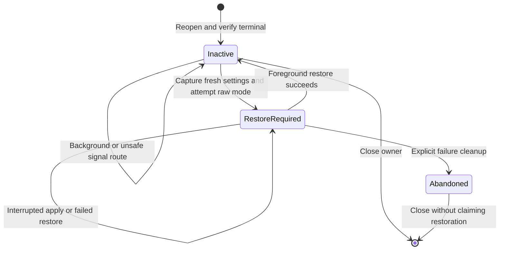

# Frontend terminal lease

The native frontend lease owns an independent descriptor for the calling terminal.
It changes terminal attributes only when the frontend explicitly activates or restores it.
Explicit bounded IO uses that independent descriptor after successful activation.
The owner never takes foreground, installs signal handlers, or grants command authority.

## Descriptor and foreground checks

`remozio_frontend_terminal_open` retains the source while resolving its terminal path.
It opens that path with `O_NOFOLLOW`, `O_NOCTTY`, `O_CLOEXEC` and `O_NONBLOCK`.
The original and reopened descriptors must name the same character device, inode and device number.
The terminal must belong to the frontend's current session.
The retained descriptor stays bound when the original source descriptor closes or is reused.
No `F_SETFL` changes the original stdin, stdout or stderr description.

| Operation | Required state | Outcome |
| --- | --- | --- |
| Open | Valid terminal in the current session | No input or attribute change |
| Activate | Original process, foreground, safe signal route | Capture fresh settings and attempt raw mode |
| Activate again | Restoration remains required | `EALREADY`; saved settings remain intact |
| Restore | Original process and foreground | Restore with `TCSANOW`; no input flush |
| Background operation | Another group holds foreground | `EAGAIN`; no foreground takeover |
| Close | Restoration succeeds or is unnecessary | Free the owner |
| Failed close | Restoration cannot complete | Keep the owner and settings for retry |
| Abandon | Caller reports failed restoration | Close without changing attributes |

## Foreground loss during an ioctl

A foreground check can become stale before `tcsetattr` runs.
The frontend must route `SIGTTOU` to its event loop with a non-restarting handler.
That handler must return without stopping the frontend itself.
The calling thread must leave `SIGTTOU` unblocked.
Ignored, default, blocked and restarting dispositions prevent activation before any attribute change.
Signal ownership must remain serialized while the lease runs.

The kernel then performs its own background check inside the terminal ioctl.
[Apple's published implementation](https://github.com/apple-oss-distributions/xnu/blob/main/bsd/kern/tty.c)
sends `SIGTTOU` and returns `EINTR` before applying a background attribute change.
The lease retains its saved settings after an interrupted apply.
It does not retry with a stale foreground observation.
A later foreground restore clears the cleanup obligation.
Each subsequent activation captures the current settings again.

## Explicit terminal IO

Read and write calls accept chunks from 1 through 4096 bytes after successful raw activation.
They use the independently retained nonblocking descriptor and preserve original stream flags.
Reads require a safe `SIGTTIN` route, including protection against foreground loss after the preliminary check.
Writes require a safe `SIGTTOU` route. Kernel enforcement also depends on the existing `TOSTOP` setting.
Partial writes retain their byte count. `EAGAIN` and `EINTR` consume no additional bytes.
A restoration attempt disables IO, even when restoration fails or is interrupted.
The caller must restore the retained settings before a fresh activation.
Dimension reads and fresh foreground checks change no terminal state.

## Measured evidence

Seven existing lifecycle tests and two new native IO tests pass on macOS 27.0.1 with an arm64 macOS 26 deployment target.
Each test uses an unprivileged fixture, a private terminal and children owned by the fixture.
The private fixture shell alone changes foreground groups.
The product never calls `tcsetpgrp`.

The tests check restoration before two actual stops and fresh settings after a foreground resume.
They also check a background resume, signal guards, reused source descriptors and a forked owner's rejection.
The race test replaces only the preliminary foreground check.
The actual background `tcsetattr` reaches the kernel and returns `EINTR` with an observed `SIGTTOU`.
Failed close retains the owner until foreground returns.
Unread terminal input survives activation and restoration.
Stable settings comparisons exclude only the kernel's `PENDIN` state; the fixture does not clear it.
The fixture drains its private master and closes it before timeout cleanup.

## Integration gates

The packaged frontend and its signal loop must call this lease after authenticated stream opening.
They must restore before cooperative suspension, disconnect and normal exit.
An authenticated job snapshot alone remains insufficient to suspend the frontend.
The frontend must reconcile current local signals and foreground state.
Mixed redirected streams must keep their separate destinations.

This lease cannot restore after `SIGKILL`, whole-process loss or terminal revocation.
A background restore retains its obligation instead of overwriting another foreground user's settings.
The [Swift frontend relay](macos-command-frontend-relay.md) now consumes the authenticated session and this owner.
The packaged signal loop and physical recovery still need validation.
No installed frontend, physical terminal, privileged service or macOS 26 runtime was tested here.
