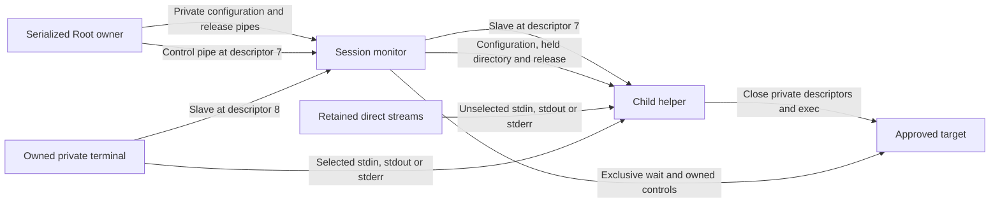

# Native command stream layouts

Native format 2 separates the private controlling terminal from stdin, stdout and stderr.
Each stream can use that terminal or retain its direct destination.
A redirected stdin therefore does not prevent terminal resize or foreground signals.

The monitor retains its terminal descriptor through target cleanup.
This matters when all three streams use direct destinations.
The child closes its extra terminal descriptor before execution.
The target can still open its controlling terminal through `/dev/tty`.
No private configuration, release, status, directory or control descriptor reaches the target.

## Private frame versions

These versions apply to inherited native helper frames, not the authenticated phone protocol.
Existing authenticated profiles and Root dispatch still use format 1.
Format 2 requires an explicit native API and is not yet advertised to callers.

| Field | Format 1 | Format 2 |
| --- | --- | --- |
| Magic | `RMC1` | `RMC2` |
| Fixed header | 40 bytes | 40 bytes |
| Mode at byte 36 | 0 for pipes; 1 for terminal | 2 for an explicit layout |
| Mask at byte 40 | Absent | One unsigned 32-bit word, 0 through 7 |
| Remaining body | Groups and length-prefixed byte strings | The same fields, after the mask |
| Declared body count | Total length minus 40 | Total length minus 40, including the mask |

All integer words use network byte order.
Mask bits 0, 1 and 2 select terminal stdin, stdout and stderr respectively.
Mask 0 still has a private controlling terminal, with all three streams direct.
Mask 7 uses the private terminal for all three streams.
Selected terminal output streams share one terminal stream.
Unselected output streams retain their separate destinations.
An unselected stream can name a different terminal.
It cannot alias the selected private terminal.

The decoder rejects unsupported magic, mode combinations, masks, lengths and trailing bytes.
Legacy spawn APIs reject format 2 with `ENOTSUP` before spawning.
Explicit terminal APIs similarly reject format 1.
Each native layer checks selected descriptor identities against the private terminal.
Those checks read metadata only; they do not consume input or change descriptor flags or terminal settings.
They grant no execution authority and do not prove that a supplied terminal is private.
The Root owner must establish provenance, code identity, caller policy and durable approval separately.

## Measured execution

Six test methods cover 36 native cases on macOS 27.0.1 with SDK 27.0 and an arm64 macOS 26 deployment target.
They compile the actual monitor and child helper sources.
The monitor fixture replaces its Root UID guard.
The child fixture mocks credential operations and accepts only the test user's UID and GID.
No test changes real credentials, installs a service or changes system configuration.
All terminal, frame, descriptor, release, process ownership and execution operations remain real.

| Cases | Count | Verified behavior |
| --- | --- | --- |
| Every stream mask | 8 | Exact binary input and separate output; resize and both control routes; actual target exit 7 |
| Cancellation after execution | 8 | Actual target death by `SIGKILL`, reported by its exclusive monitor |
| Cancellation before release | 8 | No target execution or release attempt; actual target death and monitor retirement |
| Stop and continue | 3 | Actual stop observations and monitor-owned resume for masks 0, 5 and 7 |
| Different output terminal | 1 | Mask 5 keeps stdout on another private terminal; stderr stays on the controlling terminal |
| Rejected version or layout | 8 | No owner is created; buffered input and original flags remain intact |

Execution cases require independent target exec and exit observations, a target reap report and actual monitor reaping.
The fixture drains output while the monitor retires, then requires terminal EOF.
Target checks cover raw arguments, raw environment bytes, held working directory and private descriptor closure.
Direct stream inspections compare descriptor settings before and after execution.
They exclude only XNU's `FWASWRITTEN` bookkeeping bit and record the original and observed values.
They never clear that bit or set flags on shared stream descriptions.
[Apple's definition](https://github.com/apple-oss-distributions/xnu/blob/main/bsd/sys/fcntl.h) identifies that bit as write bookkeeping.

## Remaining integration gates

The Root capture, authenticated profile, stream transport and packaged frontend must still carry this layout.
They must retain redirected streams and route credits only for streams that use the private terminal.
The frontend must integrate the [terminal lease](macos-frontend-terminal-lease.md) and reconcile local signals before suspension.
An old job observation alone must not suspend the frontend.

The direct standalone child API is compiled but lacks a separate live execution test here.
These tests do not prove privileged credential changes, signed helper deployment, foreign terminal ownership or a macOS 26 runtime.
Installed service, physical terminal and phone approval tests remain separate gates.
