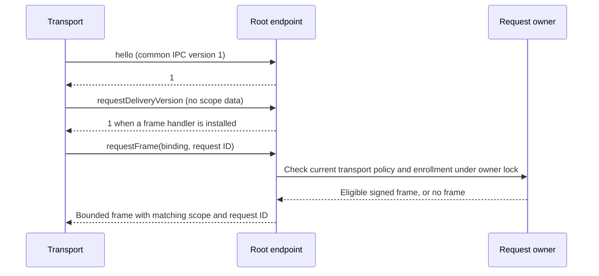

# Request-frame IPC

The transport can fetch a signed request frame through the authenticated root connection. It cannot submit arbitrary bytes for signing through this interface.

The existing hello, trust snapshot, and peer-validation calls retain their version-one behavior. Request delivery is an optional extension with its own version. The current extension supports version one only. Zero means disabled. Unknown versions send no binding or request ID. A server that lacks the extension selector can close the attempted connection; the client sends no request material before negotiation succeeds.

Each invocation retains OS peer validation and the shared work budget. The standard listener checks the current transport policy revision and enrollment binding under the same root lock as request access. The handler cannot reenter that owner. A changed policy or stale enrollment fails before the handler runs.

A nonempty reply is an approval request carrier with matching Mac, account, and request IDs. Both IPC ends bound and check this routing envelope. This is not signature or capture validation; Android must still verify the authority endorsement. An empty reply means no currently eligible frame. It does not mean denied, expired, or completed. Nil indicates failure and retires the connection.

The installed root handler must source frames from authority-owned requests, retain queue ownership across an uncertain IPC reply, and recheck current delivery eligibility. Frame retrieval is not a dequeue acknowledgment or action approval. The signed handoff API supplies exact retained bytes and checks expiry, presence, request state, and enrollment before queue acceptance.

The service supplies its own monotonic clock to the provider. Use that clock for request checks and resample it after signing.

The service does not install a frame handler by default. Production queue ownership, the selected non-exportable signer, connection routing, and decision submission still need integration. Unit tests exercise the IPC adapter and root access guard; they do not establish a live privileged XPC round trip or device E2E.
