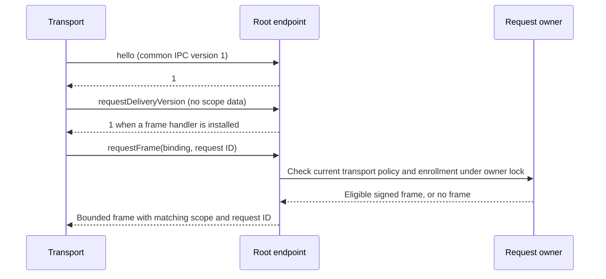

# Request-frame IPC

The transport can fetch a signed request frame through the authenticated root connection. It cannot submit arbitrary bytes for signing through this interface.

The existing hello, trust snapshot, and peer-validation calls retain their version-one behavior. Request delivery is an optional extension with its own version. The current extension supports version one only. Zero means disabled. Unknown versions send no binding or request ID. A server that lacks the extension selector can close the attempted connection; the client sends no request material before negotiation succeeds.

Each invocation retains OS peer validation and the shared work budget. The standard listener checks the current transport policy revision and enrollment binding under the same root lock as request access. The handler cannot reenter that owner. A changed policy or stale enrollment fails before the handler runs.

A nonempty reply is an approval request carrier with matching Mac, account, and request IDs. Both IPC ends bound and check this routing envelope. This is not signature or capture validation; Android must still verify the authority endorsement. An empty reply means no currently eligible frame. It does not mean denied, expired, or completed. Nil indicates failure and retires the connection.

The installed root handler must source frames from authority-owned requests, retain queue ownership across an uncertain IPC reply, and recheck current delivery eligibility. Frame retrieval is not a dequeue acknowledgment or action approval. The signed handoff API supplies exact retained bytes and checks expiry, presence, request state, and enrollment before queue acceptance.

The service supplies its own monotonic clock to the provider. Use that clock for request checks and resample it after signing.

The service does not install a frame handler by default. Production queue ownership, the selected non-exportable signer, connection routing, and decision submission still need integration. Unit tests exercise the IPC adapter and root access guard.

The [live XPC evidence](experiments/evidence/2026-10-05-request-frame-xpc.json) records 11 passing cases on macOS 27.0.1. The two-process probe imports the production protocol declaration. It verifies version negotiation and the nonempty, empty, and nil Data reply forms. Wrong client and server identifiers prevent frame dispatch. The temporary per-user LaunchAgent was removed.

This probe uses synthetic bytes and ad-hoc identifiers. It does not exercise the production root endpoint, protected service routing, Developer ID policy, or device E2E. Those release integration checks remain pending; the probe does not establish them.

## Transport integration

`DirectApprovalTransportService.requestFrame` takes a live phone session and request ID. It checks that session before retrieval and after the reply. Session replacement, closure, or cancellation prevents return to the caller.

The trust feed serializes retrieval with validation and refresh on its existing authority connection. Its bounded wait queue and refresh priority also apply to fetches. Cancelling queued work does not cancel another active operation. A disconnected authority rejects late replies and retires its listener. Explicitly unsupported request delivery leaves common trust operations available.

This API returns a frame to the transport handler. It does not write to the phone, acknowledge delivery, install a root signer, or submit a decision. The network handler must retain its channel checks before sending.

## Root retry retention

`ApprovalRequestCoordinator.retainedDeliveryFrame` owns one in-memory frame per pending request and tracks eligible recipients through `PendingRequestDelivery`. Install it through the service's trusted frame provider, using the supplied service clock and the selected authority signer. Callbacks must not mutate or reenter the authority.

A first fetch checks current enrollment, contract support, presence, deadline, and request state. Signing uses the retained request bytes. It checks deadline and presence again after signing. A lost IPC reply does not dequeue or consume the request. A retry returns the retained frame after fresh authority checks. A changed signing key fails instead of releasing a frame under the previous key.

Present suppresses first delivery to a recipient. A recipient already handed a frame can retry while the request remains valid, as required for phone review across presence changes. This handoff is not proof of phone receipt. The provider does not mark the request presented or approved.

The cache releases frames when requests leave queued/presented state, including authorization, cancellation, and expiry. It dies with the coordinator. Frame storage is bounded separately by the retained-payload budget plus one carrier overhead per request; recipients share a frame. Existing request and recipient limits also apply. This does not persist sensitive payloads or implement FCM scheduling, pending-set discovery, or decision submission.

## Pending discovery owner

`ApprovalRequestCoordinator.pendingDeliveryRequestIDs` returns the complete current set of eligible IDs for one validated enrollment. The set is bounded by the coordinator's request limit (at most 4096), sorted by ID, and contains no capture bytes. It is a discovery hint, not proof that a later fetch will succeed.

Discovery omits elapsed requests without changing their lifecycle state. The maintenance path retains responsibility for expiry and cleanup. The owner selects the requesting enrollment once from current trust. Each request then checks only that recipient and its contract support. Discovery creates no queue entries or delivery identities. Present excludes new deliveries while retaining previously handed-off requests. Discovery does not accept notification queue ownership or mark a request dispatched, presented, or consumed, and repeated discovery creates no extra request audit events.

This root API is not yet exposed by the IPC delivery extension or the phone wire protocol. Those callers must negotiate discovery support and fetch each result through the existing frame checks. They must not treat an empty discovery result as a signed terminal status for a previously known request.
