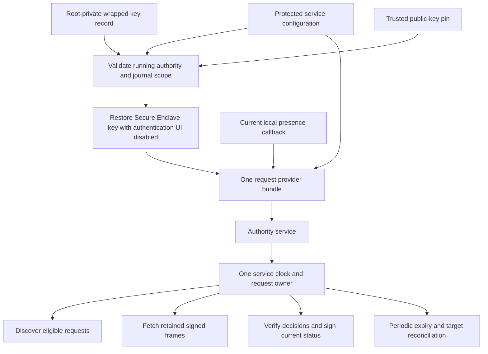

# Root request provider assembly

`AuthorityRequestProviders` composes discovery, signed request delivery, and decision/status exchange for a provisioned root service. Its public constructor requires an `EnclaveAuthorityRequestSigner`. Software signing is an internal test seam.

## Key restoration

The wrapped record uses canonical CBOR schema one. It contains the Mac ID, account ID, public key, and opaque Secure Enclave representation. The representation is at most 16 KiB; the complete record is at most 16,640 bytes. Unknown schemas, extra fields, malformed keys, and empty storage fail closed. Descriptions redact the record.

The public loader requires UID zero. It validates the running authority against the retained code policy, checks journal scope, and reads through the existing protected-file walker. That walker requires root-owned local ancestors and a private regular file, with no symlink or metadata replacement. Restoration checks the configured Mac/account and trusted public-key pin before hardware access, then checks the restored public key again.

The loader restores an existing key. It does not create, rotate, migrate, or fall back to a software key. Missing, damaged, unavailable, or mismatched storage cannot silently replace an enrolled identity. `LAContext.interactionNotAllowed` prevents an authentication dialog during restoration or signing. Opaque key storage must stay on its Mac and must not enter the shared setup export.

## Service binding

A bundle retains the exact configuration bytes. Construction rejects a bundle from a different configuration and releases the journal on failure. The public service constructor installs all three handlers and periodic expiry together. It retains the existing authority self-validation and transport code/enrollment checks. Internal fixture construction rejects mixed bundled and individual handlers.

Each handler receives the service's existing sleep-inclusive clock. Request creation, fresh status, and expiry share that clock epoch. The callbacks run under request ownership and must not reenter the service, journal, or coordinator. The local presence callback controls new delivery; it cannot invalidate an already reviewed request or hide its status.

Request body limits reserve the signed carrier inside `maximumPayloadBytes`. Status/decision exchange additionally respects the 4096-byte IPC carrier bound. All operations use the same pinned signer. The coordinator still verifies each generated signature and resamples time/presence after signing.

Periodic expiry uses the same bundle and service clock. Callers must supply a reconciliation callback for target-facing cleanup. A successful sweep returns each unreported expiry transition once, including expiries committed by request handlers. See the [expiry reconciliation contract](macos-expiry-reconciliation.md). Expiry itself grants no execution or UI-click authority. A callback failure retires the service through the existing maintenance failure path.

## Evidence and remaining integration

Component tests use real request coordination, signed payloads, and the consumption journal. They cover composed discovery/delivery/decision exchange, retained review during Present, clock/presence changes while signing, expiry, scope rejection, carrier budgets, configuration mismatch, and failure cleanup. These fixtures use software keys through the internal seam.

Hardware tests create disposable keys and restore them through the new signer with authentication UI disabled. One verifies the signing wrapper; another uses the public provider constructor to sign a real coordinator request and status. They run only where Secure Enclave hardware is available. Other tests reject software private-key bytes and a substituted public-key pin. No key record is installed by these tests.

This assembly API does not select a production accessibility policy or prove pre-login, lock/logout, another-Mac restoration, or update continuity. The [key-custody experiment](experiments/macos-key-custody.md) records those remaining live gates. Root-private storage and library self-validation do not independently prove every code-isolation requirement.

The configuration-only `AuthorityServiceRunner` remains a trust-only startup path. Onboarding must provision the selected hardware key and protected record, retain its public-key pin, connect current presence, and choose this request-enabled constructor. The existing configuration schemas and legacy constructors are unchanged. Production launch wiring, protected installation, request admission, target execution, push, and device E2E remain required.

The [protected request-startup path](macos-request-startup.md) now composes paired recovery, pinned signer restoration, providers, and service ownership. The runtime must supply presence and target cleanup before the bundled executable can select it.
