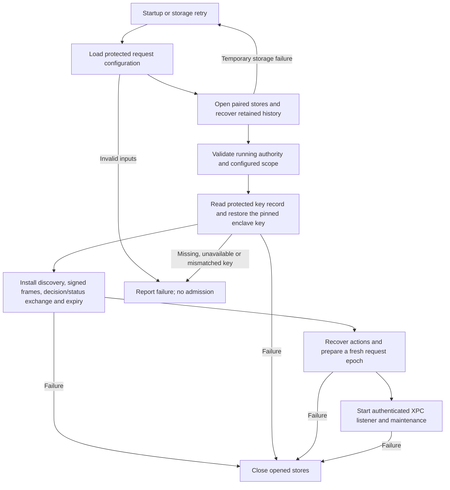

# Protected request-service startup

`AuthorityServiceRunner(requestConfigurationPath:routing:reconcileExpired:report:)` opens the request service from provisioned local state. It requires current presence and target-cleanup callbacks from the runtime owner. Neither callback has a default. They run synchronously and must not reenter the runner, service, or journal.

## Local configuration

The canonical CBOR container has schema version 1. It is separate from the existing service configuration and the phone protocol.

| Field | Value |
| --- | --- |
| 0 | Container version 1 |
| 1 | Canonical service configuration bytes; paired continuity storage is required |
| 2 | Absolute protected signing-key record path |
| 3 | Provisioned authority public-key pin; valid 65-byte P-256 X9.63 encoding |
| 4 | Maintenance interval in milliseconds; 100–60,000, default 1,000 |

The container is at most 64 KiB. Unknown, missing, duplicate, noncanonical or mistyped fields fail parsing. The service payload budget must leave room for a signed carrier. Parsing does not establish provenance: runtime uses the root-private loader, which validates local ownership, ancestors, metadata and file identity.

Provisioning writes this machine's configuration and key record. The container is not a portable setup export. Runtime does not generate a key, discover a replacement pin, initialize an empty journal, migrate storage, or repair inconsistent trust. The original trust-only configuration and initializer remain available; request startup never downgrades to them after a failure.

Every temporary-storage retry reloads the protected inputs, reopens both stores, and restores the configured signer. Opened stores close if signer restoration or service construction fails. A successful runner owns one started service and its shutdown. Inputs stay fixed within that service lifetime; coordinated activation must replace them outside active request work.

## Evidence and remaining integration

Component tests cover configuration boundaries and strict parsing, normal-user rejection, retry with changed protected inputs, key-load failure, pin mismatch, and writer-lease release. Existing service tests cover failed start and orderly shutdown. No root service is installed or activated by these tests.

The bundled `AuthorityMain` still selects the original trust-only initializer. Selecting this request startup path requires its runtime owner to supply real presence and target cleanup, rather than hard-code Away or discard expired targets. Protected provisioning, activation, request admission, target execution, local command approval, and transport executable wiring remain required.

This path preserves the hardware-only signer. It does not select its production accessibility policy or prove pre-login, lock/logout, cross-Mac restoration, update continuity, or the automatic presence detectors. Those remain [key-custody](experiments/macos-key-custody.md), [presence](experiments/macos-presence.md), and [interactive handoff](experiments/interactive-handoff.md) gates.
