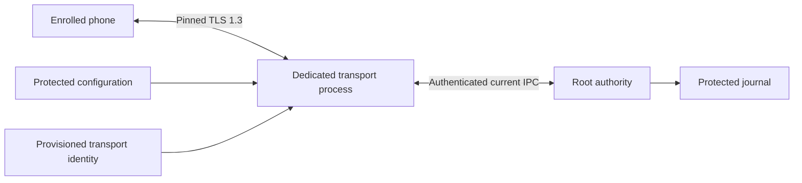
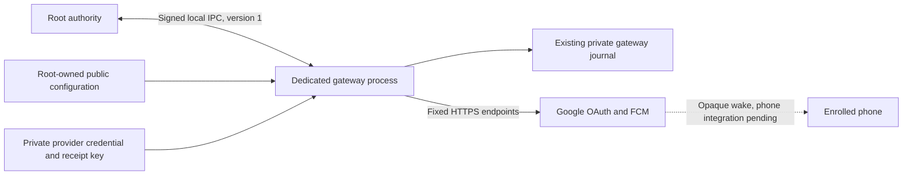

# Native Mac application

The Xcode target builds `Remozio.app` for macOS 26 and Apple Silicon. This is the product app scaffold, separate from the disposable packaging experiment.

The SwiftUI app has a main window, a menu bar entry, and a native Settings window. The menu can reopen the main window and quit the app. Settings can hide the menu entry; the Dock and Applications remain available. That preference uses the current user's defaults. It carries no enrollment or approval authority.

Settings also define defaults for the command caller: I/O mode, disconnect behavior, readiness wait, connection backoff, control timeout, and retry intervals.
The form reports invalid durations and contradictory backoff values.
These preferences apply to new CLI invocations and carry no authority pins or installation identity.
CLI integration is still in progress. These settings do not activate a command service or change approval expiry.

The app shows an explicit unconfigured state. It has no pairing, routing controls, network listeners, or approval actions yet. It does not load the experiment's service manifests, register services, request permissions, or start persistent background services. Privileged services still need the protected installation and identity gates before integration.

## Build checks

Run on an Apple Silicon Mac with Xcode and a macOS 26 or later SDK:

```sh
python3 scripts/check-macos-app.py
```

The script builds Debug and Release, verifies their signatures and hardened runtime, and checks arm64 architecture, deployment targets, localization resources, and bundle contents. It does not launch either app. The repository gate runs this check on macOS.

Build outputs are under `.build/macos-app/DerivedData/Build/Products/`. Debug uses `dev.remozio.mac.debug`; Release uses `dev.remozio.mac`. Both currently use ad-hoc signing for local build validation. The project explicitly enables the runtime signing option and disables the debug injection library. Release configuration is not a distributable release: Developer ID signing, notarization, updater integration, and trusted service identities remain outstanding.

Logs are `.build/macos-app/xcodebuild-debug.log` and `.build/macos-app/xcodebuild-release.log`. The shared Xcode scheme is available at `macos/app/Remozio.xcodeproj`.

## Validation limits

Compilation and bundle checks do not prove window behavior, menu accessibility, localization, VoiceOver, or large-text usability. Those checks remain for the interactive session. The app has not been installed or launched by the build script.

Native surfaces use [MenuBarExtra](https://developer.apple.com/documentation/swiftui/menubarextra), [Settings](https://developer.apple.com/documentation/swiftui/settings), and [SettingsLink](https://developer.apple.com/documentation/swiftui/settingslink).

## Setup file preview

The main window can open an encrypted setup file in a native sheet. The file picker uses a security-scoped URL. A shared actor reads a bounded regular file and decrypts it away from the UI actor. It rejects directories, FIFOs, remote URLs, and oversized files. Reading uses one descriptor, so replacing the path does not redirect an active read.

The password entry clears when opening starts and when the sheet closes. Derivation retains a temporary password copy until it finishes; this does not promise memory erasure. Cancellation prevents a late result from replacing the view. The UI receives only category and scope metadata, never the decrypted configuration or credentials. Closing the sheet does not change setup state.

This is a preview, not an import command. Provider access is unverified; protected application and provisioning remain pending. The UI says this before and after opening a file.

For synthetic offscreen renders of the actual SwiftUI view:

```sh
swift run --package-path macos/app SetupPreviewSnapshots /tmp/remozio-preview-snapshots
```

This Debug-only helper renders empty, error, and scope states in light/dark appearance. It does not open the product app, register services, select real files, or contact providers. Native controls, file-picker interaction, keyboard focus, cancellation timing, and VoiceOver still need the interactive session.

## Embedded authority

The `RemozioAuthority` Xcode target is embedded at `Contents/Library/LaunchServices/RemozioAuthority`. Debug and Release use separate signing identifiers. The app does not launch it, and the bundle contains no launchd registration manifests yet.

The executable accepts `--configuration /absolute/protected/configuration.cbor` for the trust-only service. It also accepts `--presence-configuration /absolute/protected/configuration.cbor` for the [presence and wake runtime](../../docs/experiments/authority-runtime-entrypoint.md). Both modes require real and effective Root identity before reading configuration.

Each mode loads its protected configuration and opens the existing journal without initialization or migration. The presence mode restores the pinned hardware signer, starts request and presence listeners, and owns independent wake recovery. It has no trust-only fallback.

SIGTERM and SIGINT stop the listener before closing the journal. Startup diagnostics omit identifiers, paths, and raw errors.

The trust-query service uses storage ceilings of 16 MiB, depth 32, and 262,144 CBOR items, with a five-second SQLite busy timeout and a one-million consumption-row ceiling. These are startup bounds for the current read-only RPC surface. Approval execution and configurable storage policy remain follow-up work.

Protected installation must validate the executable identity and release build floor before activation. It must protect the launch path, provision the service account and journal, and load the correct launchd registration. This build target does not satisfy those installation gates by itself. Do not deploy the ad-hoc build as a privileged service.

The packaging check runs only rejection paths: missing arguments and, as a normal user, non-root startup. It verifies the embedded binary's architecture, signature identity, and runtime flags. It does not start the listener or open a journal. Root activation, signal shutdown with live IPC, and pre-login recovery remain unproven.

## Embedded command child

`RemozioCommandChild` is embedded at `Contents/Helpers/RemozioCommandChild` with separate Debug and Release identities.
This small C executable prepares target credentials in a fresh process. It avoids forking the multithreaded Swift authority runtime.
It does not listen for requests or elevate an ordinary caller.
The authority does not launch it yet.

The [private launch contract](../../docs/macos-command-child.md) defines bounded input, retained descriptors and the release barrier.
The build check verifies both embedded signatures and unprivileged refusal without consuming stdin or writing to the command streams.
The parent supervisor, protected installation and current elevation policy remain required before use.

## Embedded command monitor

`RemozioCommandMonitor` is embedded at `Contents/Helpers/RemozioCommandMonitor` with separate Debug and Release identities.
It prepares one target in its dedicated session and owns that target's final wait result.
Private status buffering preserves cancellation and reaping when Root stops reading.
The [monitor contract](../../docs/macos-command-monitor.md) defines release, control, descriptor and cleanup behavior.
The authority does not launch this helper yet. Its native parent, protected installation and current elevation policy remain required.
The packaging check verifies both helper identities and non-root refusal before any private input is read.

## Embedded command frontend

The app embeds the `RemozioCommandFrontend` target as `Contents/Helpers/remozio`.
Debug uses `dev.remozio.command-frontend.debug`; Release uses `dev.remozio.command-frontend`.
Both tools preserve actual C argv bytes and require the separator before the target command.

```sh
remozio run [options] -- executable [arguments...]
remozio sudo [options] -- executable [arguments...]
```

The tool loads public installation metadata from `/Library/Application Support/Remozio/frontend.cbor`.
Root ownership and protected local ancestors remain required.
User settings come from the corresponding app's persistent preference domain.
They cannot replace installation identity or authority pins.

The CLI uses bootstrap discovery, authenticated mapped admission, and the original execution session.
It reloads protected pins before each fresh handshake under one readiness deadline.
Only verified busy refusals permit another submission.
An admitted request keeps its original policy and channel.
The loop relays PTY traffic or preserves separate pipe streams; it executes no target locally.

The packaging check verifies signatures, security generation, and byte-identical embedding.
It exercises only help and syntax refusal, including a raw non-UTF-8 argument.
Those paths consume no command stdin, write no command stdout, and log no target arguments.
The check does not submit a valid command or activate a service.

This integration is unfinished and must not be activated as a privileged installation yet.
The actual CLI loop passes composed anonymous-Mach and private-terminal tests, including verified-stop sampling, cleanup retries, and stop/resume.
The [live frontend experiment](../../docs/experiments/live-command-frontend.md) also joins the real frontend, admission owner, executor, monitor and target.
That experiment uses one unprivileged UID, software test keys and explicit fixture identity seams.
Privileged reconciliation and installed service discovery remain release gates.
Headless PTY output routing remains a pending user choice.
Setup provisioning, CLI path installation, Developer ID signing, and real-device approval tests remain separate gates.

## Embedded approval transport

`RemozioTransport` is embedded at `Contents/Library/LaunchServices/RemozioTransport`.
Debug and Release have separate signing identifiers and retain security generation 1.
It accepts only `--configuration /absolute/protected/transport.cbor`.
The process loads Root-owned public metadata and requires the configured service UID as both its real and effective UID.
It rejects Root and the recorded interactive owner account.
Provisioning must create the dedicated account and protect its key custody; different UID values alone do not prove that setup.



The configuration contains installation scope, account UIDs, authority code pins, one explicit identity location and a transport public-key pin.
It contains no private key bytes, approval key or provider credential.
The identity lookup disables authentication UI and checks the exact configured reference.
The hardware path requires a Secure Enclave P-256 private key, a matching certificate key, the configured SPKI and a current certificate validity interval.
It never searches for a replacement identity or generates a new key at startup.

The process starts the existing authenticated authority feed before accepting phone channels.
It uses the existing discovery and request-exchange handler; decisions remain Root operations.
Signal cancellation closes the service. Authority loss or listener failure closes this incarnation and returns a temporary failure.
A subsequent launch reloads configuration and performs a fresh authority handshake.
Launchd registration and restart policy are not installed by this change.

The bundle check exercises syntax and missing-provisioning refusal only, with unread stdin and no command stdout.
Unit tests cover configuration bounds, account separation, exact lookup, blocked authentication and wrong item types.
They do not access an actual keychain identity or start a configured transport.

Pre-login identity access, TLS signing without UI, dedicated-account key custody and actual enrolled-phone delivery remain unproven.
Apple's [Mac keychain guidance](https://developer.apple.com/documentation/technotes/tn3137-on-mac-keychains) requires daemons outside user contexts to use the file-based keychain.
The earlier enclave TLS probe used an interactive disposable identity; it does not establish daemon support.
The [explicit transport file path](../core/transport-identity.md) supports the approved fallback as a separate provisioning choice.
Version 1 hardware configuration remains compatible. Version 2 names one service-owned private file under Root-owned ancestors.
Startup validates the private key, certificate and installation pin without a keychain search.
Lookup failures never switch custody paths. Authority and credential recipient loaders do not use the file format.
Disposable tests verify native signatures after reload; dedicated-account isolation and pre-login TLS remain activation gates for either path.
Setup, protected activation, service registration and real-device tests remain required before deployment.

## Embedded push gateway

`RemozioGateway` is embedded at `Contents/Library/LaunchServices/RemozioGateway`.
It owns the existing SQLite gateway journal, OAuth client, token cache, and bounded delivery scheduler.
The gateway runs in a dedicated account. It requires matching real and effective UIDs before reading private files.



The process accepts only `--configuration /absolute/protected/gateway.cbor`.
Public configuration pins the registration, Root code, receipt key, service account, provider project, and local limits.
It contains no private keys or provider credentials.
Startup opens an existing journal. It never initializes, migrates, resets, or replaces one.

The private receipt key has a separate purpose and matches its configured public key.
Its public point must also match the private scalar. This software key cannot grant approval or certify recipients.
The key remains local to this Mac. Shared setup exports must exclude it.
Root and credential recipient keys retain their separate hardware custody requirements.

The listener admits one signed Root connection. Each invocation checks the kernel peer attributes before starting asynchronous work.
A harmless version handshake precedes snapshots and commands.
Snapshots carry the full registration, Root incarnation, increasing sequence, retained enrollment state, presence routing, and a short lease.
Lease expiry blocks provider handoff. Heartbeats preserve current flights and original request deadlines.
Connection loss retires the lease immediately. Shutdown cancels and drains work before closing the journal.
A replacement process needs fresh configuration, authentication, recovery, and Root state.

Root can read signed recovery pages before delivery becomes active.
The Root client returns unverified recovery data. Its query owner must verify signatures and reconcile retained history.
Candidate and recipient controls still need valid Root signatures and durable revision checks.
Token probes run as bounded service-owned tasks, so provider I/O does not occupy the control connection.
Provider acceptance does not prove phone delivery or user approval.

The bundle check verifies both build configurations, signatures, security generation, byte-identical embedding, and refusal without provisioning.
Unit tests use disposable files, keys, clocks, and provider fixtures. They do not install accounts or contact Google.
Native signed IPC, protected provisioning, launchd registration, restart behavior, and provider delivery remain activation gates.
The restricted transport submission endpoint and its credential are still pending. Root control does not replace that endpoint.
The app still shows its unconfigured state. This change does not activate push or register services.
