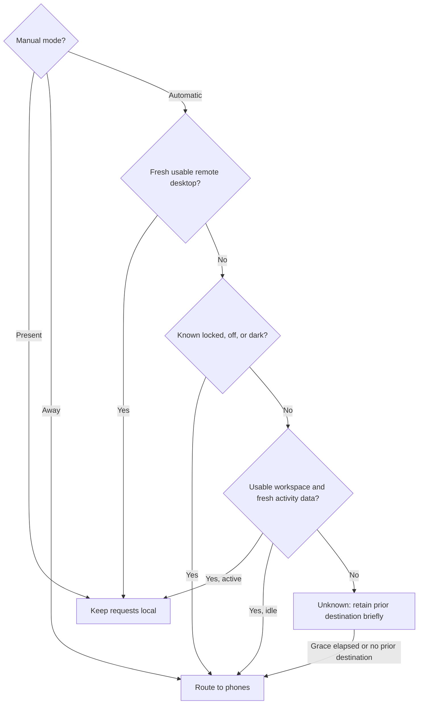

# Mac core

This package contains Mac policies, audit storage primitives, and the authority storage lease. It has no presence observers or action executor. `PresenceRouter` implements the delivery rules from design section 14. [Decision verification](decision-verification.md) binds signed phone decisions to retained requests and current trusted enrollment before durable consumption. [Audit replies](audit-replies.md) build bounded signed history responses for an already authorized Mac/account scope.

Use one router per Mac/account and serialize evaluations. Supply observations from that account's detectors. A remote session counts only when it can show that account's desktop; a listener, running process, lock screen, or SSH session does not qualify.

Every observation carries an epoch and a sleep-inclusive monotonic timestamp. Reject future timestamps, expired observations, and observations from another epoch. A changed epoch or clock regression clears the cached destination. A regression also makes the current automatic evaluation Unknown. Do not reuse this state across reboot or detector-clock replacement.

The idle default is 120 seconds. Observation lifetime and detector-unavailable grace must be provided explicitly; their product values remain feasibility decisions. No hidden grace default is selected here. Grace starts no later than the expiry of the observations that supported the cached destination. Delayed or repeated Unknown evaluations do not renew it. Manual modes have no timeout. They clear the automatic route cache; returning to Automatic requires detector evidence for local routing.

Display observations cover the account's usable displays. One readable external display keeps the workspace usable when the internal display is dark or asleep. Unknown brightness on an awake display does not mean zero brightness. An unknown display prevents a claim that all displays are off or dark. An empty, successfully observed display list means no usable display is awake; a failed query must instead produce a missing/unknown observation.

Qualifying input includes remote keyboard/pointer input and excludes Remozio automation. The timestamp must come from the same clock epoch and cannot be later than its observation. The policy does not record input content or collect activity traces.

## Integration boundaries

This package does not detect Chrome Remote Desktop, Screen Sharing, brightness, lock state, or human input. Those observers require platform evidence. Missing or unsupported remote detection sets a limitation flag while valid local observations can still determine routing.

The controller must persist manual mode, expose settings, and apply authenticated routing changes atomically. Phone controls permit Away only. This pure policy cannot authenticate a phone or modify stored settings.

The Android status view must show Offline when the Mac is unreachable. A cached routing result is last-known information, never proof of current presence. Do not queue a routing change or acknowledge success without the Mac.

Presence changes delivery only. The integration must preserve request identity, first-seen age, expiry, and already-delivered actions. It must not cancel a biometric operation when the Mac becomes present. Recheck pending request validity before handoff and suppress duplicate notifications during noisy routing changes.

Local command approval, live provider detection, authority persistence integration, and device status synchronization remain implementation gates. These unit tests do not certify remote desktop detection or activity-aware routing end to end.

The [audit storage tables](audit-storage.md) share the authority's SQLite transaction and provide bounded, coherent history reads. They do not replace authority recovery or grant dispatch permission.

The [protected journal lease](journal-lease.md) validates the existing root-owned storage path and holds its writer lock. Provisioning and authority recovery remain separate.

The [owned journal connection](journal-database.md) combines that lease with a scoped SQLite connection and expiring transaction access. The [consumption journal](consumption-journal.md) records a verified winner and its audit event together. Its [durable outcomes](consumption-outcomes.md) retain later observations without changing the winner. Checkpoint and admission integration remain separate.

The dedicated push service can use the [native OAuth client](fcm-oauth.md), [token owner](fcm-token-source.md), and [opaque wake sender](fcm-delivery.md). These provider clients do not establish recipient authority or install a service. Gateway control and app/service wiring remain pending.

[Gateway candidate verification](gateway-candidate-verification.md) binds signed token probes to trusted setup and current enrollment before durable admission.
