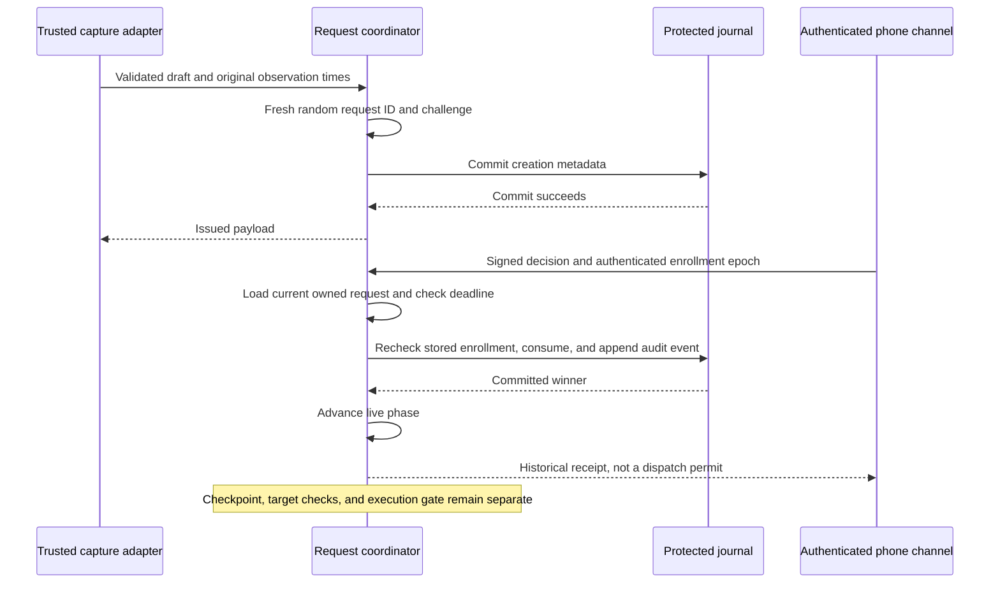

# Approval request owner

`ApprovalRequestCoordinator` owns the live request states for one Mac/account. Signed phone decisions select an owned request by ID; they cannot supply its retained payload, phase, deadline, or trust snapshot.



## Service contract

The coordinator is deliberately non-Sendable. The root service must isolate it and its journal on one executor. Serialize admission, adapter observations, enrollment changes, routing, consumption, and outcome recording there. Do not consume or transition its requests through a second journal caller.

Construct it only after protected writer ownership, authority continuity, startup recovery, and admission storage reserves are established. It does not establish those gates. Its memory limits and the ledger count limit do not reserve physical disk space or guarantee a complete lifecycle budget.

A draft is trusted, validated adapter output, not a decoded remote submission. The adapter checks capture semantics and target identity. The owner uses the journal's Mac/account identity, generates random IDs and challenges, and preserves the draft's original observation times. The caller supplies time from the configured sleep-inclusive authority clock, never from phone messages.

Before consuming a phone decision, the service rechecks the target under the same serialization boundary. A known timeout or disappearance must retire the request first. The channel supplies its authenticated phone identity and enrollment epoch independently of the decision bytes. The owner checks that identity and epoch against current durable enrollment in the consumption transaction.

Invalid signatures, unknown requests, and wrong channels do not allocate audit events. Rejection aggregation and its rate limits remain separate work. Creation, pending retirement, consumption, and post-consumption outcomes use the existing journal.

## State and capture lifetime

Admission publishes the payload only after creation metadata commits. It does not publish a provisional in-memory entry on a write failure. Consumption and outcomes update memory only after their journal transaction succeeds. A failed retirement keeps the prior state and reports an error; it cannot claim a result that was not recorded.

`pendingRequest` returns only a current queued or presented request. It checks the storage lease and expires an elapsed authorization deadline before returning. `markPresented` is idempotent. Dismissing a phone sheet does not call retirement or change the request.

`consumedRequest` retains the original binding while the phase is Authorized or Executing. It is data for the executor's separate target and checkpoint checks, never permission to dispatch. Expiry cannot rewrite an already consumed action. Terminal transitions release the coordinator's capture reference. The host must also release any copies held by adapters or transport queues.

`state` returns local observed metadata with a positive revision suitable for a status payload. It retains the reason, terminal time, deciding phone, and request bindings after capture release. Reconciliation can construct status without retaining a separate outcome description. Terminal time stays fixed. The wire terminal age is that time minus the first-observed time, not the elapsed time since completion. It is not a signed status message or a freshness guarantee. The host drives deadline evaluation even without phone traffic, reconciles terminal state to all devices, and withdraws queued work. Use `reconcileDelivery` after every owner transition and before transport work. It reads current owner state, commits elapsed expiry, and closes deliveries after capture release. Apply its withdrawals to queued and started retry tasks before discarding a closed delivery owner. Call it before `forgetTerminal`; forgotten requests cannot be reconciled. Storage or clock errors prohibit transport work and require the host to stop affected delivery tasks.

Before the first transport write, call `handoffDelivery` under the root owner's serialization boundary.
Prepare asynchronous resources first. The method rereads current owner state and protected journal trust, then calls the synchronous transport callback.
A resolved request returns withdrawals from retained metadata, even after capture release. Elapsed expiry must commit before it can return those withdrawals.
Storage or clock failure prevents the callback from running. A stale caller snapshot cannot substitute for this read.

```mermaid
sequenceDiagram
    participant Host as Serialized root host
    participant Owner as Request coordinator
    participant Store as Protected journal
    participant Transport as Prepared local transport
    Host->>Owner: Handoff queued identity with fresh presence and time
    Owner->>Store: Check lease, current enrollment, and expiry commit
    alt Resolved, expired, or revoked
        Owner-->>Host: No handoff; apply withdrawals
    else Current and routed to phones
        Owner->>Transport: Synchronously accept exact delivery identity
        alt Backpressure; nothing accepted
            Transport-->>Owner: False
            Owner-->>Host: Keep queued with original deadline
        else Ownership accepted
            Transport-->>Owner: True
            Owner-->>Host: Mark first handoff complete
        end
    end
```

The callback must not await, reenter either owner, or mutate authority state.
Return false only when no bytes or work were accepted. After accepting ownership, return true even if later delivery fails.
A refused handoff can retry with the original identity and deadline. An accepted identity cannot start a second first handoff.
The receiving queue then owns bounded retries and must receive subsequent withdrawals and routing changes.
Always apply the returned update, including when `delivery` is nil. Acceptance is not provider acceptance, phone receipt, or action authorization.
This method does not install an IPC endpoint, invoke the asynchronous gateway actor, or replace target validation by the host.

`ApprovalRequestState.statusPayload` preserves the v1 wire contract. Internal Unknown with target disappearance projects to Cancelled/target-disappeared, which existing phones render as “No longer available · reason unknown.” The owner remains Unknown. The host supplies a separate increasing observation revision, original observation ID, and current authority time, then authenticates the response. Reusing the lifecycle revision for a changed time sample is not valid. A future different wire form requires capability or schema negotiation.

The configured request count includes terminal metadata until `forgetTerminal` removes it. The capture byte limit includes Authorized and Executing requests until their terminal outcome. Forgetting cannot remove a live request or its durable consumption receipt. New admission always creates a new ID and challenge.

## Unknown, expiry, and restart

Pending retirement uses distinct reasons:

| Observation | Result |
| --- | --- |
| Local request cancellation | Cancelled; no target action |
| Authorization deadline has elapsed | Expired; the owner verifies the deadline |
| Adapter establishes an actual target timeout | Expired with target-timeout metadata |
| Target disappears without an established result | Unknown with target-disappearance metadata |
| Authority restarts before consumption | Cancelled; fresh submission or recapture required |

A 1Password expiry estimate alone is not an observed timeout. The shared `loseTarget` transition permits Unknown only for queued or presented requests. Consumed actions use the existing outcome transitions. Unknown stays terminal, even if late evidence arrives.

Clock regression or an epoch change retires the live coordinator and drops its captures. The host closes delivery and performs the normal recovery path. Storage closure blocks live snapshots. Errors are not authenticated no-admission responses and must never trigger automatic action replay.

A new coordinator starts empty. Journal history and old consumption receipts cannot reconstruct a live request or execution binding. `historicalOutcome` supplies retained winner evidence for Already handled responses. Startup recovery must still classify unresolved historical actions; this component does not retry them or invent outcomes.

## Evidence and remaining gates

Sixteen normal-user tests use the real protected journal and disposable P-256 keys. They cover fresh bindings, metadata privacy, presentation, first-decision ownership, current enrollment, decline, deadline enforcement, target loss, journal failures, outcome retention, memory limits, and restart.

Swift and Kotlin test every lifecycle state/event pair against the same fixture, including pending target loss. No action is executed and no real credential, provider, or phone is used.

Protected service hosting, authenticated transport, actual adapter validation, protected checkpoint recovery, lifecycle storage reservations, deadline scheduling, and physical-device checks remain required before production admission or dispatch.
