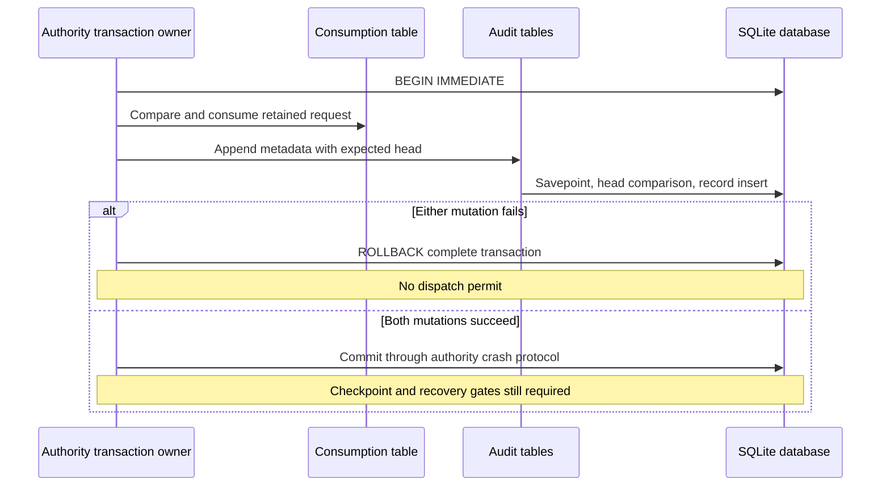

# Audit tables in the authority journal

`AuditJournalTables` stores the closed audit metadata schema in the authority's existing SQLite connection. It does not open a second database, own a consumption ledger, commit an outer transaction, or issue a dispatch permit.

## Connection ownership

The caller supplies a borrowed SQLite connection and serializes every use. Keep it open longer than the table owner. All queries require an explicit transaction. Writes additionally require `main` to be in `SQLITE_TXN_WRITE`, normally established by `BEGIN IMMEDIATE`.

Install the versioned tables once through the owner's schema migration transaction. Existing tables cause an error. No operation silently replaces or migrates them. Statements name the `main` schema explicitly.

The connection owner establishes protected paths, an OS-held writer lock, database identity checks, durability settings, recovery, and authority continuity. It selects the current epoch from validated authority state. This table layer cannot establish those properties from a database pointer.

Create a fresh random epoch after startup or classified recovery passes. The descriptor contains the verified generation, cause, and prior boundary when available. The caller authenticates that prior boundary; this layer does not infer it from an unverified database head.

`createEpoch` returns an opaque writer handle. Another table owner cannot use it, and creating a newer epoch retires this owner's earlier handle. Reading a persisted epoch does not create a writer. One table owner per Mac/account belongs to the exclusive authority writer.

A successful method return is still inside the caller's transaction. On any write failure, abort the complete consumption transaction. SQLite can automatically roll back a transaction after a storage error; do not infer a successful commit from an earlier method return.

## Storage and reads

Rows contain only canonical descriptors and audit metadata. There is no command, environment, target, UI text, password, or output field. All values use bound statements. Decoders reject unknown fields and invalid metadata before writes and after reads.

Sequence and boundary values use eight-byte big-endian blobs. Their ordering covers the full unsigned 64-bit range. Append compares the expected head and validates the next sequence. The record insert and head change share a savepoint; duplicate retained event IDs cannot advance the head. Producers must generate fresh event IDs; pruning does not retain ID tombstones.

Page reads keep the descriptor, head, retention boundary, and rows in the caller's same read transaction. They bound the row count and byte total. A smaller byte budget returns a shorter page; a single record that cannot fit fails. Missing, malformed, inconsistent, or oversized rows fail rather than become a valid partial history. Detecting validly rewritten data still requires the authority checkpoint; these tables are not an integrity witness. Pass the returned page to `AuditReplyBuilder` only after current channel authorization.

Pruning requires an explicit retained boundary and expected head. It deletes records and moves the boundary in one transaction, without reducing the head. No default retention period, automatic eviction, or epoch deletion is selected here.

## Evidence and remaining integration

Native tests use temporary SQLite files and in-memory databases. They cover shared consumption/audit commit and rollback, reopen, duplicate IDs, injected insert failures, automatic rollback, writer retirement, account isolation, full unsigned sequences, retention gaps, corrupt rows, and coherent concurrent reads. The retained page also passes the real signature builder.

These tests do not certify power-loss durability or protected production storage. Lifecycle reservations, rejection aggregation, the combined authority checkpoint, independent rollback witness, startup recovery, and admission remain work for the authority owner. Do not connect this layer to real action dispatch before those gates pass. The tests use WAL only to exercise concurrent snapshots; they do not select production journal settings.

SQLite documents [transaction state](https://www.sqlite.org/c3ref/txn_state.html), [savepoint behavior](https://www.sqlite.org/lang_savepoint.html), and [automatic rollback detection](https://www.sqlite.org/c3ref/get_autocommit.html).
