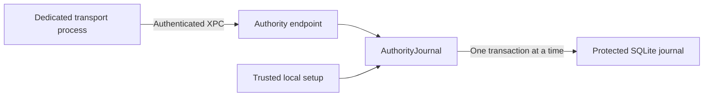

# Serialized authority journal

`AuthorityJournal` takes exclusive ownership of one `JournalDatabase` through a Swift `sending` parameter. It serializes reads, writes, and closure. Transaction callbacks are synchronous and `@Sendable`; only `Sendable` results can leave them. Database handles and audit writers remain non-Sendable.

The listener's journal initializer checks its Mac/account scope before activation. Each RPC reads current committed state through that same owner. A stale revision or missing enrollment returns false. Storage and corruption errors propagate to the endpoint, which retires the connection.

Nested operations fail with `transactionActive`, rather than deadlocking or closing a live transaction. Closing the owner waits for an active operation, releases the protected lease, and prevents subsequent reads. The listener does not close a shared journal itself; the root service must close listeners before closing its journal.

Transaction callbacks must remain bounded and must not wait for other work that needs this owner. Do not retain transaction objects through unchecked wrappers. This is a local authority API, not an exported arbitrary transaction RPC.

Tests use a disposable protected fixture and real SQLite transactions. They cover concurrent access, committed state, reopen recovery, nested access, stale bindings, storage errors, and endpoint integration. They do not install a root service or prove prelogin custody. Approval coordinator ownership, service activation, and transport trust refresh remain separate integration steps.
