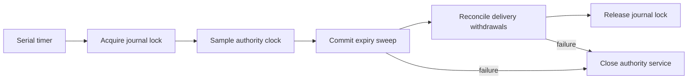

# Authority maintenance

`AuthorityService` can own a serial maintenance timer. It starts only after listener startup and stops before journal closure. Explicit closure waits for any active maintenance callback. A callback failure retires the timer and closes the service; it cannot continue serving after a failed sweep or reconciliation.

The expiry initializer samples the supplied authority clock inside `AuthorityJournal.withRequests`, calls `expirePending`, and reconciles the committed results before releasing the journal lock. The receipt time is optional audit metadata and never controls expiry.

The interval defaults to one second and accepts 100–60000 milliseconds. A timer tick is a prompt to check deadlines, not the deadline clock. Startup must supply the same sleep-inclusive clock epoch used for admission. Callbacks are synchronous and must not reenter the service or journal. Reconciliation must arrange delivery withdrawals; a failure after a successful audit commit does not undo the committed expiry.

The current trust-only executable does not enable maintenance or admit requests. Production clock construction, delivery ownership, and recovered request admission remain startup integration work. No root service or device was installed by these tests.

Tests cover interval bounds, closure before start, failure retirement, repeated start rejection, and closure waiting for active work. Existing service tests verify storage release and failed startup.
