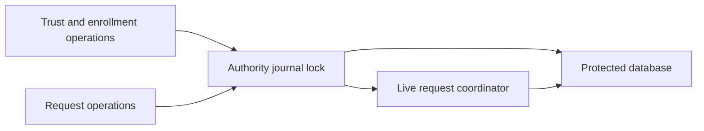
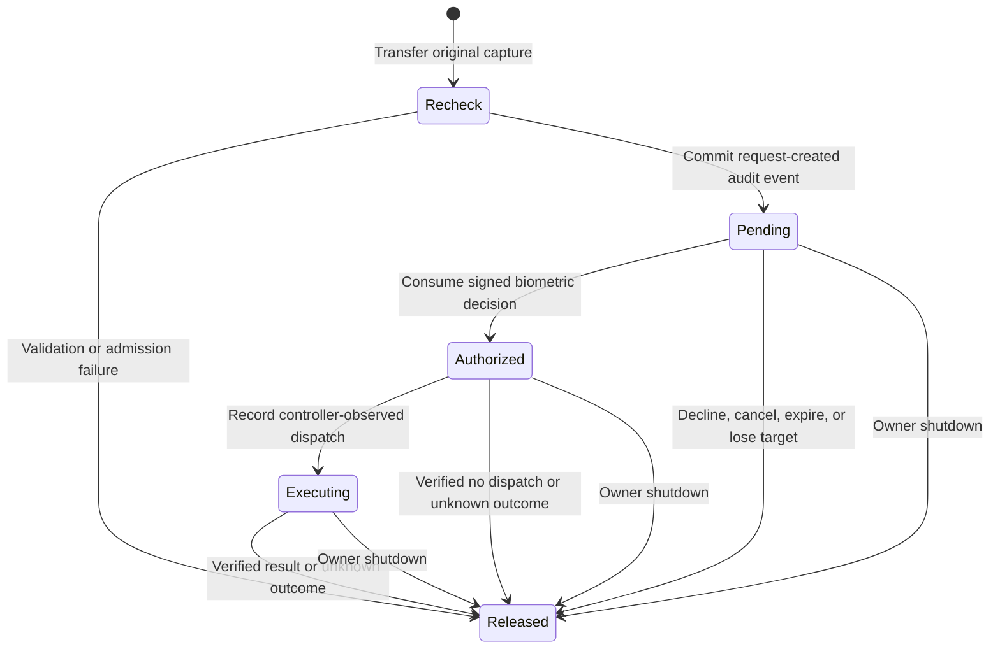

# Shared authority request owner

`AuthorityJournal` can own the live request coordinator as well as the database. Its request initializer transfers a prepared coordinator, including its database and audit writer. The caller must first establish recovery, storage reserves, and the current audit epoch.

`withRequests` holds the same lock as journal reads, writes, and closure. A synchronous callback can perform multiple coordinator operations before another thread changes trust. Only Sendable results may leave the callback. The callback must not await or retain the coordinator elsewhere. Reentry through any public journal operation is rejected; entering request work from an existing transaction is also rejected.

Storage validation precedes the callback. Successful closure drops live request captures; failed closure does not discard the coordinator.
Fatal database failures in owner reads, writes, and request preflight also release the live captures before returning.
Unrecoverable continuity failures and checkpoint mismatches retire the live coordinator.
Ordinary callback rejection, rejected reentry, and temporary SQLite contention preserve healthy requests and their objects.
Contention cannot preserve an already retired database or continuity connection. The existing initializer remains available for trust-only service startup and rejects request access as unavailable.

`AuthorityService` accepts this prepared journal owner. Its listener uses the same owner for trust queries, and service closure retires request access and releases storage.

This establishes an ownership boundary, not an admission or execution gate. Target validation, capacity reservations, recovery, authenticated RPC dispatch, and daemon composition remain required. Tests use a disposable protected journal and synthetic request data. No real action or device is used.

## Native command ownership

`admitCommand` transfers a `RetainedCommandCapture` into the same entry as its immutable issued request.
The draft must contain the exact captured bytes, the same command schema, and execute/decline for the current request.
The host supplies the current protected caller policy. The owner rechecks the original caller and files before admission.
It samples the authority clock after that work, so an elapsed deadline cannot use the earlier observation time.
A failed first admission closes the transferred caller, input, and filesystem resources.
An already transferred owner cannot be admitted again; that rejection leaves its existing request intact.

Queued, presented, authorized, and executing entries retain the original OS objects.
A terminal transition closes them only after its audit transaction commits.
An audit rollback leaves the previous pending state and objects intact.
An unrecoverable checkpoint or journal read/write closes all live objects before propagating the failure.
Cleanup checks the journal connection itself, including failures outside a checkpoint callback.
A proved rollback that preserves the checkpoint writer does not retire those objects.
Owner shutdown and an invalid authority clock release all live objects without inventing a durable outcome.
`AuthorityJournal.close` explicitly retires the coordinator after successful storage closure.
The coordinator destructor also retires its resources.

The existing raw `admit` API remains for trusted adapters and fixtures. It does not construct or retain command OS provenance.
Production command adapters must use `admitCommand`; parsing a caller-provided capture is not an equivalent path.
A typed capture transfer is not replay protection, current elevation-policy validation, or an execution permit.
The host must complete those gates, authenticated channel negotiation, protected deployment, and descriptor budgets before exposing an endpoint.
This change enables no Root installation or command execution and selects no pending sudoers policy.

Real Mach/fileport tests bind exact capture bytes through request creation and biometric decision consumption.
They verify terminal cleanup, pending expiry, cancellation, changed policy, duplicate ownership, and capacity rejection.
Injected audit failures preserve existing resources on rollback and release rejected admission resources.
A fresh clock check rejects a deadline reached during the recheck.
The tests use synthetic keys and disposable storage. They do not execute a command or exercise a phone.
