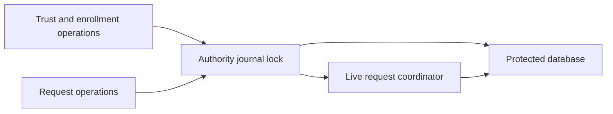

# Shared authority request owner

`AuthorityJournal` can own the live request coordinator as well as the database. Its request initializer transfers a prepared coordinator, including its database and audit writer. The caller must first establish recovery, storage reserves, and the current audit epoch.

`withRequests` holds the same lock as journal reads, writes, and closure. A synchronous callback can perform multiple coordinator operations before another thread changes trust. Only Sendable results may leave the callback. The callback must not await or retain the coordinator elsewhere. Reentry through any public journal operation is rejected; entering request work from an existing transaction is also rejected.

Storage validation precedes the callback. Successful closure drops live request captures; failed closure does not discard the coordinator. The existing initializer remains available for trust-only service startup and rejects request access as unavailable.

`AuthorityService` accepts this prepared journal owner. Its listener uses the same owner for trust queries, and service closure retires request access and releases storage.

This establishes an ownership boundary, not an admission or execution gate. Target validation, capacity reservations, recovery, authenticated RPC dispatch, and daemon composition remain required. Tests use a disposable protected journal and synthetic request data. No real action or device is used.
