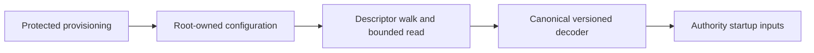

# Protected authority configuration

`AuthorityServiceConfiguration.load(path:)` reads root-owned startup state through `ProtectedServiceConfiguration`. Parsing arbitrary bytes with `decode` does not establish their provenance.

The reader requires UID 0 and an absolute path. It walks from `/` using descriptors and rejects symlinks, writable ancestors, remote filesystems, hardlinks, and non-regular files. The configuration file must have mode 0600. Ancestors must be root-owned and must not grant mutation through modes or ACLs. ACL checks are shared with the protected journal and gateway leases.

Reads are limited to 64 KiB. The reader retains every path descriptor until it has checked the identities again. It checks file size and modification metadata after reading. This detects observed changes during the read; it does not defend against a malicious root process.

Version 1 uses a deterministic CBOR map with these exact keys:

| Key | Value |
|---|---|
| 0 | Format version, 1 |
| 1–2 | Mac and account IDs, 16 bytes each |
| 3–4 | Absolute journal directory and authority Mach service name |
| 5–6 | Developer team ID and transport component identifier |
| 7 | Sorted unique transport code hashes, 1–16 entries of 20 bytes |
| 8 | Dedicated transport UID; zero and the invalid UID sentinel are rejected |
| 9–11 | Payload limit, minimum envelope version, and sorted unique audit versions |
| 12–14 | Connection limit, handshake timeout, and operation limit |

Unknown versions, extra or missing fields, duplicates, noncanonical ordering, and invalid bounds fail. The decoder compiles the transport code requirement through `XPCPeerPolicy`. No authority key or credential belongs in this file.

Protected ownership establishes who can replace these inputs. It does not prove that the installer chose correct code hashes, checked a release build floor, or provisioned a dedicated service account. Installation, activation, and the daemon entry point must enforce those remaining requirements. These tests neither install nor start a root service.

Protected storage also requires a root-owned local mount (`f_owner == 0`). This applies to every ancestor and private file during acquisition and revalidation. A user-owned mount cannot supply trusted journal, gateway, or service configuration state, even when its files report suitable owners and permissions. This uses the same mount validator as protected executable paths. Synthetic mount metadata tests cover root-owned local acceptance, user-owned local rejection, and remote rejection. A live disk-image mount experiment remains unperformed.

At service construction, the transport signing requirement must match the single active hash in retained code policy. The decoder still accepts the existing versioned format, but an allowlist containing extra hashes fails this runtime check. Neither version 1 nor version 2 can start a journal-backed listener without retained transport policy. Startup never initializes missing code policy. The trusted installer must update the protected launch inputs and retained policy through coordinated activation before restarting the listener.
