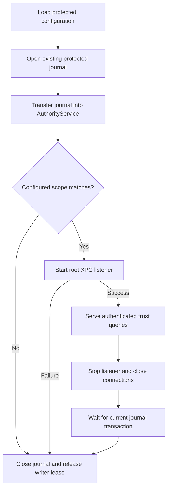

# Authority service lifetime

`AuthorityService` transfers a journal connection into one owner and binds the configured XPC listener to it. The listener verifies the journal's Mac and account scope before activation. An unconfigured journal fails construction; service recovery never initializes it.

The owner serializes start and close. Closing before startup prevents later activation. A failed start permanently retires that instance. Repeated close calls are safe. Deinitialization also closes the listener before the journal.

An RPC already inside a journal transaction may finish while shutdown waits. New or delayed journal calls fail after closure. Closing the endpoint suppresses late replies. No approval or execution RPC is added here.

The caller must load protected configuration and open its specified journal before transferring ownership. This type does not establish configuration provenance, provision files, migrate a database, or verify its own installation. The Xcode service target, protected activation and build-floor checks remain separate work. No service is installed by these tests.

Five fixture tests cover wrong scope, unconfigured storage, close before start, non-root startup failure, and deinitialization. They verify that a new owner can reacquire the actual writer lease. They do not prove root launchd activation, live IPC, or pre-login behavior.
