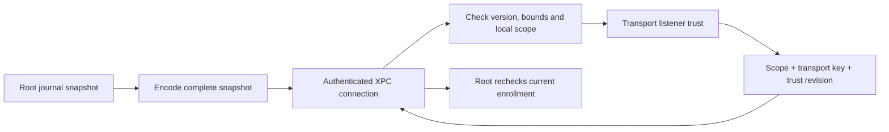

# Authority IPC trust data

`AuthorityTrustCodec` encodes version-1 deterministic CBOR for the local XPC boundary. It does not authenticate bytes. The transport must use the authenticated authority connection and supply the expected Mac and account IDs from its local configuration. `AuthorityXPCChannel.fetchTrust` closes the connection if decoding fails, including a scope mismatch.

The snapshot is an exact map: `0` version, `1` Mac ID, `2` account ID, `3` revision UUID bytes, and `4` peer rows. IDs and revision UUIDs use 16 bytes. Each peer row contains phone ID, enrollment epoch, P-256 transport SPKI, request capabilities, audit versions, minimum envelope version, and maximum payload bytes. Capability rows contain kind, wire version, schema version, and features. Unknown request kinds remain opaque.

Peers sort by phone ID. Capabilities sort by kind, wire version, and schema version. Feature and audit sets sort numerically. Decoders require the canonical encoding and reject duplicate phones, duplicate transport keys, extra fields, unknown codec versions, invalid keys, and invalid capability values. An empty peer list is valid and tells the transport to stop listening.

The snapshot has a 1 MiB byte limit, 131,072 CBOR items, depth eight, and at most 1,024 peers. Encoding fails for a snapshot that exceeds any limit. It never truncates enrollment or capability data. The caller must treat that failure as unavailable trust and stop serving until a complete snapshot is available.

The binding map contains `0` version, `1` scope array (Mac, account, phone, epoch), `2` transport SPKI, and `3` revision UUID bytes. It has a 4 KiB byte limit, 16 items, and depth three. It deliberately excludes capabilities; root validation loads current policy from the journal. Successful decoding or validation never grants approval or execution authority.

Tests cover complete round trips, canonical ordering, empty trust, bindings with large capability sets, wrong scope, duplicate identities, malformed fields, unknown versions, truncation, trailing bytes, and size bounds. The client test confirms malformed trust retires an authenticated connection. These tests use fixtures. The [root endpoint](authority-xpc-endpoint.md) and journal binding check are available. The [listener owner](authority-xpc-listener.md) manages accepted connections. Root handler wiring, ordered trust delivery, and product service wiring remain to be connected.
