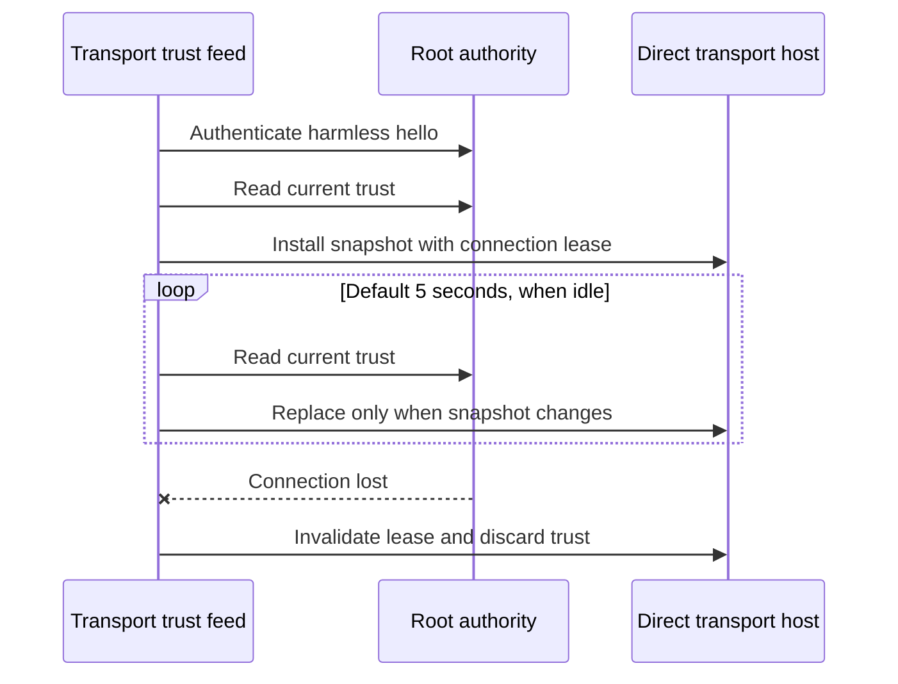

# Authority trust feed

The dedicated transport service retains an `AuthorityTrustFeed` and its `DirectApprovalTransportHost`. Construct the host with a validator that calls `feed.validatePeer(peer, revision:)`. Start the feed with that host before starting the host's listener. Close both during service shutdown.

One XPC operation runs at a time. Up to eight callers can wait by default; this limit accepts values from zero through 64. Cancelling queued work removes that waiter without cancelling another caller's operation. Cancelling active work retires the connection. Every peer validation reaches the root authority; no allow result is cached.

Refresh is configurable from 500 milliseconds through 60 seconds. The timer skips a busy interval rather than adding background work to a full queue. An explicit refresh can run after a known policy change. Identical canonical snapshots keep the existing listener and its connections. A changed snapshot replaces them, including changes that retain the same journal revision.

Each feed has a distinct lease. The host invalidates the previous lease when a new feed takes over. Stale replies and disconnect callbacks cannot replace or retire the new connection's trust. A connection loss or malformed snapshot closes the feed. Reconnection requires a new feed, handshake, and snapshot.

Refresh timing is not permission to execute a request. The root must still check current enrollment and consume the final decision atomically. Transport validation denies stale bindings between refreshes.

The fixture tests cover ordering, cancellation, queue capacity, unchanged snapshots, revocation, and connection loss. Protected service activation, automatic reconnect scheduling, and real signed XPC remain separate integration steps. These tests do not prove device or prelogin behavior.
