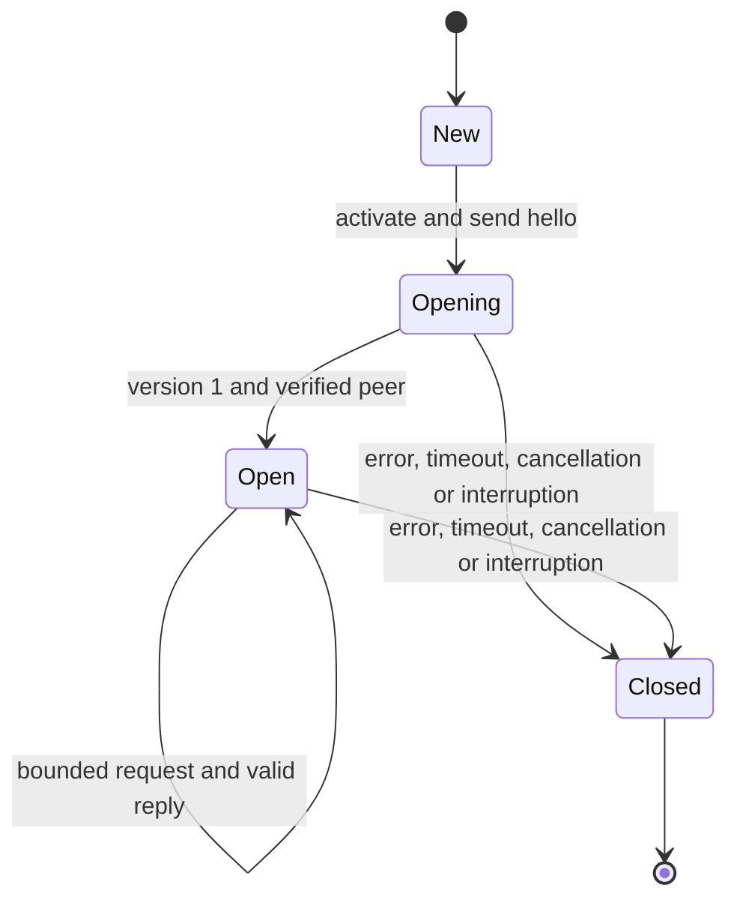

# Transport-to-authority XPC client

`AuthorityXPCChannel` owns one connection from the dedicated transport service to a root Mach service. It configures the release [peer policy](xpc-peer-policy.md) before activation and requires an expected root user ID. It has no authority key or journal access.

The first operation is a harmless `hello` with no request data. A version-1 reply and verified server credentials open the channel. Snapshot and peer-validation calls are unavailable before this step. Every native reply also checks the connection credentials; Foundation enforces the configured signing requirement on incoming messages.

The protocol exposes only hello, trust snapshot retrieval, and peer-binding validation. It has no general execution or signing method. The client permits one outstanding operation, bounds binding data to 4096 bytes and snapshot replies to 1 MiB, and applies a configurable 1–60 second deadline. Empty or oversized replies fail. A validation denial is an ordinary false result, not a connection failure.

Interruption permanently retires this instance. The caller creates a new instance, performs a fresh handshake, and fetches fresh trust. The required `onClose` callback fires once for terminal closure; the service uses it to notify `DirectApprovalTransportHost.authorityDisconnected()`. The client never retries a request automatically. Late replies are bound to an operation ID and cannot reopen a retired connection or complete another operation.

Cancellation invalidates native XPC and the local send gate before actor cleanup. The gate permits synchronous invalidation callbacks without deadlock. These rules limit local pending work; they do not assert that a remote method did not run before a timeout.

## Evidence and remaining work

Nine fixture tests cover handshake ordering, wrong versions, overlapping operations, payload bounds, denial, interruption, cancellation, timeout, synchronous invalidation, one-time owner notification, and late replies. They exercise the lifecycle with a callback driver. They do not establish live Developer ID IPC authentication or product service availability.

The exported root implementation, ordered trust-update integration, bounded server work, and service packaging remain outstanding. Root operations must use the invocation guard and enforce current enrollment atomically. A successful validation reply is not an execution permit. The [trust codec](authority-trust-codec.md) rejects an oversized snapshot without truncation; the root endpoint must propagate that failure.

No service is registered or activated by the fixture tests. The existing [XPC experiment](../../docs/experiments/macos-xpc.md) remains the evidence for the harmless-handshake requirement. It does not prove this product client is wired to a release service.
