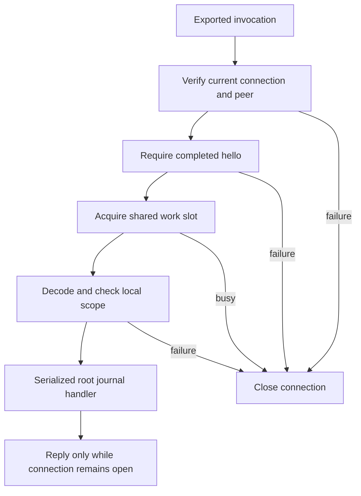

# Root authority transport endpoint

`AuthorityXPCEndpoint` exports the three operations used by the transport client: harmless version-1 hello, trust snapshot retrieval, and peer-binding validation. It has no approval, execution, signing, or credential-release method.

The root listener supplies an accepted connection and a protected release peer policy for the dedicated transport account. The endpoint rejects UID zero as that transport identity. It checks the accepted peer credentials, applies the signing requirement before activation, and binds the exported object to `XPCInvocationGuard`. Every invocation verifies the current connection and credentials synchronously before any handler runs. A successful earlier hello does not bypass later identity checks.

One shared `AuthorityXPCWorkBudget` bounds work across all transport endpoints. Its default is eight operations, configurable from one to 64. Each endpoint admits one operation at a time. Admission fails immediately when capacity is exhausted; this layer creates no task or waiting queue. The production listener must use the same budget for every accepted connection and separately limit connection admission.

Handlers run synchronously on the XPC invocation thread. The root owner must serialize all journal access, including these reads and its mutations, and bound handler work. The endpoint never owns a second journal connection. The shared slot remains occupied until a handler returns, even if the connection closes meanwhile. Closing suppresses a late successful reply; it does not interrupt an active journal read or prove that the handler did not run. Client deadlines retire the client connection independently.

The snapshot handler must return a complete snapshot in the configured Mac/account scope. The codec applies size and semantic limits before sending it. The validation handler receives only a decoded binding and must call `JournalTransaction.requireDirectApprovalBinding` within the root's current transaction. That method checks revision, scope, unrestricted active enrollment, enrollment epoch, and transport key. A denial can return false without retiring the connection. Handler errors close the connection. Admission validation is never an approval or execution permit.

Seven endpoint fixture tests cover authentication order, identity failure after hello, missing hello, malformed bindings, wrong snapshot scope, shared capacity, immediate next calls from reply callbacks, handler failure, and closure during work. A journal test passes a decoded binding through acceptance, key mismatch, and revocation. Existing journal peer tests exercise the same underlying check. These fixtures do not prove release-signed live XPC authentication.

The listener owner, protected service installation, root handler wiring, ordered trust notifications, and release-signed process tests remain outstanding. This change installs no service and activates no listener.
