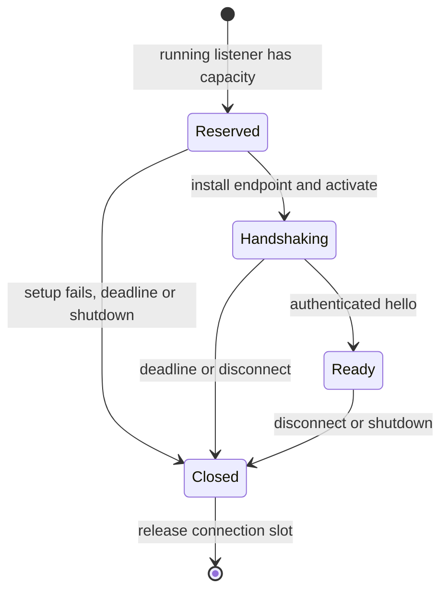
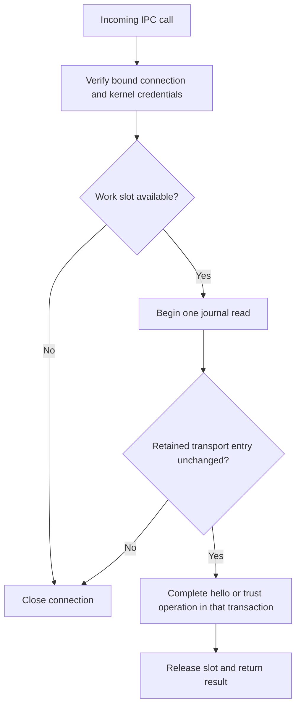

# Authority listener ownership

`AuthorityXPCListener` owns the root Mach listener, accepted connections, exported endpoints, handshake deadlines, and one shared work budget. Its name and scope come from protected local configuration. Starting requires effective UID zero. This check does not install or register the Mach service and does not replace protected deployment.

The release peer policy is configured on the listener before activation. The delegate rejects calls for another listener and reserves capacity before creating an endpoint. The endpoint checks peer credentials and configures the accepted connection's signing policy before activation. All endpoints use the same handler budget.

Connection capacity defaults to eight and supports one to 64. Reservations include setup and handshake. The handshake deadline defaults to five seconds and supports one millisecond to 60 seconds. An authenticated hello cancels its timer. A queued expiry checks the ready flag, so it cannot remove a connection that completed its handshake. A new listener instance is required after shutdown.

The registry serializes installation and activation with expiration. If setup finishes after its reservation expires, it closes the connection without activating it. UUID reservations isolate old callbacks from later connections. Removal and shutdown detach entries before closing endpoints, so recursive invalidation callbacks are harmless. Shutdown cancels every deadline and closes all owned connections. Active synchronous journal work keeps its shared work slot until it returns, as described in the [endpoint contract](authority-xpc-endpoint.md).

Seven registry fixture tests cover admission bounds, setup failure, expiration during setup, completed handshakes, shutdown during activation, recursive removal, and an actual timer firing. An endpoint test verifies the handshake notification occurs once before its successful reply. These tests do not activate a Mach service or prove live release-signed process authentication.

Protected service registration, the serialized root journal owner, ordered trust notifications, and service packaging remain outstanding. No service is installed by this change or its tests.

## Retained transport policy

The journal-backed initializer requires an active transport entry in the retained code policy. It reads that entry with the initial trust snapshot. The configured signing requirement must exactly match the retained team, identifier, and code hash. A broader hash allowlist cannot admit staged or obsolete code. The transport UID and audit-session restriction still come from protected launch configuration.

Every call checks the OS-bound connection identity first. It then reserves a shared work slot before reading retained policy, including during hello. A missing or changed transport entry rejects the call and closes the endpoint. Hello reads the current entry. Snapshot retrieval and peer validation check the entry inside the same transaction as their trust operation. Each RPC opens one journal read, not separate policy and data reads. A successful earlier check cannot authorize a read after a concurrent policy commit.

A hash, security generation, minimum generation, or active-state change invalidates the old listener's access. Its next call closes that endpoint. A fresh listener must pass the new policy check. Updating another component leaves this transport entry valid. A rolled-back policy update also leaves access unchanged.

This requires trusted installation to validate the signed metadata before retaining each hash and generation. The storage record is not remote attestation. Root self-validation, release activation, receiving-key isolation, and live signed update tests remain pending. These trust endpoints still expose no target action or signing operation. The lower-level initializer with custom callbacks remains an explicit host integration boundary; the service uses the journal-backed initializer.
