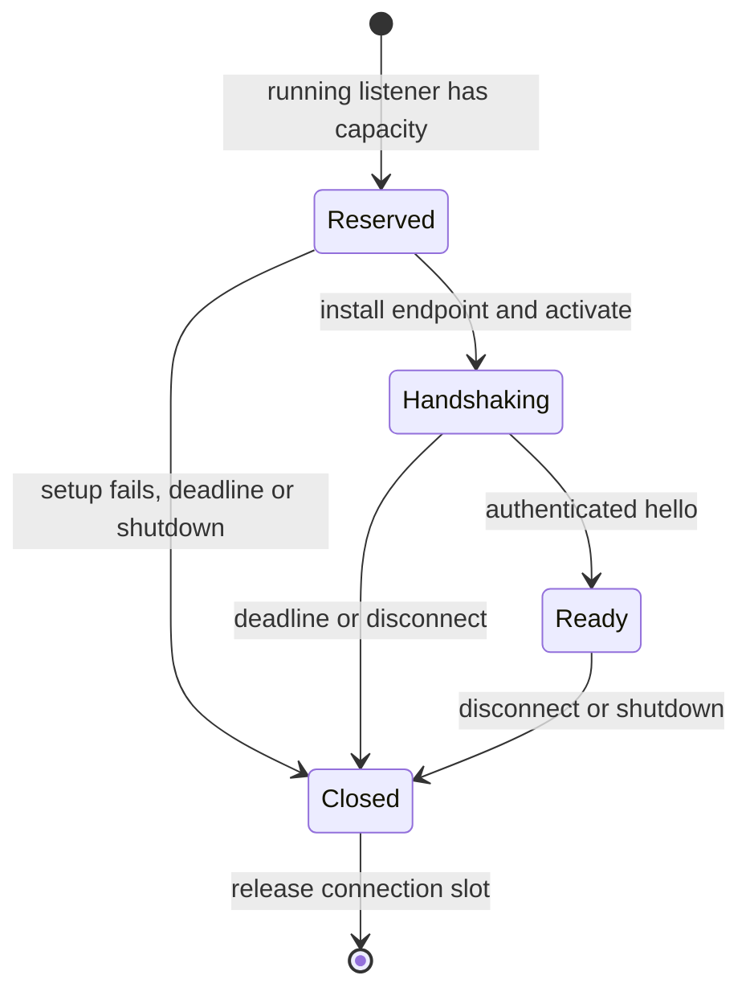

# Authority listener ownership

`AuthorityXPCListener` owns the root Mach listener, accepted connections, exported endpoints, handshake deadlines, and one shared work budget. Its name and scope come from protected local configuration. Starting requires effective UID zero. This check does not install or register the Mach service and does not replace protected deployment.

The release peer policy is configured on the listener before activation. The delegate rejects calls for another listener and reserves capacity before creating an endpoint. The endpoint checks peer credentials and configures the accepted connection's signing policy before activation. All endpoints use the same handler budget.

Connection capacity defaults to eight and supports one to 64. Reservations include setup and handshake. The handshake deadline defaults to five seconds and supports one millisecond to 60 seconds. An authenticated hello cancels its timer. A queued expiry checks the ready flag, so it cannot remove a connection that completed its handshake. A new listener instance is required after shutdown.

The registry serializes installation and activation with expiration. If setup finishes after its reservation expires, it closes the connection without activating it. UUID reservations isolate old callbacks from later connections. Removal and shutdown detach entries before closing endpoints, so recursive invalidation callbacks are harmless. Shutdown cancels every deadline and closes all owned connections. Active synchronous journal work keeps its shared work slot until it returns, as described in the [endpoint contract](authority-xpc-endpoint.md).

Seven registry fixture tests cover admission bounds, setup failure, expiration during setup, completed handshakes, shutdown during activation, recursive removal, and an actual timer firing. An endpoint test verifies the handshake notification occurs once before its successful reply. These tests do not activate a Mach service or prove live release-signed process authentication.

Protected service registration, the serialized root journal owner, ordered trust notifications, and service packaging remain outstanding. No service is installed by this change or its tests.
