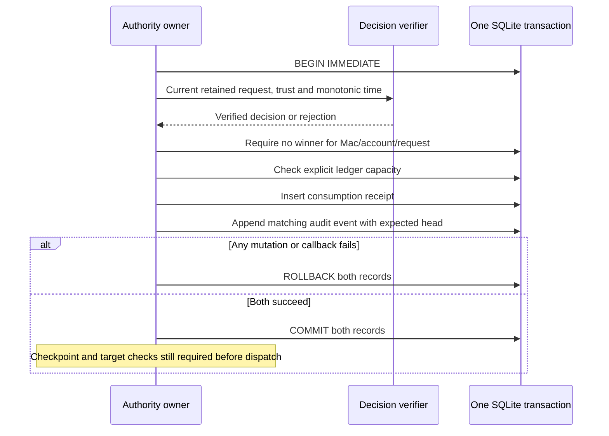

# Atomic decision consumption

`JournalTransaction.consume` verifies a signed phone decision, stores an immutable receipt, and appends its generated audit event within the owner's write transaction. It returns evidence, never permission to dispatch.

## Winner and verification

Use one write callback per decision. The authority must serialize that callback with retained request transitions and trust changes, and supply current state and time. The existing verifier checks request digest, challenge, account, lifecycle, expiry, enrollment, contract, exact permitted action, key class and signature. A previously verified object cannot bypass this verification.

The first committed decision wins for the Mac/account/request ID. A later decision, including an identical replay or a changed challenge, cannot overwrite it. New requests need fresh IDs. The database key and exclusive owner enforce this rule; another process cannot acquire the live writer lease. A callback result is provisional until `write` returns successfully.

Decline resolves the request with a No dispatch receipt. Other accepted actions record Accepted, which does not claim execution. Little Snitch allow-once and deny-once retain their decision-key policy; reusable rules and 1Password actions retain the biometric-key policy. The event's category, action, phone, authentication, outcome and reason are derived from the verified decision and retained request. The caller supplies a fresh event ID and an optional authority receipt time.

Both writes share the outer transaction. Even a caught mutation error prevents commit. Audit insertion failure removes the provisional consumption; ledger insertion failure adds no audit event. A head mismatch retires the connection through the existing owner rule.

## Storage and history

The internal `consumptions_v1` table contains scope and request IDs, the canonical decision, and the generated audit metadata. The decision includes request digest, challenge, winning phone/key IDs and exact action scope. It contains no captured command, environment, UI text, target text, credential, output or signature. The capture remains in memory.

Receipt reads bound both blobs before decoding and cross-check their scope, request, phone, action and outcome metadata. This detects malformed or inconsistent values. It does not authenticate a coherently rewritten database or prove continuity after backup restoration. Reopened receipts are history; they cannot recreate a pending request or a writer capability.

The consumption receipt retains its event metadata when audit history is pruned. There is no ledger eviction or winner reset API. `maximumConsumptions` and decision CBOR limits are required configuration. Invalid decisions do not consume capacity. Reaching capacity fails before either write; this count limit is not a disk reservation or a lifecycle storage guarantee. Safe ledger retention and admission reservations remain separate work.

Schema version 2 adds the ledger. Existing version 1 stores require the explicit migration described in [the connection contract](journal-database.md). The migration preserves history, creates no historical consumption rows, and grants no authority continuity. Version 1 shipped only the gated audit foundation. This migration must never be used to repair a lost production ledger.

## Evidence and remaining integration

Fourteen normal-user tests use real synthetic P-256 signatures. They cover opposite decisions from two phones, replay after reopen, changed challenges, account isolation, current verification failures, action policy, both table failures, callback/automatic rollback, duplicate audit events, head mismatch, capacity, pruning, transaction lifetime, bounded corrupt reads and explicit migration.

Pending-state comparison and cancellation/revocation ordering must still be owned by the authority coordinator. Lifecycle storage reserves, durable outcome transitions, checkpoint commits, recovery classification and the independent rollback witness remain required before real dispatch. Process-local tests do not prove physical power-loss behavior or remote-device operation. No action was executed.
