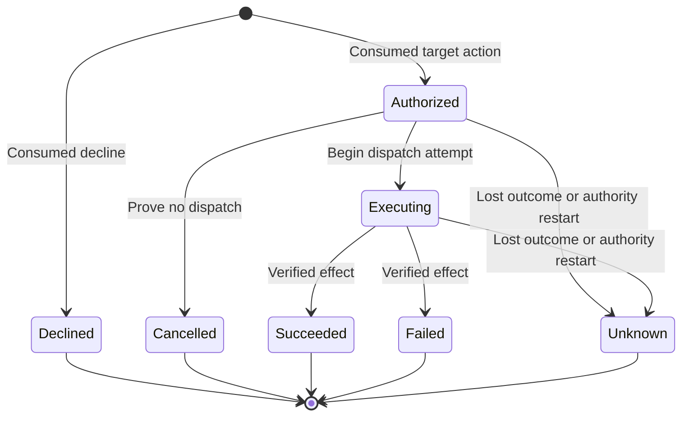

# Durable consumption outcomes

`JournalTransaction.transitionConsumption` records an outcome observation and its audit event in the same transaction. The original winning decision remains immutable. A returned state is historical evidence, not an action permit.

## Observation contract

The controller supplies an existing request ID, its expected outcome revision, a lifecycle event, a fresh audit event ID, and optional receipt time. The connection scopes the lookup to its Mac/account. The existing `RequestLifecycle` rules reject invalid transitions, stale revisions and every attempt to leave a terminal state. Unknown cannot transition back to dispatch, even if a late success observation arrives.

Revision zero represents the immutable consumption receipt. Decline is terminal at that revision. Target actions start with historical Authorized state. A first outcome has revision one; only Executing can advance to revision two, which is terminal. The closed schema rejects other revision/state combinations.

`beginDispatch` records entry into the dispatch attempt, not proof that an external effect happened. Verified success or failure requires effect evidence from the controller. A click, missing acknowledgment, timeout or process exit without the required verification cannot establish success. `proveNoDispatch` is valid only before a dispatch attempt. Restart or lost-outcome observations preserve Unknown.

The controller must reconcile stored nonterminal outcomes during startup before admission. Merely reopening or migrating the database does not run recovery. It cannot authorize an old action, recreate its sensitive payload, or issue a permit. After continuity validation, recovery can record Unknown in a fresh audit epoch while retaining the original consumption receipt and phone identity.

## Atomic writes and retained evidence

Each request has at most one row in `consumption_outcomes_v1`, with a foreign key to its immutable consumption. The row stores a bounded audit event and a checked revision. Reads cross-check scope, request, phone, action, category, authentication, outcome and revision. The event uses System authentication because it describes the Mac's observation; the original receipt retains the phone decision's authentication class.

The operation inserts revision one or compares and updates revision one to two, then appends the same event through the audit head check. Both writes use the outer transaction. A caught error still prevents commit. A head mismatch or automatic rollback retires the connection. Neither an audit failure nor an outcome failure leaves a partial new observation.

Audit pruning does not remove the winner or the latest outcome. Reaching the consumption row limit does not block observations for existing rows. This is not a guarantee against disk exhaustion; lifecycle storage reservations remain required. There is no outcome deletion, reset or automatic retry API.

Schema version 3 adds the outcome table through explicit version 1 or 2 migration. Migration preserves audit history and existing receipts. It creates no outcome observations or recovery conclusions. A failed migration rolls back its schema changes and version update. See [the connection contract](journal-database.md).

## Evidence and remaining gates

Thirteen new fixture tests cover verified and conflicting terminal results, Unknown before/after dispatch, invalid and stale observations, decline, No dispatch proof, restart into a fresh epoch, insert/update failures, automatic and callback rollback, head mismatch, duplicate events, capacity, pruning, scope and transaction lifetime, malformed rows, and both migration paths.

These tests use synthetic signatures and temporary storage. They execute no command or UI action. The authority coordinator still must verify observation sources, quiesce late actors, complete the checkpoint protocol, classify recovery and establish independent authority continuity. Physical power-loss and real-device tests remain deferred.
