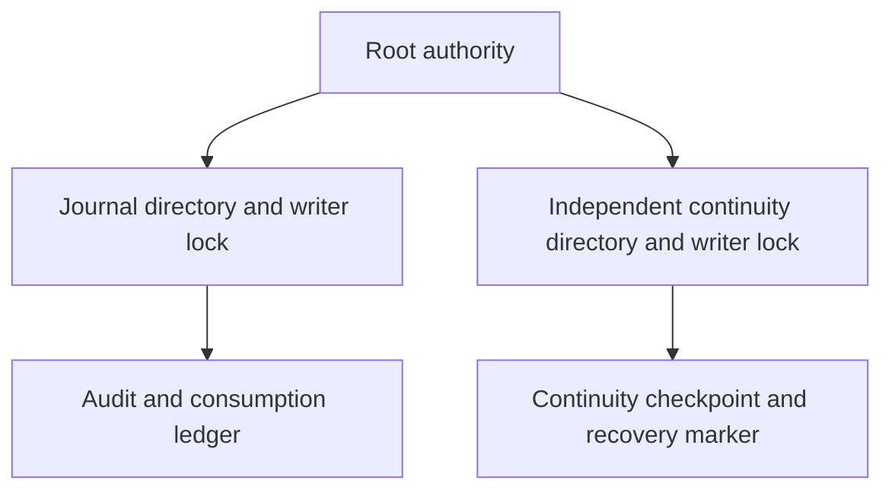

# Independent continuity storage

`ProtectedContinuityLease` acquires an existing root-owned `continuity.sqlite` and `writer.lock` in a private directory. Installation must place that directory outside the replaceable journal directory. Both stores can remain locked by the authority at the same time.

The shared storage checks retain file and ancestor identities, reject symlinks and unsafe permissions or ACLs, and require a local root-owned mount. Acquisition never creates files or substitutes `journal.sqlite` for a missing continuity store. A failed identity check permanently retires the lease. Close SQLite before releasing its lease.

This PR establishes storage ownership only. The checkpoint schema, durable commit protocol, startup validation, history-loss classification, and recovery marker remain to be implemented. The current authority executable still serves trust queries only. It must not enable request admission merely because both storage leases can be acquired.

Tests hold both stores, replace the journal while preserving the continuity lease, reject missing continuity storage, verify exclusive ownership, and retire a replaced continuity file. Common storage tests cover path traversal, ACLs, nonregular files, and lock replacement. No service was installed and no physical recovery test was run.
