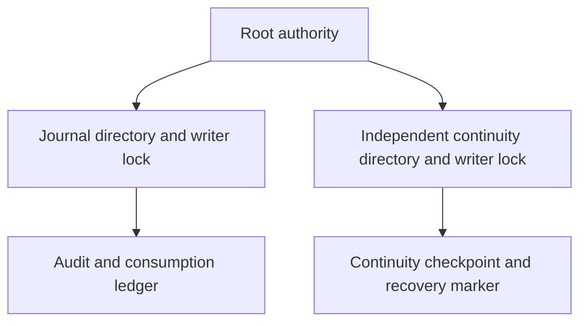
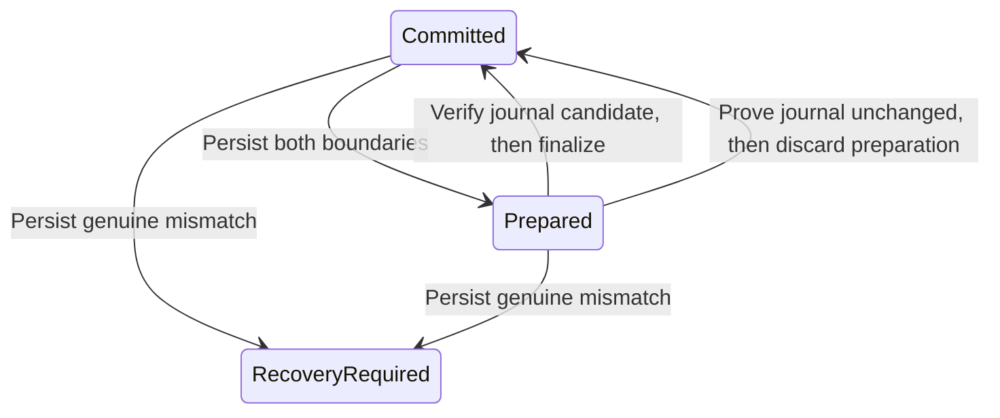

# Independent continuity storage

`ProtectedContinuityLease` acquires an existing root-owned `continuity.sqlite` and `writer.lock` in a private directory. Installation must place that directory outside the replaceable journal directory. Both stores can remain locked by the authority at the same time.

The shared storage checks retain file and ancestor identities, reject symlinks and unsafe permissions or ACLs, and require a local root-owned mount. Acquisition never creates files or substitutes `journal.sqlite` for a missing continuity store. A failed identity check permanently retires the lease. Close SQLite before releasing its lease.

The lease establishes storage ownership only. The checkpoint persistence API is described below. Journal coordination, startup validation, and history-loss classification remain to be implemented. The current authority executable still serves trust queries only. It must not enable request admission merely because both storage leases can be acquired.

Tests hold both stores, replace the journal while preserving the continuity lease, reject missing continuity storage, verify exclusive ownership, and retire a replaced continuity file. Common storage tests cover path traversal, ACLs, nonregular files, and lock replacement. No service was installed and no physical recovery test was run.

## Checkpoint persistence

`ContinuityStore` opens only an existing protected file. Explicit setup can initialize an empty file; normal open never creates or repairs a missing, corrupt, or unsupported store. Its schema binds the Mac and account and stores one committed checkpoint, an optional prepared checkpoint, and a sticky recovery marker.

Each checkpoint contains a generation, authority-state digest, ledger digest, journal epoch, and journal head. Digests are fixed-width inputs from the trusted authority's canonical state encoder, which remains to be integrated. They contain no target labels or command text. The prepared generation must immediately follow the committed generation; overflow is rejected.

All mutations use SQLite transactions with DELETE journaling, synchronous EXTRA, and fullfsync. Lease validation surrounds commit. An uncertain commit retires the connection; reopening must reconcile retained state. A rolled-back statement failure preserves both boundaries and does not invent a recovery-required condition. SQLite errors remain distinct from unsupported or malformed state. Finalize and discard compare the complete retained state, so a stale caller cannot clear a marker or replace a different pending checkpoint. No API clears the recovery marker.

The root coordinator must persist preparation before changing the journal. It may finalize only after verifying the journal's committed candidate. Recovery may discard preparation only after proving the journal still matches the old boundary. Neither operation permits dispatch. Canonical digest computation, journal coordination, interruption classification, repair, and startup admission remain integration work. Reopen tests are not power-loss or physical-device evidence.

Tests cover all four mutation failures, rollback and retry, reopening each checkpoint phase, marker persistence, wrong scope, stale transitions, invalid generations, corrupt bytes, missing rows, and unsupported versions. No action was dispatched by these tests.
