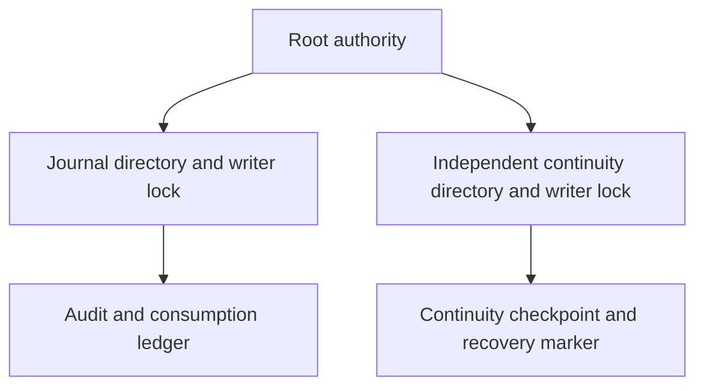
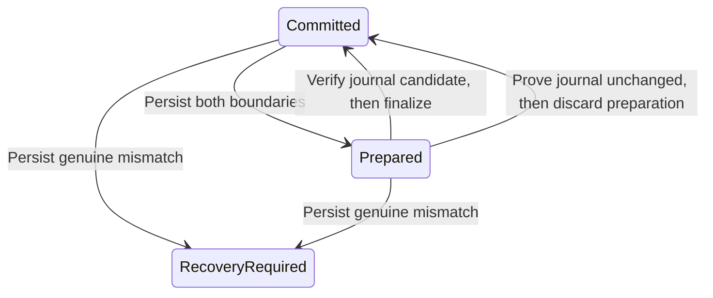
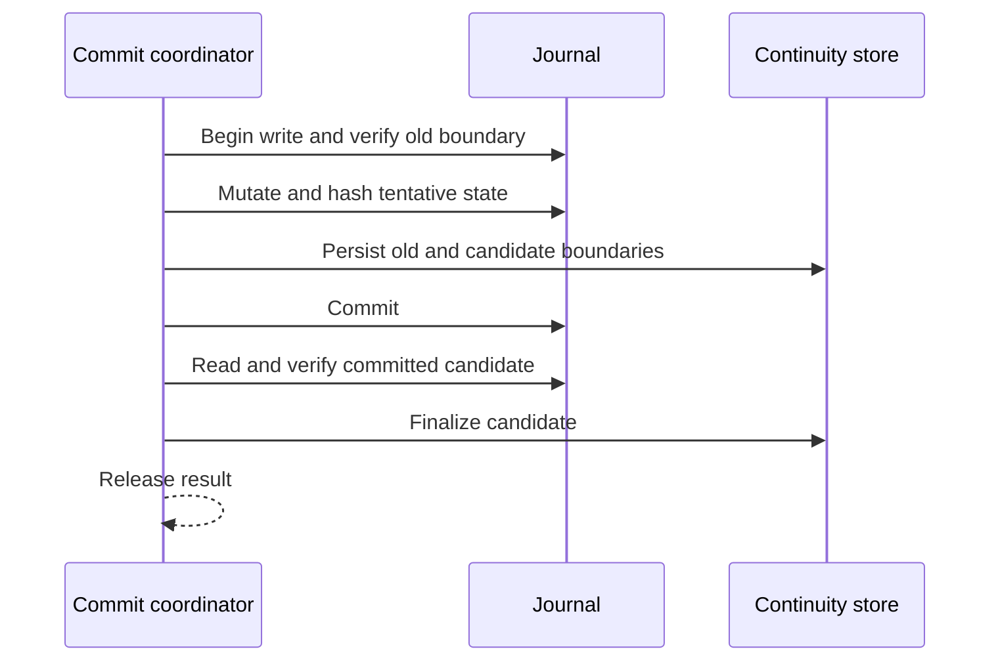
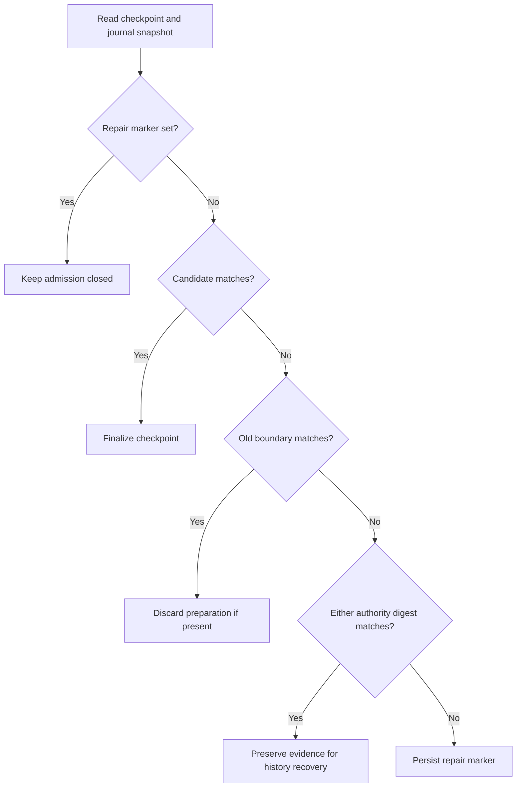

# Independent continuity storage

`ProtectedContinuityLease` acquires an existing root-owned `continuity.sqlite` and `writer.lock` in a private directory. Installation must place that directory outside the replaceable journal directory. Both stores can remain locked by the authority at the same time.

The shared storage checks retain file and ancestor identities, reject symlinks and unsafe permissions or ACLs, and require a local root-owned mount. Acquisition never creates files or substitutes `journal.sqlite` for a missing continuity store. A failed identity check permanently retires the lease. Close SQLite before releasing its lease.

The lease establishes storage ownership only. The checkpoint persistence API is described below. Journal coordination, startup validation, and history-loss classification remain to be implemented. The current authority executable still serves trust queries only. It must not enable request admission merely because both storage leases can be acquired.

Tests hold both stores, replace the journal while preserving the continuity lease, reject missing continuity storage, verify exclusive ownership, and retire a replaced continuity file. Common storage tests cover path traversal, ACLs, nonregular files, and lock replacement. No service was installed and no physical recovery test was run.

## Checkpoint persistence

`ContinuityStore` opens only an existing protected file. Explicit setup can initialize an empty file; normal open never creates or repairs a missing, corrupt, or unsupported store. Its schema binds the Mac and account and stores one committed checkpoint, an optional prepared checkpoint, and a sticky recovery marker.

Each checkpoint contains a generation, authority-state digest, ledger digest, journal epoch, and journal head. Digests are fixed-width inputs from the trusted authority's canonical state encoder, which remains to be integrated. They contain no target labels or command text. The prepared generation must immediately follow the committed generation; overflow is rejected.

All mutations use SQLite transactions with DELETE journaling, synchronous EXTRA, and fullfsync. Lease validation surrounds commit. An uncertain commit retires the connection; reopening must reconcile retained state. A rolled-back statement failure preserves both boundaries and does not invent a recovery-required condition. SQLite errors remain distinct from unsupported or malformed state. Finalize and discard compare the complete retained state, so a stale caller cannot clear a marker or replace a different pending checkpoint. No API clears the recovery marker.

The root coordinator must persist preparation before changing the journal. It may finalize only after verifying the journal's committed candidate. Recovery may discard preparation only after proving the journal still matches the old boundary. Neither operation permits dispatch. Canonical digest computation, journal coordination, interruption classification, repair, and startup admission remain integration work. Reopen tests are not power-loss or physical-device evidence.

Tests cover all four mutation failures, rollback and retry, reopening each checkpoint phase, marker persistence, wrong scope, stale transitions, invalid generations, corrupt bytes, missing rows, and unsupported versions. No action was dispatched by these tests.

## Journal snapshot hashes

`JournalTransaction.continuityDigests()` hashes a single SQLite transaction, including its tentative writes. The authority digest covers the journal identity, enrollments, pairing receipts, routing controls, and gateway controls. The ledger digest covers the identity, audit epochs and records, consumptions, and outcomes. History changes remain distinguishable from trust changes.

The versioned SHA-256 format separates the two domains. It sorts tables and rows, includes column names, and frames each value with its type and length. Integer values use eight big-endian bytes. Text and blob bytes remain distinct; null and empty values remain distinct. Hashing streams rows instead of retaining the complete journal in memory. SQLite can use temporary storage to sort rows.

The schema-12 table catalog must match exactly. An added or missing table or a different schema version fails the snapshot rather than silently weakening coverage. This digest checks byte continuity; it does not replace semantic record validation. Protected state outside this database, including future installation floors and root-key identities, still needs its own binding before startup admission can use a complete authority checkpoint.

Tests cover insertion-order independence, trust changes, consumption and outcome changes, history separation, transaction rollback, reopen stability, expired transaction access, and an uncovered table. Commit coordination and recovery admission remain unimplemented. No physical power-loss test was run.

## Coordinated writes

The internal `CheckpointedJournal` primitive verifies the old boundary inside the journal write transaction. It runs the mutation, hashes the tentative result, and durably prepares both checkpoint boundaries before SQLite commits the journal. It then reads the committed journal again and finalizes the checkpoint. Only after finalization does the method return the callback's result.

The callback must not dispatch actions or publish results. The host must serialize both connections and establish complete authority continuity before constructing the primitive. The helper binds current journal state only; it does not yet include external root-key or installation state. Existing request writes do not use it yet.

Any failure withholds the result and retires that coordinator instance. A transient failure does not set the durable recovery marker. Reopening must inspect both boundaries before retrying storage work; it must never retry an action. Tests inject SQLite preparation and finalization failures, a journal rollback after preparation, and callback failure. They verify retained evidence after reopening and reject a mismatched or unresolved boundary before running a mutation. These are process-level storage tests, not physical power-loss evidence. Automatic recovery and admission integration remain separate work.

## Interrupted preparation recovery

`JournalCheckpointRecovery` reads the independent checkpoint and compares both boundaries with one journal snapshot. It finalizes a matching candidate or discards preparation when the old boundary still matches. Repeating a completed recovery returns the unchanged checkpoint. It reconstructs no requests, permits, or callback results.

History differences preserve both boundaries and return a discontinuity classification. They do not set the repair marker. A mismatch in journal authority state persists the sticky marker. SQLite and lease failures propagate; they are not converted into a repair diagnosis. A failed marker write also propagates, so the host must keep admission closed and independently check again on restart.

These results describe journal storage only. External root-key and installation continuity must also pass. Before admission resumes, the host still must record history gaps and unresolved outcomes, create a fresh audit epoch, and retire old requests. A finalized preparation is not evidence of an external effect and never authorizes replay. This recovery helper is not yet connected to authority startup.

Tests exercise finalize and discard after reopening, idempotence, history-only differences, transient finalization failure and retry, authority mismatch, failed marker persistence, and marker retention after the original trust bytes return. No physical power-loss test was run.
