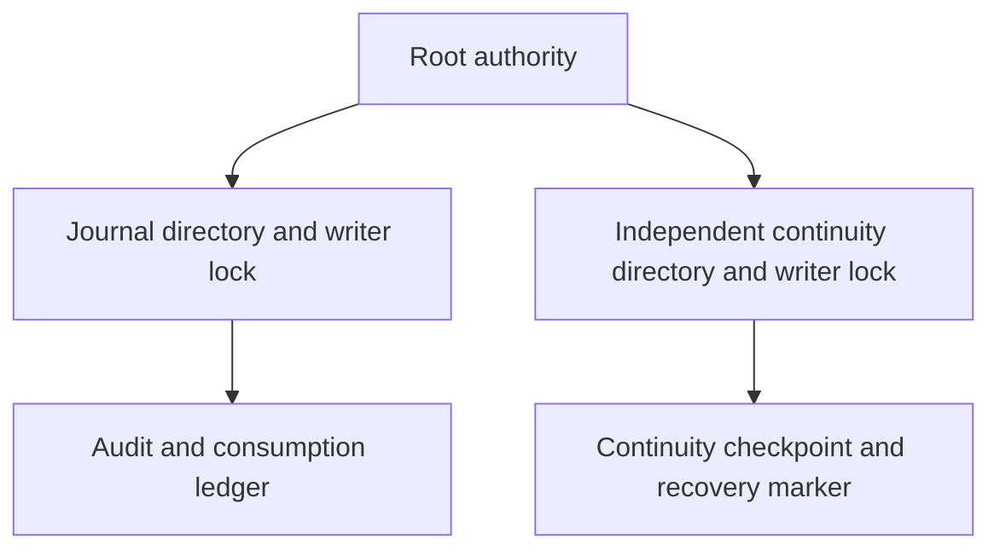
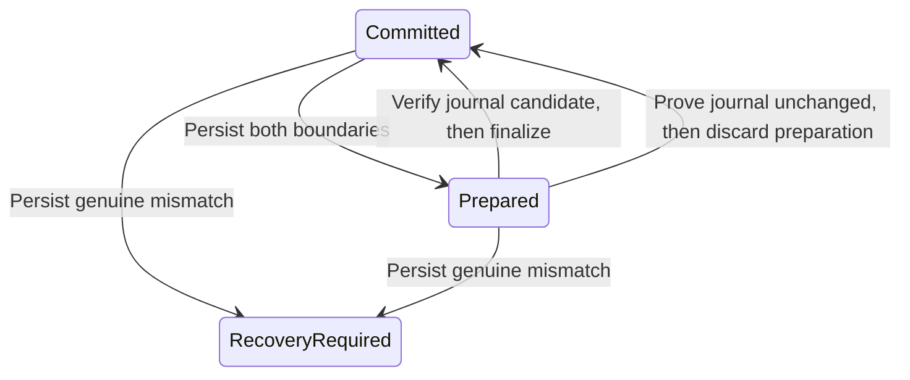
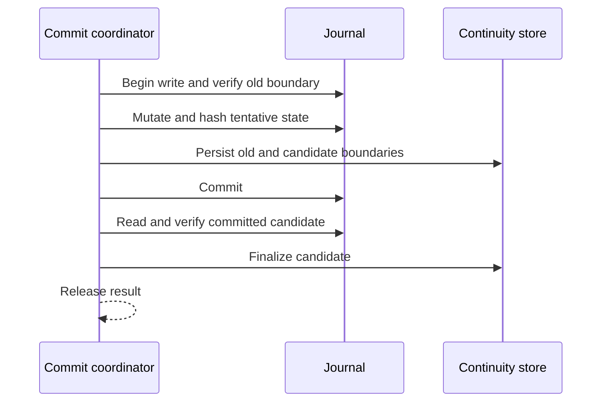
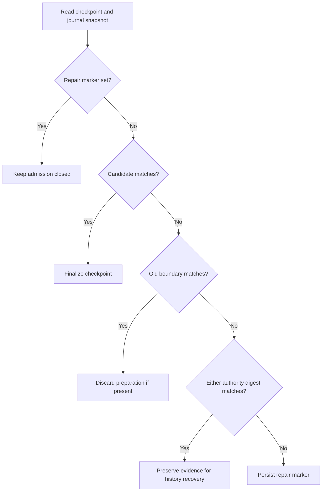
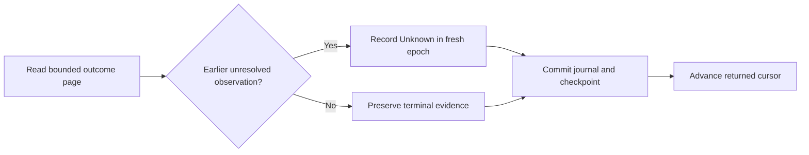
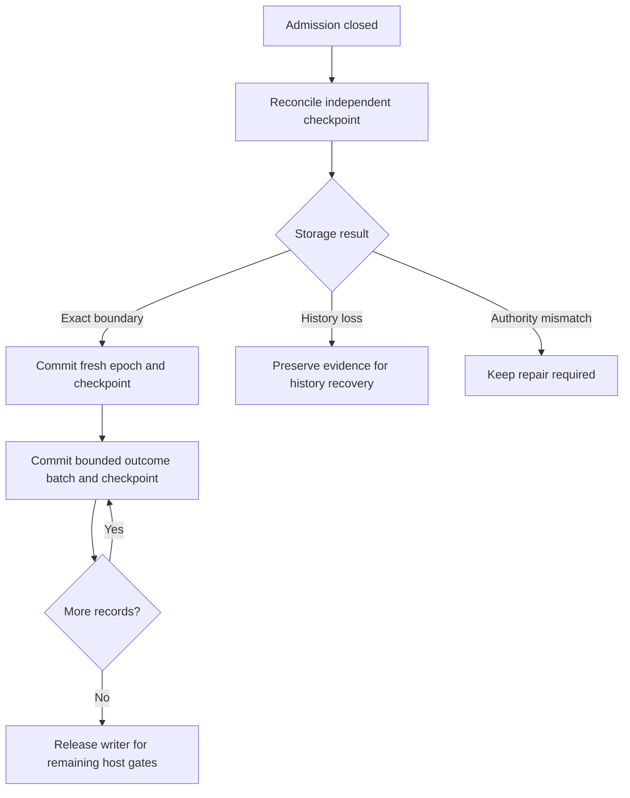
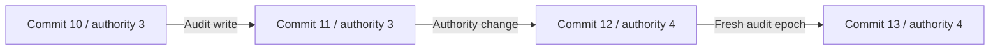
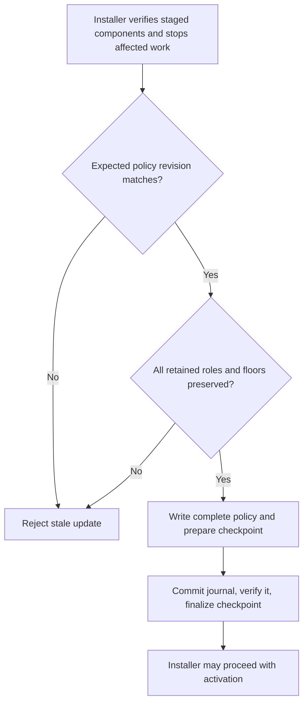

# Independent continuity storage

`ProtectedContinuityLease` acquires an existing root-owned `continuity.sqlite` and `writer.lock` in a private directory. Installation must place that directory outside the replaceable journal directory. Both stores can remain locked by the authority at the same time.

The shared storage checks retain file and ancestor identities, reject symlinks and unsafe permissions or ACLs, and require a local root-owned mount. Acquisition never creates files or substitutes `journal.sqlite` for a missing continuity store. A failed identity check permanently retires the lease. Close SQLite before releasing its lease.

The lease establishes storage ownership only. The checkpoint persistence API is described below. Journal coordination, startup validation, and history-loss classification remain to be implemented. The current authority executable still serves trust queries only. It must not enable request admission merely because both storage leases can be acquired.

Tests hold both stores, replace the journal while preserving the continuity lease, reject missing continuity storage, verify exclusive ownership, and retire a replaced continuity file. Common storage tests cover path traversal, ACLs, nonregular files, and lock replacement. No service was installed and no physical recovery test was run.

## Checkpoint persistence

`ContinuityStore` opens only an existing protected file. Explicit setup can initialize an empty file; normal open never creates or repairs a missing, corrupt, or unsupported store. Its schema binds the Mac and account and stores one committed checkpoint, an optional prepared checkpoint, and a sticky recovery marker.

Each checkpoint contains a commit generation, authority-state digest, ledger digest, journal epoch, and journal head. Version 2 also retains a separate authority generation. Digests are fixed-width inputs from the trusted authority's canonical state encoder, which remains to be integrated. They contain no target labels or command text. The prepared generation must immediately follow the committed generation; overflow is rejected.

All mutations use SQLite transactions with DELETE journaling, synchronous EXTRA, and fullfsync. Lease validation surrounds commit. An uncertain commit retires the connection; reopening must reconcile retained state. A rolled-back statement failure preserves both boundaries and does not invent a recovery-required condition. SQLite errors remain distinct from unsupported or malformed state. Finalize and discard compare the complete retained state, so a stale caller cannot clear a marker or replace a different pending checkpoint. No API clears the recovery marker.

The root coordinator must persist preparation before changing the journal. It may finalize only after verifying the journal's committed candidate. Recovery may discard preparation only after proving the journal still matches the old boundary. Neither operation permits dispatch. Canonical digest computation, journal coordination, interruption classification, repair, and startup admission remain integration work. Reopen tests are not power-loss or physical-device evidence.

Tests cover all four mutation failures, rollback and retry, reopening each checkpoint phase, marker persistence, wrong scope, stale transitions, invalid generations, corrupt bytes, missing rows, and unsupported versions. No action was dispatched by these tests.

## Journal snapshot hashes

`JournalTransaction.continuityDigests()` hashes a single SQLite transaction, including its tentative writes. The authority digest covers the journal identity, enrollments, pairing receipts, routing controls, and gateway controls. The ledger digest covers the identity, audit epochs and records, consumptions, and outcomes. History changes remain distinguishable from trust changes.

The versioned SHA-256 format separates the two domains. It sorts tables and rows, includes column names, and frames each value with its type and length. Integer values use eight big-endian bytes. Text and blob bytes remain distinct; null and empty values remain distinct. Hashing streams rows instead of retaining the complete journal in memory. SQLite can use temporary storage to sort rows.

The schema-12 or schema-13 table catalog must match exactly. Unknown tables or versions fail the snapshot. Schema 13 adds retained code policy to the authority digest and changes its domain to `schema13/authority`. The ledger retains the schema-12 domain because its format and tables are unchanged. Existing schema-12 digest bytes remain unchanged. This digest checks byte continuity; it does not replace semantic validation. External root-key identities and actual installed binaries still need validation before admission.

Tests cover insertion-order independence, trust changes, consumption and outcome changes, history separation, transaction rollback, reopen stability, expired transaction access, and an uncovered table. Commit coordination and recovery admission remain unimplemented. No physical power-loss test was run.

## Coordinated writes

The internal `CheckpointedJournal` primitive verifies the old boundary inside the journal write transaction. It runs the mutation, hashes the tentative result, and durably prepares both checkpoint boundaries before SQLite commits the journal. It then reads the committed journal again and finalizes the checkpoint. Only after finalization does the method return the callback's result.

The callback must not dispatch actions or publish results. The host must serialize both connections and establish complete authority continuity before constructing the primitive. The helper binds current journal state only; it does not yet include external root-key or installation state. Existing request writes do not use it yet.

Any failure withholds the result and retires that coordinator instance. A transient failure does not set the durable recovery marker. Reopening must inspect both boundaries before retrying storage work; it must never retry an action. Tests inject SQLite preparation and finalization failures, a journal rollback after preparation, and callback failure. They verify retained evidence after reopening and reject a mismatched or unresolved boundary before running a mutation. These are process-level storage tests, not physical power-loss evidence. Automatic recovery and admission integration remain separate work.

## Interrupted preparation recovery

`JournalCheckpointRecovery` reads the independent checkpoint and compares both boundaries with one journal snapshot. It finalizes a matching candidate or discards preparation when the old boundary still matches. Repeating a completed recovery returns the unchanged checkpoint. It reconstructs no requests, permits, or callback results.

History differences preserve both boundaries and return a discontinuity classification. They do not set the repair marker. A mismatch in journal authority state persists the sticky marker. SQLite and lease failures propagate; they are not converted into a repair diagnosis. A failed marker write also propagates, so the host must keep admission closed and independently check again on restart.

These results describe journal storage only. External root-key and installation continuity must also pass. Before admission resumes, the host still must record history gaps and unresolved outcomes, create a fresh audit epoch, and retire old requests. A finalized preparation is not evidence of an external effect and never authorizes replay. This recovery helper is not yet connected to authority startup.

Tests exercise finalize and discard after reopening, idempotence, history-only differences, transient finalization failure and retry, authority mismatch, failed marker persistence, and marker retention after the original trust bytes return. No physical power-loss test was run.

## Retained outcome reconciliation

Recovery can enumerate consumption outcomes by request ID with `JournalTransaction.consumptionOutcomes`. Each page has a record limit and a byte budget for stored decision and event bodies. An oversized first record returns `pageTooSmall`; it is never silently skipped. The returned cursor advances only past included records. Decoding still validates each receipt and outcome. The host must hold its recovery lock across pages to preserve a stable view.

The internal `reconcileInterruptedConsumptions` operation processes one page in the journal write transaction. It records `Unknown / authorityRestarted` for retained authorized or executing observations from an earlier epoch. Terminal outcomes remain unchanged. The outcome updates and their new audit events commit or roll back together. The caller supplies a fresh epoch writer and the current audit head; unresolved observations in that same epoch are rejected as live work.

Revisiting a committed page adds no duplicate terminal events. This path never grants a permit or retries an external action. When separate retained evidence proves no dispatch, the host must record that specific outcome before this conservative fallback. Unenumerable missing history still needs an explicit gap record. The startup host must keep admission closed, create the fresh epoch only after continuity checks, and use checkpointed writes for every batch. Those startup connections remain unimplemented.

Tests cover request ordering, row and byte boundaries, corruption, reopening, expired access, idempotent Unknown records, live-epoch rejection, stale empty-batch heads, and atomic rollback when the second recovery audit insert fails. Physical recovery remains untested.

## Checkpointed startup sequence

`JournalStartupRecovery` combines checkpoint reconciliation, fresh epoch creation,
and bounded recovery batches. It withholds its epoch writer until every batch and
its checkpoint commit. A failed operation retires that sequence; the host must
reopen storage and start a new sequence with a fresh epoch before retrying.

The sequence does not dispatch actions or restore request payloads. Reopening
between batches starts enumeration again; terminal outcomes remain unchanged.
Unresolved observations become Unknown through the existing conservative recovery
path. The host must record independently proven no-dispatch outcomes before that
fallback. A matching checkpoint alone does not prove that an action was never
executed.

The caller must hold exclusive ownership, validate external authority state, and
supply a fresh descriptor bound to current trust. Automatic history-gap recovery,
no-dispatch proof integration, retry scheduling, and service admission wiring are
not yet implemented by this sequence. Its completed writer proves storage
completion only. Tests cover interrupted epoch finalization and restart between
nonempty batches; they do not simulate physical power loss or service installation.

## Protected launch paths

Authority configuration version 2 adds the independent continuity directory at
CBOR key 15. Version 1 retains its exact original fields and canonical encoding.
Version 2 requires the new text field; missing fields, extra fields, wrong types,
and unsupported versions are rejected. Both paths must be absolute and contain no
empty or traversal components. Neither directory may contain the other.

`AuthorityStorage.open` acquires both root-protected stores without initializing
or migrating either. A failed continuity open closes the journal. The owner holds
both leases until close or destruction. It compares the validated device/inode
ancestry of both opened directories and rejects containment in either direction,
including path aliases on case-insensitive volumes. Before acquiring the second lock,
it rejects a continuity directory with the journal directory identity. This keeps
self-contention from being reported as a retryable failure. Runtime lease checks remain necessary:
configuration path validation alone does not prove filesystem identity.

This entry point requires version 2 configuration. The executable selects this joint owner for version 2. Version 1
keeps its existing journal-only trust service path. Neither path enables action
admission. Configuration decoding alone grants no approval authority.

## Trust service lifetime

The version-2 service reconciles exact checkpoint boundaries before constructing
its trust listener. It holds both leases until shutdown, failed construction, or
destruction. Each trust read checks the independent checkpoint and the journal
boundary within the serialized owner. Raw writes and request work remain disabled
on this owner; there is no dispatch path.

A history discontinuity remains distinct from a persisted repair marker. The
executable reports history recovery as pending with a temporary-failure exit code.
Lock contention and explicit temporary SQLite or system failures also receive
temporary-failure status. Wrong scope, incompatible stores, unsafe metadata, and
unknown errors receive configuration-failure status. Extended SQLite codes use
their primary error class. A confirmed repair marker has a separate diagnostic.
Automatic history recovery and fresh action-epoch preparation remain required.

Tests exercise paired ownership through service shutdown and construction failure.
They do not install launchd services or prove prelogin, logout, or reboot behavior.

## Automatic startup retries

The executable now retains an `AuthorityServiceRunner` while startup is pending.
It retries explicit temporary storage failures automatically. Each attempt reloads
protected configuration, reacquires both configured stores, and runs the existing
checkpoint validation before starting the trust service.

Retries use one timer and exponential backoff: one second initially, capped at
30 seconds by default. The runner accepts bounded delay settings for later app
settings integration. Attempts never overlap. Persistent unavailability remains
visible in bounded diagnostic messages. Wrong scope, unsafe paths, incompatible
stores, and confirmed repair are terminal. Pending history recovery keeps its
separate result; the automatic history-recovery operation is still required.

Termination cancels a pending retry and waits for any active attempt. If that
attempt acquires a service during shutdown, shutdown disposes of it without
reporting it as running. Failed attempts must release all resources before retry.
This loop never retries a command, consumes a request, or clears a repair marker.

Tests cover capped backoff, permanent failures, cancellation during backoff and
acquisition, retained shutdown ownership after a close error, and real contention
on a protected fixture store. The contention test checks release of the first
lease before retry and ownership of both leases after recovery. No launchd
installation, signal lifecycle test, or physical reboot test was run. Phone health
and authenticated no-admission responses still need transport integration; these
local diagnostic statuses do not provide that proof.

## Retained authority generation

Checkpoint encoding version 2 adds a positive authority generation. The commit
counter still advances for every checkpointed write. The authority generation
advances exactly once when the canonical authority digest changes. Audit-only
writes, epoch creation, and no-op transactions retain the authority generation.
Old audit headers remain immutable when current trust changes.

Preparation validates both counters against the previous checkpoint and the
candidate authority digest. It rejects skipped or false authority advances,
format downgrade after version 2, and overflow. Journal rollback retains the old
generation; interrupted finalization retains both generations until exact
checkpoint reconciliation selects the durable candidate. Recovery does not
increment the authority generation a second time.

Version 1 remains readable with its original bytes and compare-and-set identity,
including a pending version-1 preparation. It has no dedicated authority
counter. The next validated checkpointed commit seeds that counter from the
retained commit generation, then applies any authority change in that commit.
This is a compatibility baseline, not an inferred historical trust revision.
It neither reads a generation from replaceable audit history nor rewrites old
epoch descriptors. New candidates use version 2; unknown versions fail closed.

Startup recovery rejects a supplied epoch descriptor whose generation differs
from the retained authority generation or the defined legacy baseline. A fresh
epoch and its checkpoint still commit before its writer can leave recovery.
This generation currently covers the authority tables included in the journal
digest. Binding external identity keys, installed code generations, and security
floors to the combined authority state remains required before action admission.
The counter alone proves none of those unimplemented integrations.

Tests cover authority changes versus audit writes, reopen, interrupted upgrade
and finalization, legacy preparation, stale epoch descriptors, malformed version
fields, invalid transitions, and exhausted counters. No physical crash or
power-loss test was run.

## Retained code policy

`JournalTransaction.codePolicy()` returns the retained policy and its revision. A schema-12 journal returns no policy. Opening it never creates a policy or migrates the schema.

The protected installer calls `installCodePolicy` inside a coordinated write after it verifies signatures, placement, release compatibility, and quiescence. The first installation creates schema 13 and the complete policy in that transaction. The independent checkpoint retains both the old schema-12 boundary and the new schema-13 boundary until commit completes. Restart reconciliation can therefore finalize the new boundary or discard a rolled-back migration.

Each role retains its team, identifier, code directory hash, installed security generation, minimum generation, and active flag. The catalog includes the app, authority, GUI agent, transport, command frontend, notification gateway, tunnel client, setup controller, bridge endpoint, and bridge command. Storage accepts a subset; the release validator must enforce required components and compatibility.

Normal updates cannot remove a retained role, change its signing identity, or lower either generation. Disabling a component marks it inactive and preserves its floor. The complete policy uses one compare-and-swap revision. An identical update preserves that revision and the authority generation. Any policy change advances the retained authority generation through the coordinated checkpoint. Security generations use the full positive UInt64 range.

A missing policy row in schema 13 is corruption, never permission to initialize again. Encoding is canonical and bounded. Tests cover invalid roles and identities, stale revisions, retained inactive floors, read-only and expired transactions, rollback, preparation failure, finalization failure, and restart reconciliation across both schema versions. The migration does not change the ledger digest.

This is storage infrastructure. It does not authenticate installer input, validate a release manifest, inspect live processes, or activate a binary. The protected installer and each privileged XPC request must consume this retained policy before action admission is enabled. Physical update and power-loss tests remain pending.
