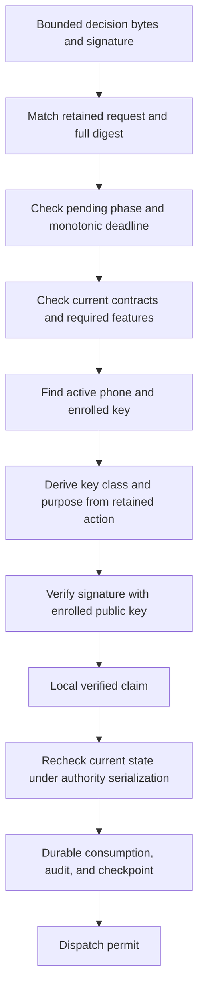

# Authority-side decision verification

`DecisionVerifier` combines the shared protocol checks with an authority-owned request and current enrollment snapshot. It verifies a phone decision without dispatching an action.

The code in this change ends at **Local verified claim**. The last three steps remain separate implementation work.

## Trusted inputs

The authority supplies the retained request, lifecycle phase, admission time, and deadline. Admission time and deadline use one sleep-inclusive monotonic clock. They never come from phone time or the request's wall-clock display fields. An authority restart changes the clock epoch and retires pending requests. A time before admission, a different epoch, or a time at or after the deadline fails verification.

The trust snapshot belongs to one Mac/account. It contains the current authority capabilities, allowed contracts, active enrollments, enrolled keys, and authenticated phone capabilities. The allowed-contract set incorporates current security floors. The verifier checks the exact retained contract; it does not renegotiate or rewrite a pending request.

Every trust, revocation, capability, or floor change must change the snapshot revision before a later consumption can succeed. Snapshot assembly must be consistent and account-scoped. Never build it from a decision or unauthenticated advertisement. Duplicate phone IDs or duplicate key IDs within an enrollment fail construction.

Enrollment validation and key attestation are not implemented here. The enrollment service must establish distinct key purposes and enforce the platform key policy before trusting a key. A matching signature proves possession of the enrolled key; this code does not prove biometric hardware or user presence.

## Peer inputs

Only the canonical decision bytes and raw signature come from the phone. The verifier derives the signing purpose and required key class from the selected action and retained permitted actions. The phone cannot choose a verification key, substitute another action scope, or turn a decision key into biometric authority.

The decision must match the Mac, account, request ID, complete request digest, and challenge. The selected phone and key must exist in the current active enrollment. Current authority and phone capabilities must support the retained contract and all required features.

Canonical parsing and signature-input construction use explicit independent limits. Error values are local diagnostics; they are not an unauthenticated network response contract. No request details or credentials are logged.

## Consumption boundary

`VerifiedDecision` has no public initializer and is not serializable. It carries the checked decision, action requirement, trust revision, clock epoch, and deadline. It provides no dispatch operation.

Verification is a snapshot check. Its result does not survive changes in authority state, revocation, target validity, expiry, or request consumption. The transaction owner must check current state again while serializing competing decisions. It must reject a stale revision and commit consumption, audit, and the continuity checkpoint before dispatch. Signature verification alone does not resolve races between two phones.

No API here restores pending requests, accepts a verified claim from IPC, enrolls a phone, persists a key, or performs an external action. Protected enrollment, target revalidation, durable consumption, crash recovery, and authenticated transport remain implementation gates.

## Evidence

The unit tests use disposable in-process P256 keys and synthetic captures. They cover command, both 1Password categories, one-time Little Snitch actions, reusable rule scopes, and cancellation. Negative cases cover each request binding, account separation, revoked or missing enrollment, wrong key class, wrong key material, altered signatures, incorrect purpose, changed scope, capability/floor changes, deadline boundaries, clock epochs, and unavailable lifecycle phases.

These tests exercise software verification only. They do not test device biometrics, protected storage, concurrent consumption, adapters, or real approvals.
