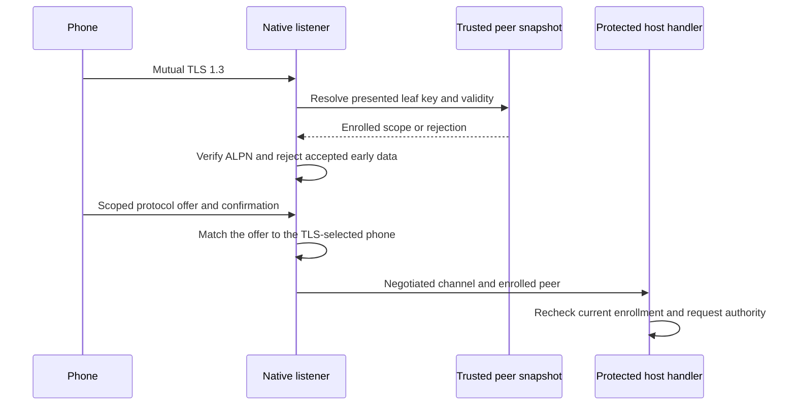

# Direct approval listener

`DirectApprovalListener` owns a native TLS listener and its accepted channels. The protected host supplies a `SecIdentity` and an immutable array of trusted `DirectApprovalPeer` records. Each record binds a transport pin to a Mac, account, phone, enrollment epoch, protocol floor, capabilities, and payload limit. The listener rejects duplicate phone IDs, duplicate transport keys, mixed authorities, empty snapshots, and more than 1024 peers.

The listener requires mutual TLS 1.3 and ALPN `remozio/1`. Session resumption and tickets are disabled. A leaf must match an enrolled P-256 key and be within its validity interval. Certificate renewal with the same key keeps the same scope. No CA, hostname, discovery name, or phone-supplied scope can select another enrollment. The ready connection is checked again before protocol negotiation. Only a fully negotiated channel reaches the handler.

The default connection capacity is eight, configurable from one to 64. Capacity includes handshakes, negotiation, and active handlers. Excess native connections are cancelled before a task is created. Slots stay occupied until their handler ends and the channel closes. Opening and negotiation each have a configurable deadline from one to 60 seconds, with a 15-second default. The listener also bounds its own startup wait. It does not impose an idle deadline after negotiation; the host owns request lifetimes.

Closing the listener cancels native listening, immediately invalidates and aborts channel I/O, and cancels handler tasks. A task that ignores cancellation can finish later, but its channel cannot send or receive another application message. Listener instances cannot restart. The host must close an instance before changing its enrollment snapshot, then construct a replacement. The handler must verify current enrollment and request authority at every relevant operation; a retained snapshot is not a revocation check.

Local-network binding publishes `_remozio._tcp.` with instance `Remozio-` followed by the lowercase 32-digit Mac ID. Automatic renaming is disabled because Android matches that name. The name is a discovery hint and contains no credential. The listener uses an ephemeral port on available interfaces; TLS authentication remains mandatory regardless of network origin. A ready event means the native listener is ready, not that Android has discovered it or that a firewall allows access. Loopback binding uses IPv4 loopback and never advertises.

## Protected journal snapshots

`JournalTransaction.directApprovalTrust` reads the authority revision, eligible enrollments, and retained pairing proofs in one transaction. It returns an immutable `DirectApprovalTrust`. An empty peer array means no phone is eligible; the host must stop listening rather than create an unauthenticated listener.

The result excludes revoked phones and phones with unresolved gateway trust restrictions. Transport pins are converted from the stored P-256 points to canonical SPKI. The advertised request contracts must be both locally allowed and present in the enrollment. Their feature sets are intersected. If that intersection exceeds the channel limit, only its lowest 64 feature IDs are advertised. Stored capabilities remain unchanged. The host must not deliver a request that requires a feature absent from the negotiated set. Audit versions and payload limits come from trusted local configuration.

For a retained pairing, the same proof and binding checks used by receipt recovery verify the transcript against the stored enrollment. The listener floor is the maximum of that transcript's floor and current local policy. Legacy administrator-enrolled records without a pairing transcript retain the version-1 floor; reading them does not invent a proof or receipt. Malformed retained proofs fail the read and retire the journal owner. This does not add protection against privileged database edits or whole-Mac backup rollback.

Retain the returned revision with the listener. Before using a channel under the authority's serialization, `requireDirectApprovalPeer` rechecks the revision, Mac/account/phone/epoch scope, active unrestricted enrollment, and transport key. Changing the supplied local policy also requires replacing the listener. These checks grant no request authority: execution, actions, and decision consumption still use their existing verifiers and journal transaction.

Journal tests cover empty and legacy snapshots, restart with a retained higher floor, a higher local floor, invalid proofs, contract and feature filtering, 64/65/128-feature boundaries, revocation, trust restriction of one among two phones, and stale or forged bindings. The higher-floor fixture tests retention; it does not add protocol-version-2 support.

## Evidence and remaining integration

The synthetic TLS peer uses this listener for negotiated tests, with disposable software identities and loopback binding. The original raw TLS experiment stays separate. Native tests cover peer-to-scope mapping, renewal, invalid certificates, ambiguous enrollments, and immediate channel abort. Kotlin/native tests exercise negotiated exchange through the existing synthetic HTTPS relay, scope rejection, multiple enrolled phones, and excess connections.

The product app does not start this listener yet. Protected identity provisioning, service ownership and listener replacement on journal changes, service installation, request delivery, and LAN advertisement on a real network remain integration work. The tests do not prove Android DNS-SD discovery, hardware-key lifecycle, firewall behavior, or physical LAN-to-relay handoff. They install no service and publish no LAN advertisement.
