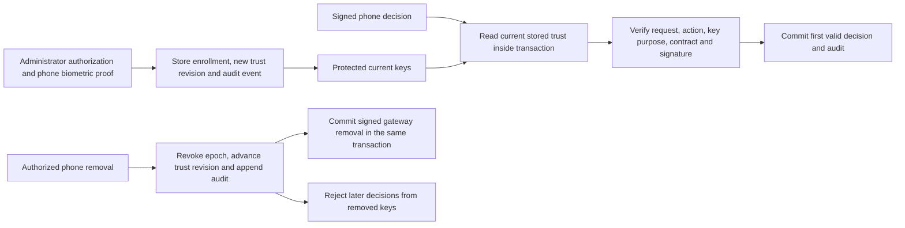

# Durable approval enrollment

The protected root journal owns approval keys and the current trust revision for one Mac/account.
Public decision consumption reads these records inside the same transaction that records the winning decision and its audit event.
A caller-supplied enrollment snapshot cannot authorize that public path.

## Setup and storage

`configureApprovalAuthority` stores the authority capabilities and allowed contracts once.
It does not enroll a phone or read trust from audit history. Empty or incompatible setup policy is rejected.
`addApprovalEnrollment` stores the phone identity, enrollment epoch, notification tag, capabilities, and two distinct approval keys.
The decision and biometric public keys must be valid P-256 points with distinct key IDs and key material.
The host must verify administrator authorization and the phone biometric enrollment proof before this root-local call.
These constructors do not authenticate setup, attest Android hardware, or expose a network enrollment endpoint.

Each mutation requires the current trust revision. Successful changes produce a fresh revision and a metadata-only enrollment audit event.
Keys, notification tags, and identity material never appear in that audit event.
Active enrollments feed `approvalTrustSnapshot`; `approvalEnrollments` also lists retained revoked epochs for device management.
Rows use bounded, versioned database-only JSON. This is not a new wire format.
Malformed encoding, policy, keys, or mismatched row identifiers retire the journal owner without a reset.

The journal retains up to 1,024 enrollment epochs, including revoked ones. Each encoded body is bounded to 32 KiB.
It accepts at most 64 contracts and 128 features per contract. These are storage limits, not default UI selections.
No enrollment-history pruning exists yet. A storage limit fails the transaction rather than silently removing trust history.

## Removal and replacement

`revokeApprovalEnrollment` targets one exact phone epoch. It revokes its keys, advances the revision, and writes its audit event atomically.
When a gateway registration exists, the call also requires `EnrollmentGatewayRemoval` with its root-local typed signer and current control head.
The journal derives the removed phone and tag from stored enrollment. It commits the signed gateway revocation in the same transaction.
A missing gateway context, invalid signature, failed audit append, or storage error rolls back the entire removal.
The returned control remains historical evidence until commit and continuity checks permit publication.
An inactive gateway does not prevent retaining removal; the gateway outbox checks delivery eligibility separately.

Removal leaves requests pending for other authorized phones. It does not erase an earlier winning decision or turn audit history into dispatch permission.
A decision carrying an old trust revision fails. A fresh revision still cannot use the removed keys.
The controller must reconcile the remaining approval surfaces before cancelling a request after the last phone is removed.
That controller and its implemented local approval surface remain separate work.

Replacement is a removal followed by an add inside one `JournalDatabase.write` callback, using the returned revision and next audit sequence.
If the add fails, removal and both audit changes roll back together.
A previously removed phone can enroll again with a fresh epoch, fresh key IDs, and fresh approval keys.
Old epochs and approval key IDs or key material cannot be reused within this Mac/account journal.
The phone identity may survive a key replacement. This does not require re-pairing merely because an OS invalidates a biometric key.
Key invalidation reporting and authorized key rotation within an existing enrollment remain service integration work.

## Consumption boundary

The public `consume` overload takes `expectedTrustRevision` instead of a trust snapshot.
It obtains current policy and active keys from storage, checks the revision, then runs the existing decision verifier and consumption journal.
Its result is not a dispatch permit. Request admission, continuity, checkpointing, and target revalidation still apply.
The overload accepting a caller-supplied snapshot is internal; existing synthetic peers use it through their Debug-only test import.
It is not available through the production library API.

Public gateway candidate creation, proof consumption, renewal, and pending-control reads now derive phone trust from the enrollment journal.
Each call checks the expected trust revision and the exact active phone epoch. The notification tag comes only from stored enrollment.
A revoked phone cannot create a candidate or use a late proof, even if a caller retains its former snapshot.
A new epoch of the same phone cannot use its previous epoch's challenge.
The host still authenticates the phone channel and supplies protected gateway registration activity and the root-local signer.
Gateway identity is checked against the journal's pinned registration before a control is signed or returned.
The caller-supplied phone-trust overloads are internal fixture paths. Push registration never creates approval authority.

## Schema and evidence

Root journal schema 10 retains authority policy, enrollment tables, and routing state. It retains gateway acknowledgments and retains recovered delivery receipts and adds recovered revocations. Explicit migrations accept source versions 1 through 9.
Existing audit, consumption, and gateway state survive migration. No migration creates enrollment authority from those records.
A restored complete backup still needs the independent continuity witness. A valid local database alone does not prove freshness.

Tests cover both removal/consumption orders, another phone winning after removal, restart, same-phone re-enrollment, replacement rollback,
gateway/audit atomicity, stale revisions, invalid keys, storage faults, malformed data, read-only access, and explicit migration.
All tests use normal-user protected fixtures and synthetic keys. No actual enrollment, privileged installation, or phone biometric operation runs.

See [gateway history recovery](gateway-history-recovery.md) for transactional counter repair and its trust boundary.

See [recovered gateway revocations](recovered-gateway-revocations.md) for permanent restrictions and atomic system audit events.
