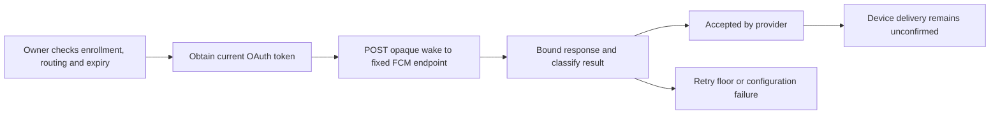

# Native FCM wake sender

`FCMWakeSender` makes one authenticated HTTPS attempt to Firebase for one registered Android app instance. Each Mac can use this client independently. It has no central service dependency beyond Firebase itself.

The data payload has two fields: `wake_v1` and `enrollment_v1`. Each is a base64-encoded, opaque 32-byte identifier supplied by the delivery owner. The enrollment tag selects one pinned Mac/account enrollment on a phone shared by several Macs. Allocate it randomly during authenticated enrollment and reject duplicate tags there. It is only a routing hint; the phone must ignore unknown or retired tags and never follow a push-supplied endpoint. Never derive it from command text or other sensitive content. The message contains no request details, account names, credentials or approval decisions. The phone must resolve the wake and fetch authoritative state over its separately authenticated channel.

## Configuration and ownership

Host this client in the dedicated unprivileged push service. Supply the Firebase project, Android package name, token, wake identifier, enrollment tag, TTL and priority. TTL is explicit and must fit Firebase's supported range. It is the provider storage lifetime, not the request's authorization deadline. Select it from the currently queued work. An old wake never authorizes an action.

High priority is for time-sensitive, user-visible notifications. The Android receiver must show an appropriate notification promptly, then fetch private content separately. Background audit refresh can use normal priority. No collapse key, notification text, or untested direct-boot setting is inserted by this client.

The owner must verify current enrollment, presence routing, registration version, token expiry and request lifetime before every attempt. This component does not acquire OAuth credentials, refresh them, schedule retries, persist registrations, or revoke keys. These remain integration work. The app does not invoke the sender yet.

## Transport and results

The URL is fixed to Firebase's HTTPS send API; configuration cannot provide another host or arbitrary URL. Each attempt owns an ephemeral session with no cookie, credential or response cache. Redirects are refused. The configurable timeout defaults to 30 seconds and is bounded to 120 seconds.

The response reader rejects a declared or streamed body above 64 KiB. Cancellation invalidates that attempt's session. Errors expose stable categories instead of provider text or URLSession diagnostics. Token and wake descriptions are redacted; this does not erase secret values from process memory.

`accepted` means the provider accepted a send, not that the phone received it. `validated` is the separate result of `validateOnly`; it sends nothing to the phone. A malformed success response fails. Only a matching typed `UNREGISTERED` error marks a registration invalid. Generic 404 responses do not. Registration invalidation must remove only delivery metadata, not approval trust.

For retryable status codes, the result supplies a minimum delay. Quota errors have a minimum of 60 seconds. Valid numeric and HTTP-date `Retry-After` values can increase that floor. An unrepresentably large numeric delay becomes the largest finite interval, never a short retry. Compare this against remaining request lifetime before converting it to a clock deadline. The owner must also apply backoff and jitter, and recheck authorization and routing. No automatic retry happens inside this client.

## Evidence and remaining gates

Eleven native tests use a URLProtocol fixture that intercepts every URL. They cover the exact payload, distinct routes sharing one registration, validation mode, typed errors, retry floors, body limits, redirects, cancellation and diagnostic redaction. No Google endpoint, provider credential or physical device is used. These fixtures test Foundation's client path on the current host; they do not prove delivery through Firebase.

Pending work includes protected provider credentials, OAuth acquisition, registration and rotation, bounded scheduling, Android reception, notification permissions, and the encrypted fetch channel. Live configuration and Pixel tests must cover Doze, force-stop, offline TTL, LAN/mobile transitions, and stale notifications.

## Provider references

- [HTTP v1 authentication and send](https://firebase.google.com/docs/cloud-messaging/send/v1-api): use a current OAuth bearer token with the messaging scope.
- [Send endpoint](https://firebase.google.com/docs/reference/fcm/rest/v1/projects.messages/send): endpoint shape and validation-only requests.
- [Android message fields](https://firebase.google.com/docs/reference/fcm/rest/v1/projects.messages#AndroidConfig): TTL, priority and package restriction.
- [FCM error codes](https://firebase.google.com/docs/cloud-messaging/error-codes): typed errors, quota backoff and Retry-After handling.
- [Android priority guidance](https://firebase.google.com/docs/cloud-messaging/android-message-priority): user-visible notification expectations and possible deprioritization.
