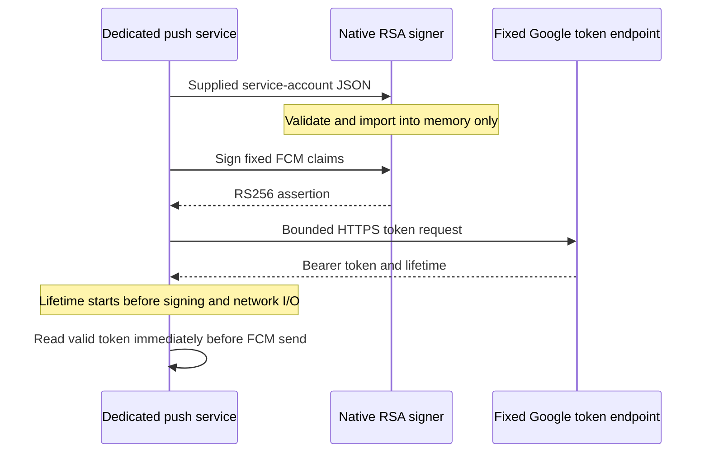

# Native FCM OAuth

`FCMOAuthClient` obtains a short-lived Google access token from an explicitly supplied service account. It uses Foundation and Security.framework inside the Mac app bundle. Production code needs no subprocess, additional runtime, or external credential helper.

## Credential boundary

`FCMServiceAccount` accepts at most 64 KiB of JSON. It requires the service-account type, a bounded email and key ID, and the exact Google token endpoint. Unknown fields cannot add scopes, delegate another user, or change the endpoint. It does not discover files, environment variables, or credentials from other apps.

The private key must use one unencrypted `PRIVATE KEY` PEM container, bounded to 16 KiB. Native import must return one RSA private key, with 2048–4096 bits and RS256 signing support. Weak RSA keys, other key types, malformed containers, and multiple containers fail. No keychain destination or interactive prompt flag is supplied. The private native handle stays behind a mutex; callers cannot obtain it.

These are provider credentials, not the nonexportable Remozio approval identity. The dedicated push service must own their protected persistent store. The setup controller will provision, rotate, and export them through the agreed encrypted setup flow. The approval transport must never receive the service-account key. This PR adds no persistent store or setup UI.

Descriptions and errors redact keys, tokens, provider response text, and native diagnostics. This does not erase copies of secrets from process memory.

## Assertions and token requests

Assertions use RS256, a fixed token audience, and only the Firebase messaging scope. They contain no delegated `sub` claim. The assertion lifetime defaults to 300 seconds and is configurable from 1 to 3600 seconds. Wall-clock inputs must be finite, nonnegative, and within the supported date range.

The client posts a form body to `https://oauth2.googleapis.com/token`. It reuses the wake sender's ephemeral, redirect-free HTTP transport, its 64 KiB response limit, and cancellation handling. The timeout defaults to 30 seconds and is configurable up to 120 seconds. It makes one attempt; it has no automatic retries.

A successful response must contain a bounded token, the `Bearer` type, and an integral lifetime from 1 to 3600 seconds. If a scope is returned, it must equal the requested messaging scope. Non-success responses expose only their HTTP status. Authentication failure never changes Remozio enrollment or approval authority.

`FCMTokenLease` measures expiry with a continuous clock from before signing and network I/O. Network latency, sleep, or a later wall-clock change cannot extend that lease. `accessToken()` rejects expiry at the exact boundary. The delivery owner must call it immediately before a send; extracting a token does not make it valid forever. A lease is process-local and must not be persisted.

## Evidence and next integration

Eleven tests cover exact JWT claims, native signature verification and tamper rejection, concurrent signing, credential bounds, weak or wrong keys, token response validation, conservative expiry, redirects, response limits, cancellation, and redaction. The test harness generates disposable keys with the system OpenSSL binary. Production code does not invoke it. HTTP fixtures intercept every URL, including redirect targets. No live Google request, real credential, or keychain write is involved.

Protected provisioning, token caching and renewal, retry scheduling, gateway recipient controls, and app/service wiring remain implementation work. Provider permission checks and real FCM delivery remain live-test gates. Neither this client nor provider acceptance proves phone delivery.

## References

- [Google service-account OAuth](https://developers.google.com/identity/protocols/oauth2/service-account): assertion claims, RS256, token endpoint, and response lifetime.
- [FCM HTTP v1 authentication](https://firebase.google.com/docs/cloud-messaging/send/v1-api): the Firebase messaging scope and bearer-token usage.
- [Apple SecItemImport](https://developer.apple.com/documentation/security/secitemimport(_:_:_:_:_:_:_:_:)): native import. The local SDK's `SecImportExport.h` documents that a null destination keychain skips persistence.
