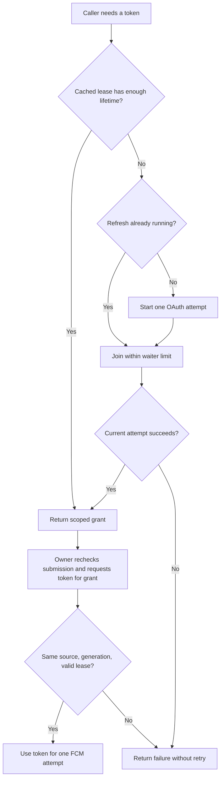

# Push token ownership

`FCMTokenSource` owns one provider configuration's in-memory OAuth cache. Concurrent callers share one refresh. Each caller receives a grant that belongs to this source and its current credential generation.

## Cache and resource bounds

The default refresh margin is 60 seconds. It is configurable from 0 to 3599 seconds. A cached or newly acquired lease must have more remaining lifetime than that margin. Expired or too-short results never enter the cache. The owner can retry according to its scheduling policy; the token source does not retry automatically or run a refresh timer.

At most one refresh is active for the current configuration. The default waiter limit is 64, configurable from 1 to 1024. A caller above the limit receives `capacityExceeded`; existing waiters remain intact. These limits do not replace gateway submission limits.

Cancelling one caller removes only its wait. Cancelling the last waiter cancels the OAuth task and forgets that attempt. A provider that finishes late cannot populate the cache or satisfy another attempt's waiters. The native OAuth transport propagates that cancellation to its URLSession.

## Rotation, invalidation and shutdown

`replace(client:)` starts a new credential generation, discards the cache, cancels the old refresh, and returns `credentialsChanged` to its waiters. Old grants can no longer obtain a bearer token. Only the protected setup flow should invoke replacement; this method is not an authenticated management endpoint.

After an FCM authentication failure, `invalidate(grant)` disables that grant and its copies. It removes the cached entry only when they match. A late 401 for an older token cannot evict a newer token or cancel its refresh. Grants from a different token source cannot affect this source.

`shutdown()` is terminal. It drops the source's credential and cache references, cancels the current refresh, and fails pending and later calls. It also prevents old grants from obtaining tokens. Late refresh completions remain ignored.

The owner calls `accessToken(for:)` immediately before a send. This checks the source, credential generation, invalidation, and continuous-clock expiry. It cannot revoke a bearer token that a caller already extracted or retract an active provider request. The service controller must separately coordinate configuration changes and active sends.

## Authority and integration

Host this owner in the dedicated push service alongside the [OAuth client](fcm-oauth.md) and [wake sender](fcm-delivery.md). Cache entries and grants are process-local; none are persisted or exported. Their descriptions redact tokens.

A token grant authorizes no Remozio action or enrollment change. The gateway must still verify root-controlled recipient mappings and recheck enrollment, routing, registration version, and request expiry for every send. A token refresh does not preserve an earlier submission check across its suspension.

Protected provisioning, the gateway control protocol and store, retry scheduling, and bundled service wiring remain separate work. This component starts no service, opens no submission listener, and sends no wake itself.

## Evidence

Eleven tests use a controlled asynchronous provider and clock. They cover refresh sharing, cache reuse, waiter bounds, cancellation isolation, late results, credential rotation, stale invalidation, terminal shutdown, cross-source grants, expiry, and configuration limits. They explicitly complete cancelled attempts to verify that late callbacks cannot restore stale state. No real keys, provider requests, or devices are used.
