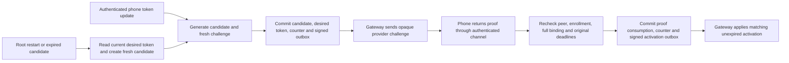

# Authority token proofs and control outbox

The root journal now retains token candidates, desired token choices, consumed proofs, and signed gateway controls.
The gateway still owns provider delivery. The root decides whether an authenticated phone proof permits a mapping activation.

## Transaction boundary

Enable these APIs with `GatewayAuthorityPolicy` when opening `JournalDatabase`.
The policy fixes encoding limits, control capacity, candidate lifetime, and the current clock epoch.
An explicit `configureGatewayAuthority` call pins one registration to the journal's Mac and account.
It cannot replace an existing registration or initialize over orphaned gateway state.

`prepareGatewayCandidate` checks the separately authenticated phone identity and epoch against current retained trust.
It generates a candidate ID, operation ID, challenge, and next control revision. It stores the token outside audit history.
The host supplies a local typed signer. The journal verifies its signature with the pinned root key before storing the control.
The candidate, desired-token pointer, signed outbox entry, and counter share the journal transaction.
A failed transaction publishes nothing. The host must never send a value captured inside the callback before commit.

`consumeGatewayProof` parses the bounded proof and compares its complete binding with the retained candidate.
The current phone epoch and tag, both original deadlines, current process, and latest desired token must still match.
It marks the candidate consumed and inserts one signed activation in the same transaction as the counter advance.
A unique index also prevents a second activation for that candidate. Swallowing a mutation error cannot commit the surrounding transaction.
The typed signing callbacks are root-local capabilities, not generic signing RPCs.

## Retry and recovery

`pendingGatewayControl` rechecks current eligibility before returning the original signed envelope.
A candidate stops being eligible after consumption. A superseded token choice cannot be published or proved as current.
Provider acceptance alone never consumes a proof, activates a mapping, or changes enrollment.

Each journal owner uses a fresh run ID. Old candidates cannot accept proofs or publish controls after reopening, even with a reused clock epoch.
Retained desired tokens survive. `renewDesiredGatewayCandidate` reads only the latest desired token under current trusted enrollment.
It generates a fresh candidate, challenge, operation, revision, and deadline. It does not refresh an arbitrary old outbox entry.
Routine recovery needs no new phone biometric or operator prompt. The service scheduler must call this path after establishing local continuity.

Historical signatures, token digests, counters, desired pointers, and proof-consumption links are checked when read.
Known inconsistency or a clock regression retires the journal owner. These checks do not detect restoration of a complete, internally consistent backup.
The independent continuity witness remains required before the root publishes controls or accepts phone operations.

## Schema and service integration

Root journal schema 4 adds the registration, candidate, desired-token, and outbox tables.
Known migrations from versions 1, 2, and 3 require the explicit source version. They preserve existing audit and consumption state.
A migration does not derive enrollment or gateway authority from audit records. Failed migration rolls back its table and version changes.
The separate gateway database remains at schema 3.

The service host must authenticate phone channels and administrator setup, own current enrollment state, and serialize trust changes with these calls.
It must provide the non-exportable root signer and establish continuity before publishing any signed control.
Neither a constructor nor a supplied phone ID proves authentication. These methods are not exposed as network endpoints.
The host may append metadata-only audit events in the same journal transaction. Tokens and challenges must never enter audit records.

Durable enrollment changes, revocation outbox entries, authenticated gateway acknowledgments, counter reconciliation, and scheduling remain integration work.
The retained row limit is a storage bound; no history pruning or whole-backup recovery is implemented here.
Do not report registration as healthy until the actual gateway and phone flow provides the required evidence.

## Validation

Tests use protected normal-user SQLite fixtures and ephemeral signing keys. They perform no privileged installation or phone interaction.
They exercise atomic writes, injected failures, superseded proofs, expiry, restart renewal, signature checks, row limits, migration, and corrupted state.
A local integration test passes the stored candidate and activation through the real gateway database and its provider-probe lifecycle.
The phone channel is a fixture in that test. It does not establish that authenticated transport or real FCM delivery works.
